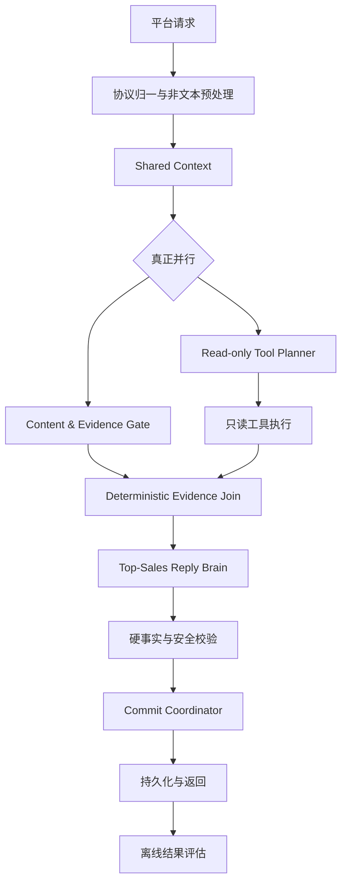

# 模型主导的 AI 顶级销售大脑重构方案

## 1. 文档地位

本文档是 `codex/reply-chain-refactor` 分支后续回复链路开发的业务语义与 Prompt 设计依据。

- 本文档建立在当前已经实现的真并行链路之上。
- 本文档继承项目宪法、当前有效业务事实和此前确认的支付、门店、SOP、已付登记规则。
- 本文档不采用后来提出的六层状态机方案，不引入售前槽位表、人工权重意向分数、代码销售阶段状态机、规则打分动作选择器、按异议分类套话术或自动替换客户可见文案。
- 若其他旧设计文档、旧 Prompt 或旧测试目标与本文档冲突，后续重构以本文档为准；权威业务事实仍以当前 `business_rules.json` 和经审核的配置为准。
- 本阶段只在该开发分支实施、仿真和审核，不合并 `main`、不部署、不发送真实客户消息。

## 2. 背景与问题

当前链路已经完成架构层面的真并行：Gate 与 Tool Planner 同时运行，Join 合并证据，Reply 负责最终回复。但模型的知识组织仍然接近“场景匹配器”：

- Parallel Reply 固定 Prompt 约 1.27 万字符，包含大量“客户说 X 时必须 Y”的微场景规则。
- Reply 每轮还会收到约 1.62 万字符业务规则包。
- 精准话术库有 104 条成品回复，但只有 15 类重复适用场景。
- Gate 命中 `selected_scene_id` 后，运行时会把整组参考回复交给 Reply，容易形成“识别场景 -> 找模板 -> 改写过渡句”的行为。
- 单个场景补规则后可以局部通过，但规则组合会产生冲突、repair 和中性兜底。

2026-08-09 绑定提交 `c02497288` 的最新 125 条全量离线仿真结果为：

- 硬错误 0 个。
- 可评估语义通过率 95.2%。
- 模型供应商基础设施失败 0 个。
- 仍有 5 个关键场景未通过，集中在活动尚未完整介绍就发预约金卡、健康风险继续在线追问，以及门店当前任务承接偏移。
- 该轮每个场景只运行 1 次，且没有可用 baseline comparison，不能证明稳定性和相对改善。
- 同一回复的多个语义评审结论存在明显分歧，单个模型评分不能作为发布结论。

旧的 78.8%、12 个硬错误是同日中间运行结果，不作为本方案基线。当前结论应是：结构安全已经明显改善，但关键销售节奏、跨轮稳定性、评审一致性和相对基线证据仍未达标。主要瓶颈仍是过密、相互竞争的场景规则限制了模型的完整理解和自主决策，而不是供应商故障。

## 3. 重构目标

最终模型不是“客户问什么就回答什么”的客服，也不是“用大模型灵活套模板”的适配器，而是在客户通常只有 5 至 10 轮有效决策窗口的条件下，能够：

1. 理解客户表面问题背后的真实决策阻力。
2. 结合完整聊天判断已经建立了哪些价值、信任和行动基础。
3. 自主选择本轮应答疑、证明、铺垫、切换维度、成交还是暂停。
4. 用真实门店、案例、活动和政策事实帮助客户形成决策。
5. 不在同一问题上卡死，不机械追问已经回答或客户不愿回答的信息。
6. 在成交基础形成后及时推进预约金，不提前压卡，也不在高意向出现后继续无效铺垫。
7. 使用自然、坚定、有同理心的微信表达，不暴露系统内部结构。

### 3.1 当前问题与架构解法

| 当前问题 | 根因 | 本方案的直接解法 | 验证信号 |
|---|---|---|---|
| 有时能承接完整聊天，有时机械重复上一问 | 多节点传递语义结论、旧画像和微规则互相抢权 | Reply 每轮读取完整时间聊天并重新判断；审计结论不跨轮固化 | 已回答信息不重复问，短回复能承接紧邻上下文 |
| 门店、斑点时长或时间问题反复循环 | 主线被写成固定下一步，模型缺少切换维度原则 | 主线改为决策地图；同一阻力无信息增量时切换销售钥匙或暂停 | 同一阻力循环率低于 2% |
| 客户第一次问价格就收到预约金卡 | 活动报价和预约金收口绑定在同一 SOP/规则 | 拆分 `activity_offer` 与 `deposit_close`，发卡引用更早活动轮次和另一把销售钥匙 | 首次询价同轮发卡率为 0 |
| 回复像场景匹配和模板润色 | 104 条成品话术及 `selected_scene_id` 直接进入运行时 | 只蒸馏销售原理、事实和证据用途；成品话术默认离线 | 未见组合仍能合理回答，表达不复刻模板 |
| 为修效果不断新增 Python 防护 | 风格和销售动作被当成硬校验 | 逐函数所有权审计；只保留事实、结构和安全硬边界 | 语义硬失败减少，业务策略不由 Python 改写 |
| 大量“您稍等一下” | 分支失败、语义硬校验和 repair 冲突共同耗尽回复 | 并行失败隔离、针对性 repair、事实型降级和 Reply 预算保留 | 中性兜底为 0，单分支失败仍可回答 |
| 离线高分但上线仍出问题 | 单次测试、过期夹具、评审分歧和缺少真实基线 | 多次完整轨迹、可复现指纹、盲评、分歧人工裁决和后续可回滚观察 | 关键场景 5/5，baseline comparison 可用 |

这张映射也是方案范围边界：某项改动如果不能改善表中的观测信号，不应因为“架构更漂亮”而实施。

## 4. 项目宪法

### 4.1 模型负责

- 当前客户问题和潜在顾虑的理解。
- 客户当前意向、信任、阻力和决策状态。
- 哪个销售维度最值得在本轮推进。
- 是否暂停主线、切换维度、继续铺垫或进入成交。
- 是否采用 Gate 候选、采用哪些事实以及如何自然表达。
- 是否发送预约金卡，以及为什么当前适合或不适合。

### 4.2 代码负责

- 原始请求、完整聊天、时间和结构事实的清洗与提供。
- 只读工具规划、调用、超时、重试和结果归一。
- 门店 ID、客户可见范围、案例 URL、支付和订单事实校验。
- 金额、人数、已付、风险、投诉退款、同轮最多一张卡等硬边界。
- Schema、幂等、并发、持久化和非业务失败恢复。

### 4.3 代码严禁负责

- 用关键词判断正常销售意图、心理、异议类型或主线阶段。
- 计算意向分数并通过阈值决定促单。
- 维护售前必填槽位并按空字段决定下一问。
- 通过状态机决定客户必须进入哪个销售阶段。
- 按场景 ID 强制增加成品话术或成交动作。
- 自动改写客户可见销售文案来“修复”模型语义。

### 4.4 内容资产与表达

- SOP、活动图、案例图和预约卡点资料是可核验的内容资产，不是“客户说 X 就发送 Y”的场景模板。
- Gate 只按客户当前目标、资产用途、交付状态、依赖关系和结构兼容性检索证据；不得决定销售动作或复原成品回复。
- Reply 是唯一客户表达和销售节奏决策者。它可以采用、组合、重写或忽略 Gate 候选，但采用后必须完整交付候选中的真实媒体和结构消息。
- 活动认知与预约金成交是两个独立动作：首次活动或价格介绍可以同时交付活动宣传图，不得自动绑定预约金说明或收款卡。
- 真人感通过“承接真实聊天、给出当前结论、一个主要目标”的通用原则实现，不通过固定句式、关键词字典、语义正则或微场景补丁实现。
- 上下文优化只去除逐字重复和与本轮无关的大块数据；任何唯一业务事实、硬边界、相关历史和本轮工具事实不得因压缩丢失。

## 5. 目标架构



概念上可以区分理解、策略、知识和生成，但不能把它们拆成多个互相覆盖的业务模型。对客户的完整理解、销售策略和最终表达由同一个 Reply 模型完成，避免语义在多节点之间丢失。

### 5.1 适用范围

本架构负责普通客户消息的回复链路。以下协议路径保持独立：

- `sop_platform_task`：按平台协议原样转发 `message_content`，不经过销售 Reply 改写。
- 企微自动加好友开场：继续执行协议级首次加微处理，不混入普通客户语义。
- `/sop/events` 主动触达：保留独立的发送时机和阶段判断；可复用经过审核的内容资产与销售原则，但不得复用普通 Reply 的临时心理判断。
- 图片、语音、定位和转账事件：先完成协议级事实提取，再进入同一普通回复链路；不是新的销售分支。

本次重构不得为了统一图形而把上述协议路径强行塞入 Reply，也不得让它们绕过现有发送、幂等和客户范围保护。

## 6. Shared Context

每轮只构建一次不可变上下文，Gate、Tool Planner 和 Reply 共用。包含：

- 当前客户原始消息、消息类型、时间和时区。
- 当前消息之前可获得的完整带角色、类型和时间聊天记录。
- 权威订单、支付、已付保护状态和登记事实。
- 客户当前 WeChat 接触边界内的门店权限和真实发送记录。
- SOP 实际发送记录、未完成内容资产和素材发送证据。
- 本轮图片、语音转写、定位卡和平台转账事件等结构事实。
- 当前有效的业务事实、销售原则和硬边界版本。

聊天记录默认完整输入，并为每条消息保留角色、消息类型和北京时间。为了防止极端长会话超过模型上下文，运行时必须：

1. 先计算真实 token，而不是按固定字符数粗暴截断。
2. 优先保留当前消息、最近完整对话、支付/门店/SOP 等权威事实和所有仍被当前对话引用的原文。
3. 只有超过模型安全上下文时才压缩更早历史；压缩结果只能是客观事件索引，不能生成客户心理、销售阶段或下一步建议。
4. 在输入和 trace 中显式记录 `history_truncated`、保留范围和 token 数；关键证据被截断时本轮不得据此做成交判断。

不把以下内容作为权威输入：

- 旧画像中的客户心理、意向等级和下一销售策略。
- 代码推导的销售阶段、主阻力或下一步动作。
- 其他 WeChat 接触档案中的画像、SOP 进度或发送次数。
- 无客户原话、结构事件或工具事实支持的偏好结论。

Reply 本轮输出的客户心理、阻力、销售钥匙覆盖和预约金准备度只用于当前 trace 和离线评审，不持久化为下一轮权威事实，也不写回客户画像。下一轮仍根据完整聊天和当轮权威事实重新判断。

## 7. 信息判断协议

Reply 使用以下四类信息判断方式：

1. **共同已知**：客户已经明确表达且系统已有可靠事实，直接承接，不重复询问。
2. **客户知道、模型不知道**：只有缺失信息会显著改变本轮回答或工具查询时，才提出一个最小问题。
3. **模型知道、客户不知道**：主动补充与客户当前决策真正相关的事实、证据、风险边界或可执行选择。
4. **共同未知**：优先调用工具；工具仍无法确认时明确不确定性，并只询问最小必要信息，不编造事实。

该协议只规定如何处理信息不确定性，不替代销售判断。Reply 还必须结合客户当前意愿、阻力和可接受步幅决定是否推进。

## 8. 四把销售钥匙

### 8.1 地址匹配

解决客户“能否到店、门店是否真实、去哪里”的可达性和信任问题。

- 客户明确要地址时，使用真实可见门店事实和结构卡。
- 地址已经交付后，不继续反复确认方便不方便。
- 客户持续纠结距离且没有更优门店时，不在地址维度卡死；承接现实阻力后切换到效果、活动价值或风险保障。

### 8.2 效果展示

解决客户“值不值得去、能否改善”的价值判断。

- 真实案例和可验证素材优先于空泛保证。
- 案例用于证明改善方向，不承诺客户一定与图片一致。
- 已经发送近期真实案例后，不机械重复发图，应继续理解客户剩余顾虑。

### 8.3 活动介绍

解决客户“得到什么、价格是否透明、为什么现在值得了解”的交易理解。

- 活动内容、268 元价格、包含项目和必要政策必须准确。
- 活动价格是价值介绍，不等于立即收预约金。
- 客户第一次问价格时，只讲清活动和价值，不同轮追加预约金卡。

### 8.4 卡点排疑

解决客户当前不行动的真实原因，例如效果、距离、价格、时间、信任或付款顾虑。

- 先识别客户问题背后的决策阻力，不只回答字面。
- 使用最相关的一个事实或证据处理，不一次堆满所有理由。
- 同一阻力处理一至两次仍无变化时，切换销售维度或合理暂停，不能循环施压。

## 9. 预约金准备度

预约金是客户形成基本判断后的承诺动作，不是活动介绍的一部分。

Reply 只能在完整上下文支持以下条件时选择发送预约金卡：

1. 活动内容和价格已经在当前消息之前单独讲清。
2. 四把钥匙中至少已有两个维度被有效铺垫，其中必须包含活动介绍。
3. 除活动之外，地址、效果或卡点中至少一个已经被客户回应、认可或有效承接，不能只是系统单方面发送过。
4. 客户当前出现继续了解、认可、报名、预约、保留名额或付款信号。
5. 当前不存在权威已付、健康风险、投诉退款、明确强拒绝或人数上限等硬边界。

关键行为：

- 第一次问价格：回答活动和价值，不发卡。
- 活动尚未讲清但客户直接问怎么付款：先完整讲清活动，不同轮发卡。
- 活动此前已讲清，客户随后问怎么参加、怎么付或明确同意保留：可以直接发一张预约金卡。
- 客户选择人工转账：不发小程序卡。
- 客户权威已付：不再发卡，进入姓名电话和到店意向登记。
- 订单不是发卡前置；支付后再尽力创建或关联后台订单。

模型负责判断销售钥匙是否真正被覆盖；代码只核验模型引用的聊天、发送和结构事实真实存在，并执行硬边界。

为避免重新演变成代码槽位状态机，Reply 在选择 `payment` 时必须同时输出：

```json
{
  "deposit_evidence": {
    "offer_prior_turn_refs": ["真实历史消息或SOP发送引用"],
    "supporting_key": "address | effect | objection",
    "supporting_refs": ["真实客户或助手消息引用"],
    "current_intent_refs": ["当前客户消息引用"]
  }
}
```

代码只验证引用存在、活动介绍发生在更早轮次、引用属于当前 WeChat 接触边界，以及硬禁区没有触发；“这些原文是否代表有效铺垫或当前行动信号”由 Reply 和离线语义评审判断，Python 不通过关键词重新分类。

## 10. 5 至 10 轮决策窗口

主线是决策地图，不是固定流水线。正常情况下，模型应在有限窗口内完成价值建立和成交判断：

- 早期：接住当前需求，并完成地址或效果中的一个有效铺垫。
- 中段：补足另一个销售维度，讲清活动价值和价格。
- 后段：处理真实卡点；有行动信号时进入预约金，无行动基础时继续价值铺垫或合理暂停。

每轮只选择一个主要目标：

- 解答当前核心问题。
- 建立一个新的决策依据。
- 用证据增强已有判断。
- 处理当前最大阻力。
- 推进一个低摩擦承诺动作。
- 暂停销售推进并尊重客户情境。

不要求四把钥匙全部解决，也不要求固定顺序。模型应选择当前信息增益最大、对客户阻力最有帮助且动作成本最低的一步。

### 10.1 每轮销售运动与最小承诺

准确回答客户的问题只是基本要求，不自动等于一轮销售对话已经完成。除非完整历史表明此时应暂停或终止，Reply 还应为本轮选择一个最小、唯一且符合客户当前接受程度的决定动作，例如补一个关键证据、确认一个真实阻力、让客户在两个真实门店中选择，或在成交条件成熟时完成预约金动作。

“最小承诺”不是固定追问模板，也不是每轮强推：

- 客户下一句“好、行、可以”应只可能承接一个清楚的命题；上一轮没有留下唯一命题时，不能把短确认猜成付款同意。
- 软性犹豫通常代表仍有阻力，不自动等于终止。模型可以低压力地确认一次真正卡点，或补充一个最相关证据。
- 明确要求停止、投诉、健康风险、正在忙且不希望被打扰时，应暂停，不为了指标继续营销。
- `pause` 由完整历史决定，不是礼貌犹豫的默认答案，也不是所有犹豫都必须追问。近期仍有明确未解决顾虑且客户没有要求停止时，低压力承接最关键的一项；明确退出、现实中断、风险投诉、没有可承接顾虑，或承接后仍持续退避时可以暂停。
- 暂时不决定但仍保留考虑空间，与明确终止项目或联系不是同一语义。历史已暴露顾虑时承接最关键的一项；尚未暴露具体卡点但仍有参与信号时，可以做一个低压力最小诊断。
- 最小诊断只围绕完整历史最支持的一项阻力；无法判断时使用一个开放式单问题，不罗列多个业务类别让客户选择。
- 选择低压力诊断就应在当前回复中提出，不用未来式客服出口伪装推进；此刻不适合提问时才明确暂停。
- 同一维度已经解释清楚或现实条件无法改善时，应切换到另一把销售钥匙，不能循环追问。
- 成交基础成熟时减少解释并直接完成动作；基础不足时只补最有价值的一项，不堆叠所有卖点。

该判断完全属于 Reply。代码只保存 `sales_judgment` 供 trace 和离线评审，不硬校验“是否足够推进”、不自动追加问句、不因软拒绝改写客户可见回复。

## 11. 从 104 条精准话术提炼销冠知识

### 11.1 当前语料结论

- 104 条回复只覆盖约 15 类重复场景。
- 79 条包含图片、视频或其他素材，说明销冠经验的核心之一是“用证据而不是只靠解释”。
- 正向价值包括：承接顾虑、重构决策标准、社会证明、风险降低、价值对比、降低行动成本和明确下一步。
- 污染包括：跨项目眼袋/衰老话术、过期门店数量、固定时效、额外赠品、指定老师、永久有效、保持十年、绝对无副作用等未批准承诺。
- 个别场景标签和内容不一致，不能把原配置直接当成训练事实。

### 11.2 允许学习的销售原理

1. **听懂问题背后的问题**：客户问次数，可能真正担心反复消费；问距离，可能在判断是否值得专门跑一趟。
2. **先承接再重构**：不否定现实顾虑，把判断标准从距离或低价转向效果、总价值、透明度和风险。
3. **证据优于宣称**：案例、真实门店、透明活动事实比“我们很好”更有说服力。
4. **降低决策风险**：用真实可退、认可再做、价格透明和时间后定等事实减少行动压力。
5. **控制推进步幅**：客户只建立一点信任时推进小确认；明确报名或付款时及时收口。
6. **切换维度而非死磕**：某个阻力无法进一步解决时，换到另一个决策维度。
7. **每轮一个目的**：回答、证明、排疑或成交只能有一个主目标，避免堆叠。
8. **紧迫感必须有事实来源**：只能使用输入中批准的名额和活动事实，不制造虚假稀缺。

### 11.3 禁止学习的表达

- 否定客户感受：“距离不是问题”“时间挤一挤就有”“你还担心什么”。
- 羞耻、贬低或制造容貌焦虑。
- 绝对效果、安全、维持年限、固定恢复时间或指定老师承诺。
- 未经批准的赠品、报销、接送、门店数量和活动期限。
- 每轮固定使用“亲”、大量表情或同一种结尾问句。
- 把客户第一次询价直接转换成付款卡。

### 11.4 新知识结构

原始话术保留在离线销冠语料库中，不默认进入运行时 Prompt。每条样本应被标注为：

```json
{
  "example_id": "champion_example_id",
  "surface_question": "客户表面问题",
  "underlying_barrier": "真实决策阻力",
  "sales_objective": "本轮希望改变的认知或行动",
  "reasoning_principles": ["reframe_value", "social_proof"],
  "approved_fact_refs": [],
  "evidence_purpose": "该素材能证明什么",
  "next_step_logic": "为什么当前推进或不推进",
  "counterproductive_moves": [],
  "original_messages": [],
  "runtime_eligible": false
}
```

运行时知识拆为：

- `business_facts`：权威价格、项目、退款、门店、支付和登记事实。
- `sales_principles`：少量稳定的销冠推理原则。
- `evidence_catalog`：真实案例、门店、活动素材及其证明目的和限制。
- `sop_content_assets`：可组合的内容模块。
- `champion_examples`：清洗并标注的离线学习、评审和少量检索语料。
- `anti_patterns`：禁止模仿的销售动作和表达。

## 12. 节点职责

### 12.1 Content & Evidence Gate

Gate 是内容检索器，不是场景分类器或销售决策者。

输入：Shared Context、未完成 SOP 内容、销售原则索引、证据目录。

输出：最多 3 个可选内容或证据资产，每项包含：

```json
{
  "content_id": "真实配置 ID",
  "content_type": "sop | case | offer | trust | principle",
  "purpose": "能解决什么决策问题",
  "proof_value": "能证明什么",
  "fact_refs": [],
  "constraints": [],
  "render_policy": "facts_only | adaptable | verbatim_required",
  "approved_points": [],
  "media_refs": [],
  "verbatim_messages": []
}
```

普通精准答疑和销冠语料只能返回 `approved_points`、事实引用、证据目的和使用限制，不能返回整段成品回复。只有平台要求原样发送的静态 SOP 或协议内容可以使用 `verbatim_required`；可润色 SOP 使用 `adaptable`。这样 Gate 仍能提供真实素材，但不会把 Reply 重新变成模板改写器。

Gate 不再输出或控制：

- `selected_scene_id` 对应的成品精准回复。
- 客户心理、意向强度、销售阶段和最终动作。
- 是否发送预约金卡。
- 是否必须回到某个主线步骤。

### 12.2 Read-only Tool Planner

只规划门店、距离、案例、订单和支付等只读查询。不得输出客户话术、客户类型、阻力结论或成交动作。

### 12.3 Deterministic Evidence Join

只合并 Shared Context、Gate 候选、工具事实、缺失事实和权威冲突。不得选择候选、生成话术或决定销售动作。

### 12.4 Top-Sales Reply Brain

Reply 是唯一复杂业务大脑，接收完整聊天和全部证据，自主完成理解、策略和生成。

建议输出：

```json
{
  "sales_judgment": {
    "customer_goal": "当前真正目标",
    "established_keys": ["address | effect | activity | objection"],
    "active_friction": "当前真正阻碍决定的事实、顾虑或现实限制",
    "decision_opportunity": "当前最值得利用的决策机会",
    "primary_objective": "本轮唯一主要目标",
    "smallest_next_commitment": "本轮希望客户做出的一个最小且唯一的决定或动作",
    "posture": "answer | advance | switch | pause | close",
    "reason": "简短可审计说明"
  },
  "reply_messages": [],
  "used_fact_refs": [],
  "selected_content_ids": [],
  "action": "none | ask | offer | payment | registration",
  "commit_actions": []
}
```

`sales_judgment` 是简短审计结论，不要求模型输出隐藏推理过程，也不发送给客户。代码不能根据其中普通心理字段覆盖模型回复；只对硬边界和事实引用进行验证。

`sales_judgment` 不得跨轮持久化，不得成为下一轮 Shared Context 的权威输入。它的用途只有三个：当前轮结构一致性、trace 排障和离线效果评审。

### 12.5 硬事实与安全校验

保留：

- Schema 和非空结构。
- 客户可见门店和真实 store_id。
- 真实案例 URL、订单和支付事实。
- 已付、当前健康风险、投诉退款和明确强拒绝禁卡。
- 每位 10 元、最多 4 位、同轮最多一张预约金卡。
- 不得虚构距离、楼号、档期、接待人、到账或已预约。
- 活动首次介绍和预约金卡分轮的结构保护。

健康风险、投诉退款和明确拒绝等硬保护不得由 Python 关键词直接推断。Reply 必须给出枚举结论和当前客户原文引用，代码验证引用真实、结论与动作不冲突；高风险误判通过独立安全评审和关键场景测试阻断发布。平台结构化支付、订单和转账事件仍由代码直接判定，因为它们是权威事实而不是客户心理。

删除或降级为语义评审：

- 精准回答后必须回主线。
- 门店后必须问斑点。
- 每轮必须有 `closing_move`。
- 风格、两条文本节奏、固定信心词顺序。
- Python 根据关键词增删工具、重发门店、推进活动或压预约金。
- 自动改写客户可见销售文案。

## 13. SOP 内容拆分

当前 `s10_activity_intro` 将活动价格、活动素材和预约金卡绑定为一个完整候选，与本方案冲突。应拆分为：

1. `activity_offer`：活动内容、268 元价格、包含项目和活动素材。
2. `deposit_close`：10 元用途、抵扣、退款事实和预约金卡。

Reply 可以引用活动事实回答，但只有满足预约金准备度时才能选择 `deposit_close`。

## 14. Prompt 设计

Reply Prompt 只保留六个板块：

1. **角色使命**：帮助客户形成真实决策并自然推进，不做被动客服或模板适配器。
2. **信息判断协议**：共同已知、客户知道、模型知道和共同未知。
3. **销冠推理原则**：理解阻力、选择销售钥匙、证据优先、控制步幅和切换维度。
4. **权威事实与硬边界**：不能说反、不能越界的内容。
5. **本轮动态证据**：完整聊天、Gate 内容和工具事实。
6. **输出 Schema 与事实自检**。

Prompt 可保留极少量“语义边界校准”，用于区分可逆暂缓与明确终止等高风险边界；校准只说明判断差异，不提供可照抄成品话术，不扩展为“客户说 X 就回复 Y”的场景库。

其中，“当前先不决定但仍表示会继续考虑”的混合表达，在首次出现且近期仍有明确顾虑时属于可逆暂缓；“明确结束项目或要求停止联系”才属于终止边界。该校准用于防止模型只抓住单个放弃用词，不规定客户可见回复。

禁止把以下内容重新塞回常驻 Prompt：

- 大量“客户说 X 就回答 Y”的场景规则。
- 104 条成品话术正文。
- 按阶段必须执行的固定下一动作。
- 为修单个测试而增加的客户句式补丁。

不设置危险的固定字符上限。记录 Prompt token、动态证据占比和截断情况；优化时优先去除重复，不删除唯一业务事实。

## 15. 迁移实施步骤

### 阶段 0：冻结基线

- 保留当前真并行架构和 2026-08-09 最新 125 条仿真结果，但只把它作为候选基线，不把单次 95.2% 当成稳定基线。
- 同一夹具按普通场景 3 次、关键场景 5 次重跑，形成 A 版稳定基线。
- 每份证据绑定 `git_commit + worktree_patch_hash + business_rules_hash + sop_config_hash + fixture_hash + model`。当前工作区有未提交改动，只记录 `git_commit` 不足以复现。
- 固化客户可见输出、节点输入、工具事实和评审原文，作为后续 B 版比较依据。
- 不继续通过新增场景规则修补失败样本。

### 阶段 1：销冠语料蒸馏

- 审计 104 条精准话术，标记可学原理、事实污染、过期承诺和反面表达。
- 生成 `sales_principles`、`champion_examples` 和 `anti_patterns`。
- 所有事实与当前业务配置核对，原始文本默认 `runtime_eligible=false`。

影响：只增加新知识结构，不改变在线行为。

### 阶段 2：拆分活动和预约金内容

- 将活动介绍与预约金收口拆成独立资产。
- 保留原配置映射和迁移审计，防止部署覆盖前端配置。
- 同步清理当前已知冲突：`s10_activity_intro` 中的预约金文字和 `payment_collection`、`S3_PRICE` 中把价格回答与预约金说明绑定的决策，以及 `S3_PAYMENT_COLLECTION` 中依赖旧 `conversion_stage` 的同轮收款规则。
- `activity_offer` 只负责活动价值、268 元总价、包含范围和活动素材；`deposit_close` 才包含 10 元用途、抵扣、可退和收款卡。
- 更新结构测试，确保第一次询价不发卡，历史活动已完成后的明确付款意愿可发卡。

影响：改变成交节奏，必须多轮仿真验证。

### 阶段 3：Gate 候选化

- 移除 `selected_scene_id -> reference_messages` 运行时注入。
- Gate 改为返回内容用途、证明价值、事实来源和使用限制。
- Gate 不再输出最终路线或付款决定。

影响：Reply 获得更多自主权；需检查 Gate 是否遗漏必要素材。

### 阶段 4：Reply 销售大脑

- 用原则驱动 Prompt 替换微场景 Prompt。
- 增加 `sales_assessment` 审计结构。
- 取消固定主线动作，保留每轮一个主要目标。
- 使用完整聊天判断销售钥匙、阻力和预约金准备度。

影响：模型输出多样性增加；事实和安全硬校验必须保持。

### 阶段 5：清理过度保护

- 删除只服务旧 Planner、旧场景 ID 和旧成品话术注入的代码。
- 将风格和销售策略检查降级为离线语义评审。
- 保留硬事实、安全、支付、门店、幂等和失败恢复。

影响：减少 repair 和中性兜底；必须确认没有事实安全回归。

### 阶段 6：A/B 仿真与人工审核

- A 版：当前场景规则 Reply。
- B 版：原则驱动 Top-Sales Reply。
- 使用完全相同的模型、工具事实、聊天和随机次数对比。
- A 版使用阶段 0 的不可变输出快照，不在生产代码中长期维护双套回复链路。
- 同一客户轨迹必须盲评；评审输入不能暴露 A/B 标签。
- 未达到门禁时继续留在开发分支，不合并或部署。

### 15.1 实施文件映射

| 目标 | 当前代码锚点 | 主要改动 | 必须保留 |
|---|---|---|---|
| Shared Context | `ai_paths/app/graph/nodes/parallel_reply_chain.py::_shared_context` | 完整时间聊天、token 预算、排除语义画像 | WeChat 接触边界、订单支付事实、发送记录 |
| 真并行 | `create_parallel_evidence_node` | 分支失败隔离、独立 deadline 和耗时记录 | Gate/Tool Planner 同时启动 |
| Gate 候选化 | `_run_content_gate`、`SopExecutionService.evaluate_chat_gate` | 移除 `selected_scene_id` 和精准成品话术注入，输出资产用途与限制 | SOP 真实 ID、素材和 send_once 事实 |
| Tool Planner | `TOOL_PLANNER_SYSTEM_PROMPT`、`_normalize_read_only_tool_calls` | 只保留工具边界和参数事实 | 只读工具白名单、真实 evidence refs |
| Join | `create_evidence_join_node` | 删除 `appointment_blocker_reference_for_reply(selected_scene_id)` 等语义注入 | 只合并，不决策 |
| Reply | `ai_paths/app/prompts/reply_synthesizer.py`、`reply_nodes.py` | 原则驱动 Prompt、审计字段和预约金证据 | 客户可见消息唯一生成权 |
| 硬校验 | `reply_validation.py`、`reply_quality.py` | 建立逐函数所有权清单，删除语义硬失败 | 门店权限、支付、金额、结构和事实安全 |
| 内容配置 | `config/sop_reply_packs.json`、精准话术配置 | 拆活动与预约金、蒸馏语料、保留配置迁移 | 当前有效活动事实和媒体 |
| Commit | `create_prepare_commit_node`、`create_commit_coordinator_node` | 明确写操作白名单、顺序和失败语义 | Reply 校验通过后才执行，幂等 |
| 仿真 | `ai_paths/app/simulation/*`、`workflow_tests/fixtures/*` | A/B 快照、多轮稳定性和评审分歧处理 | 独立 DB、虚拟 Outbox、零真实发送 |

每个阶段必须形成独立 diff、规则迁移表和对应测试报告。不得在一次提交中同时重写 Gate、Reply、校验和 SOP 配置，否则失败时无法定位和回滚。

### 15.2 并行失败与降级矩阵

| Gate | Tool Planner/工具 | Reply 行为 |
|---|---|---|
| 成功 | 成功 | 使用完整证据正常生成 |
| 失败/超时 | 成功 | 不使用内容候选；Reply 仍可基于聊天、业务事实和工具事实回答 |
| 成功 | 失败/超时 | 稳定事实可回答；需要实时门店、案例、订单等事实时只做最小反问或事实不足说明，不编造 |
| 失败/超时 | 失败/超时 | Reply 仍先尝试用 Shared Context 回答无需实时事实的问题 |
| Reply 及一次针对性 repair 均失败 | 任意 | 才允许异常兜底“您稍等一下” |

并行节点必须隔离异常和取消，单个分支失败不能取消另一个已成功分支。每个分支有独立 deadline，整轮必须为 Reply 和一次 repair 保留预算。

### 15.3 Commit 与回滚

- 首版延后写操作白名单仅包含当前已经验证的 `create_work_order` 和 `add_customer_mobile`；新增写操作必须单独审核。
- Commit 只能在 Reply 消息通过硬校验后执行，并使用请求幂等键。
- Commit 失败只记录内部关联失败，不撤回已经确认的支付事实，不改写客户回复，也不得声称已开单成功。
- 仿真比较使用冻结快照，不为此保留长期生产双链路。
- 生产回滚依赖已验证 release 和部署指针，不依赖在新代码里永久保留旧业务大脑。

### 15.4 规则迁移清单

实施前必须从当前 `business_rules.json`、SOP 配置、精准话术配置、Prompt 和 Python 校验中生成逐条清单。每条规则至少包含：

```json
{
  "rule_id": "稳定标识",
  "current_sources": ["文件和字段或函数"],
  "target_level": "hard_law | business_fact | sales_principle | content_asset | deprecated",
  "target_owner": "shared_context | gate | tool_planner | reply | validator | commit",
  "runtime_validation": "hard | reference_only | semantic_review | none",
  "migration_status": "pending | migrated | superseded",
  "regression_tests": []
}
```

迁移规则：

- `hard_law`：进入结构或事实校验，但不得用关键词判断普通销售语义。
- `business_fact`：进入 Shared Context，模型不能说反，但自主决定是否需要提。
- `sales_principle`：进入 Reply 的短原则集，只做决策指导，不触发 Python hard fail。
- `content_asset`：进入 Gate 目录，必须有事实来源、用途和渲染策略。
- `deprecated`：保留来源和取代原因，不进入模型上下文或运行时判断。

任何 active 规则没有清单映射、唯一事实来源或回归测试时，不允许删除旧实现。任何同一句规则同时存在于 Prompt、配置和 Python 中时，必须确定唯一 owner，其余位置只引用规则 ID，不复制正文。

## 16. 测试设计

### 16.1 数据集

- 当前 125 条全链路轨迹。
- 最近真实失败日志的脱敏多轮回放。
- 至少 50 条、每条 5 至 10 轮的完整销售轨迹。
- 未见措辞、错别字、语音、短回复、混合顾虑和客户改口。
- 地址卡住后切效果、效果后切活动、价格后不立即发卡等决策窗口场景。
- 高意向、低意向、正在忙、明确拒绝、健康风险和信任危机场景。
- 协议专项：`sop_platform_task` 原样转发、首次加微阻断、SOP Event、图片、语音、定位和平台转账。

#### 重构期模型测试成本控制

- 架构、Schema、规则迁移和硬事实尚未冻结时，真实模型只运行最小失败集：每类系统性失败保留 1 个代表场景，每个场景运行 1 次，不启用 reviewer。
- 同一修复只重跑受影响的 checkpoint；已经通过且未受改动影响的场景不重复调用模型。
- 确定性测试、静态合同和仿真隔离测试不受该限制，可全量运行，因为它们不消耗模型 token。
- 完成代码与 Prompt 冻结后，先执行 125 条场景单次覆盖；单次覆盖无系统性问题后，才执行普通 3 次、关键 5 次及语义评审。
- 重构期最小测试通过只说明链路可继续开发，不能替代下方正式验收指标，也不能据此给出可合并或可部署结论。

### 16.2 核心指标

- 硬事实错误：0。
- 不可见门店、金额错误、重复卡和事实编造：0。
- 中性兜底：0。
- 当前问题有效解决率：至少 95%。
- 首次价格与预约金卡同轮出现率：0。
- 发卡前活动已在更早轮讲清：100%。
- 发卡前至少两把销售钥匙有真实证据：100%。
- 同一阻力循环率：低于 2%。
- 5 至 10 轮内形成成交、明确阻力或合理暂停：至少 90%。
- 总体语义通过率：至少 90%，且不得低于主分支当前可复现基线。
- 关键支付、已付、门店、健康和投诉场景：全部通过。
- 普通场景每条至少运行 3 次且至少 2/3 通过；关键场景运行 5 次且必须 5/5 通过。
- 所有报告必须包含可复现指纹；缺少 baseline comparison 时不得给出“优于旧版”结论。

### 16.3 泛化测试

- 同一顾虑使用不同口语、方言、错别字和顺序表达。
- 一个消息同时包含两个顾虑，检查模型是否选择最关键目标。
- 历史中存在过期问题，当前客户已经切换话题。
- 两把钥匙已经覆盖但顺序不同，检查是否仍能形成正确成交判断。
- 未出现在 104 条精准话术中的新组合，验证不是模板记忆。

### 16.4 评审方式

- 结构硬校验与模型语义评审分开。
- 评审模型只评价客户问题、历史承接、销售策略、真人感和事实安全。
- 每个关键失败至少使用 3 次独立语义评审；多数结论一致才自动判定。评审之间对关键错误结论不一致时标记 `review_disputed`，必须人工裁决，不能自动算通过或失败。
- 增加盲化人工抽样，重点审查回复原文和 5 至 10 轮整体策略，而不是只看单轮关键词。
- 供应商失败单独统计，不计为业务策略失败。

### 16.5 能证明与不能证明

离线仿真可以证明：事实和结构安全、历史承接、主线不循环、预约金时机、Prompt 泛化及模型稳定性达到发布候选标准。

离线仿真不能证明模型已经成为“顶级销冠”，也不能直接证明预约金转化率提升。真正效果仍需要在上述门禁全部通过后，另行获得人工批准，使用隔离测试客户和小范围可回滚线上观察验证：

- 预约金转化率和有效对话轮数。
- 客户明确拒绝、删除、投诉和人工接管率。
- 首次价格后过早发卡率。
- 在 5 至 10 轮内形成成交、明确阻力或合理暂停的比例。

该观察阶段只验证，不自动学习、不自动改 Prompt，也不绕过客户消息发送审核要求。

## 17. 可观测性

每轮 trace 至少记录：

- Gate 候选及其用途，不记录为最终决定。
- Tool Planner 调用和工具事实。
- Reply 的 `sales_assessment`、事实引用和最终消息。
- 预约金准备度所引用的历史活动、地址、效果或排疑证据。
- 硬校验、repair、fallback 来源、模型和耗时。
- Gate 与 Tool Planner 的并行最大耗时，而不是简单相加。
- `git_commit`、worktree patch、配置、夹具和模型指纹。
- `history_truncated`、输入 token、保留历史范围和被省略的客观事件数量。
- 分支失败状态、剩余 Reply 预算和实际采用的降级路径。

不得记录密钥、完整手机号、支付凭证或可回连客户标识。

## 18. 明确排除的设计

后续开发不得从其他方案重新引入：

- 售前必填槽位和空槽位追问顺序。
- 回复速度、消息长度、表情等人工加权意向分数。
- `score > 0.7` 等阈值促单。
- 代码销售阶段状态机和固定进入/退出条件。
- 规则加打分的下一步动作选择器。
- 先分类异议再检索 3 至 5 套成品回复。
- 关键词命中后自动替换客户可见合规文案。
- 未经人工审核自动替换生产话术。
- 无限期、跨 WeChat 共享客户心理和销售进度。
- 在缺少可靠结果标签时直接实施强化学习或自动在线学习。

确定性状态仍可用于支付、订单、登记、SOP 发送和幂等等客观流程；不得扩展为客户心理或销售节奏控制器。

## 19. Review 检查点

每个实施阶段必须回答：

1. 是否新增了 Python 关键词业务判断？
2. 是否把销售策略变成了硬状态机或固定动作？
3. 是否有业务事实、支付边界或客户可见门店能力丢失？
4. 是否把 104 条原话或其他成品模板重新注入常驻 Prompt？
5. 是否让 Gate、Tool Planner 或 Join 成为新的业务大脑？
6. 是否出现更多 repair、中性兜底或 Prompt 冲突？
7. 是否使用完整聊天理解客户，而不是依赖旧画像结论？
8. 是否通过多轮而非单轮测试证明销售策略改善？
9. 报告是否绑定完整工作区与配置指纹，而不只是 HEAD？
10. 是否存在评审模型互相矛盾却被平均分掩盖的关键场景？
11. `sales_assessment` 是否被错误持久化或反向控制下一轮？
12. 单个并行分支失败时，另一分支和 Reply 是否仍可工作？

任一问题未明确通过，不进入下一阶段。

## 20. 完成定义

只有同时满足以下条件，才可认为本次销售大脑重构完成：

- Gate 与 Tool Planner 继续真并行，Reply 是唯一复杂业务大脑。
- 运行时不再依赖精准场景 ID 和成品话术匹配完成普通销售回复。
- 活动价格与预约金动作已拆分。
- 四把销售钥匙和 5 至 10 轮决策窗口由模型结合完整聊天判断。
- 代码仅保留事实、工具、结构、安全、幂等和失败恢复。
- 全量仿真达到验收指标，人工审核确认不是模板化回复。
- 关键场景重复运行全部通过，评审分歧已人工裁决，baseline comparison 可用。
- 规则迁移表、回滚方案和主分支差异审计完整。
- 未经明确审核，不合并 `main`、不部署、不发送真实客户消息。

## 21. 完成后的强制架构复审门禁

全量仿真和人工效果审核通过后，仍不得直接宣布重构完成。必须重新从真实 HTTP 入口追踪一次普通 AI 回复的可达代码，而不是只审查新增文件或测试名称。复审结论必须绑定完整工作区 patch、配置和模型指纹。

### 21.1 逐层复审范围

1. 请求归一和背景事实加载：只允许协议清洗、图片/语音/定位事实、订单支付、门店权限、SOP 交付和发送记录。
2. Shared Context：不得包含画像心理标签、固定成交阶段、主阻碍、下一步建议、自动门店确认或代码推导的预约金准备度。
3. Gate：只能提名内容资产及用途；不得输出最终话术、工具参数、付款决定、客户类型或成交动作。
4. Tool Planner：只能规划只读工具和缺失事实；不得选择 SOP、成交理由、是否推进或客户可见说法。
5. Join：只能合并原始上下文、候选、工具事实、缺失事实和权威冲突；不得补写销售结论。
6. Reply：必须是普通客户回复中唯一负责客户心理、销售节奏、是否推进、是否切换维度和最终表达的节点。
7. Validation/Normalizer：只允许 schema、真实引用、权限、金额算术、支付/已付/健康/投诉等硬事实和结构一致性；不得静默新增、删除或改写客户可见销售动作。
8. Commit：只能在回复通过硬校验后执行有权威来源的延后写操作；失败不得改变客户已付事实或改写客户回复。
9. Runtime fallback：只能处理基础设施失败，不得根据场景生成业务兜底；普通链路全部失败时只返回统一中性等待文案。

### 21.2 必须逐项回答的问题

- 是否有 Python 根据客户自然语言判断普通销售意图、客户心理、成交阶段或主阻碍？
- 是否有 Normalizer 根据旧状态或关键词替模型增加、删除或替换工具、卡片、金额、门店或客户可见文字？
- 是否有硬校验要求固定主线、固定动作句、固定消息数量、固定语气或压单强度？
- 是否有 `strong_default`、销售原则或离线示例被误当成 `hard_law`？
- 是否有 Gate、Tool Planner、Join 或 Commit 实际决定最终销售动作？
- 是否有 `sales_assessment`、`payment_assessment`、客户类型或阻力结论被持久化并在下一轮当成权威事实？
- 是否有旧 Planner/Normalizer、`selected_scene_id`、成品精准回复或固定 `conversion_stage` 仍能进入新链路？
- 是否有 repair 或 fallback 在模型失败后自行制造业务内容，而不是让同一 Reply 结合完整证据重试？
- 是否有内容资产被当成必须照抄的模板，而不是可选证据？
- 是否有代码在纠正结构时静默改变模型的业务决定？如果有，必须改为硬失败并交 Reply repair。
- 是否完整提供了带时间聊天和权威事实，且没有用代码语义摘要替代原文？
- 是否所有硬校验都能明确归入事实、权限、结构、安全、幂等或失败恢复；无法归类的检查默认视为架构违规？

### 21.3 结果分类与处理

- `allowed_hard_boundary`：事实、权限、结构、安全、幂等和算术检查，可保留并补回归。
- `auxiliary_evidence_only`：仅整理事实或提供 soft warning，不改变模型决定，可保留。
- `semantic_intrusion`：代码决定客户心理、销售阶段、推进动作或客户可见话术，必须删除或迁回 Reply。
- `over_protection`：业务原则被硬校验、静默修复或多重 repair 强制执行，必须降级为 Prompt 原则或语义评审。
- `legacy_unreachable`：旧模块仍被其他协议使用但新链路不可达，可暂留；必须有不可达测试，不能只靠注释说明。

任一 `semantic_intrusion` 或未解释的 `over_protection` 未清零，均不得合并或部署。该复审在后续任何大规模 Prompt、Normalizer、校验或上下文改动后都必须重跑。
