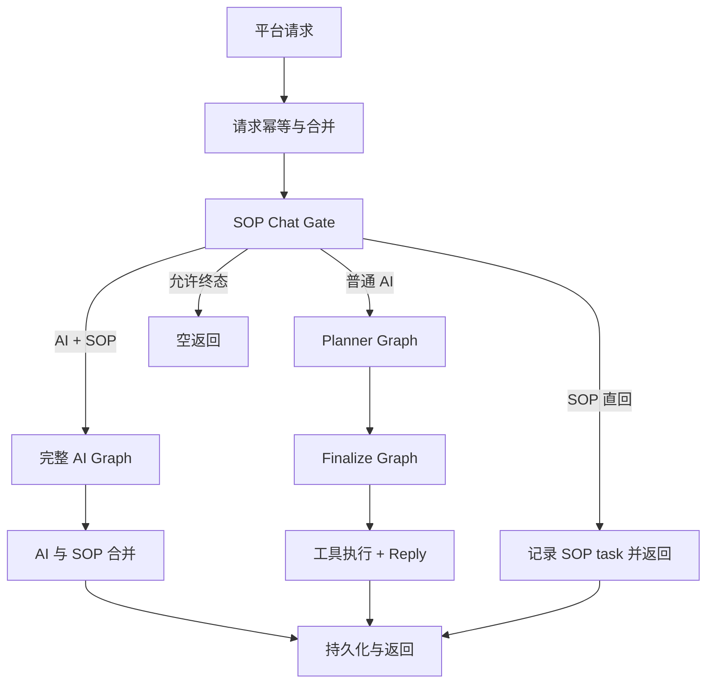
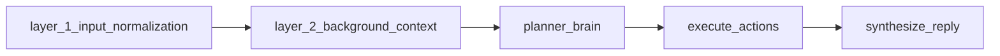
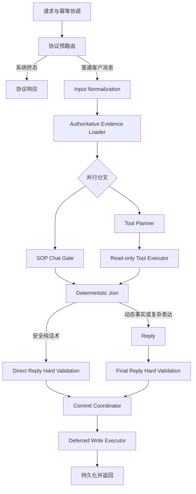

# SOP Chat Gate、Tool Planner、Reply 并行重构方案

## 1. 文档信息

- 当前代码基线：`625061d283a4b18a63c3381e81da918d65da52c2`。
- 实施分支：`codex/reply-chain-refactor`。
- 文档目的：定义普通 AI 回复链路的最新目标架构、节点职责、数据合同、迁移顺序、测试门禁和回滚方式。
- 适用入口：`/reply`、`/reply/workflow-compatible` 及其兼容入口。
- 不直接改动：`/sop/events` 主动触达框架、平台外部协议、支付/门店/订单接口协议、客户可见消息 schema。
- 当前状态：本文件是迁移设计，不表示目标架构已经实现。

## 2. 核心结论

当前主要问题不是业务规则数量本身，而是以下职责同时存在于多个模型节点：

1. Gate、Planner、Reply 都可能重新理解客户当前问题。
2. Planner 同时拥有销售节奏、工具规划、结构动作和客户文案草稿。
3. Reply 会在 Planner 决策之外再次补充动作或追问。
4. 客户画像、旧策略摘要和未完成槽位可能压过最新客户原话。
5. `unknown`、`deferred`、`declined`、`completed` 没有稳定区分，导致反复追问。

目标架构采用：

```text
协议预路由
  -> 一次输入归一
  -> 一次权威事实加载
  -> Gate 与 Tool Planner 并行
  -> 只读工具执行
  -> 确定性 Join
  -> Gate 安全直回或 Reply 最终表达
  -> 硬校验
  -> 延后写操作与状态提交
  -> 返回
```

节点所有权明确分开：

- Gate：匹配 SOP、精准话术和简单场景，生成第一层内容候选并选择路由。
- Tool Planner：规划回答本轮问题所需的最小工具事实。
- Reply：复杂场景的最终业务大脑；结合完整聊天、Gate 内容候选和工具事实，最终判断客户状态、轮次结果、主线动作并生成回复。
- Code：提供事实、执行工具、校验结构、处理幂等、安全和非业务失败。

Gate 不是新的 Planner，也不是全局对话大脑。它可以直接结束的只限于无需动态事实、无需复杂历史判断且结构安全的简单场景。

## 3. 项目宪法

- 模型负责业务语义、客户心理、销售节奏和自然表达。
- 代码负责事实输入、工具调用、schema、幂等、安全边界、重试和非业务兜底。
- 不新增 Python 关键词分支判断普通销售意图、顾虑类型或对话阶段。
- 不因重构删除当前业务规则、活动事实、支付规则、项目范围或门店权限边界。
- 不为了缩短 Prompt 用摘要替代最新真实聊天。
- Join 层不能成为新的业务规则引擎。
- 并行阶段不能投机执行写操作。

## 4. 当前真实代码链路

当前 `ChatRuntime` 先串行运行 SOP Chat Gate，再根据 Gate 结果进入 Planner/Finalize Graph。



当前 Graph：



当前代码已经拆出：

- `planner_graph`：输入归一、背景上下文、Planner。
- `finalize_graph`：工具执行、Reply。
- `full_graph`：完整串行图。

这三个入口可以作为迁移兼容层，不需要重新创建第二套业务运行时。

### 4.1 当前预算

以 `625061d28` 默认配置为准：

| 项目 | 当前值 |
|---|---:|
| 整轮预算强制 | `true` |
| 普通整轮硬上限 | `120s` |
| 强风险整轮硬上限 | `120s` |
| Gate 总预算 | `15s` |
| Planner 总预算 | `35s` |
| Reply 总预算 | `45s` |
| Reply 预留 | `30s` |
| Vision 总预算 | `15s` |
| Planner hedge 延迟 | `10s` |
| 其他模型 hedge 延迟 | `3s` |

并行目标是降低常见场景 P50/P90，不是重新把整轮预算缩回 60 秒。

### 4.2 当前关键风险

- Gate 会在最终路由确认前创建 SOP event/task；SOP 直回时直接标记 `sent`。
- Gate 与背景层分别读取记忆、订单、SOP 进度等信息，事实快照可能不同。
- Planner 仍输出 `payment_decision`、`sales_progression`、`closing_move`、`precision_qa_decision` 和客户文案草稿。
- Reply 仍接收 Planner 草稿和大量重复业务判断字段。
- `execute_actions` 同时容纳只读和写工具，不适合直接提前执行。
- Planner normalizer 对旧 schema 有大量结构保护，不能一次删除。

## 5. 最新上下文原则

### 5.1 完整聊天优先，不使用软画像替代

普通客户聊天通常不长。正式决策上下文优先直接输入全部可获得聊天记录，而不是输入旧模型生成的客户心理摘要。

每条消息必须保留：

```json
{
  "message_ref": "msg_18",
  "sender": "customer | assistant | staff | system",
  "message_type": "text | image | voice | location | store_address | payment_collection | transfer_event",
  "content": "客户可见正文或结构消息摘要",
  "sent_at": "2026-08-06T14:32:10+08:00"
}
```

同时提供：

```json
{
  "current_time": "2026-08-06T15:10:00+08:00",
  "timezone": "Asia/Shanghai"
}
```

时间必须附着在每条消息上，不能只提供当前时间。模型需要据此判断：

- 客户说“在忙”是刚刚还是几天前。
- 客户反复说时间不确定后是否仍应追问。
- 门店卡、案例图、预约金卡是否刚发送。
- 新客户进展是否发生在最近一次主动触达之后。

### 5.2 不进入正式决策上下文的软画像

以下内容不再作为 Gate/Planner 的权威输入：

- `next_sales_strategy`。
- 旧模型推断的客户类型。
- 旧心理总结和旧意向等级。
- 旧 `main_blocker`。
- 旧下一步建议。
- 无消息证据的偏好推断。

Gate 每轮根据完整聊天重新判断当前意向和节奏。

### 5.3 必须保留的权威事实

不能从聊天文字可靠推断的事实必须使用精简结构账本：

```json
{
  "authoritative_facts": {
    "payment": {},
    "orders": {},
    "registration": {},
    "visible_store_scope": {},
    "sop_deliveries": {},
    "structured_messages": {},
    "risk_holds": {}
  }
}
```

必须保留的原因：

- 发过预约金卡不代表已付。
- 文本门店名不能替代真实 `store_id` 和客户可见范围。
- SOP 完成状态、send_once 和发送次数不一定完整出现在平台聊天中。
- 支付截图理解、平台转账事件和订单支付状态属于结构事实。
- 三个月以前订单需要代码按时间窗口规范化。
- 图片 URL 不能独立证明已经发送了有效案例图。

权威事实只描述事实、来源、时间和完整性，不携带销售策略。

### 5.4 长度保护

- 不超过 100 条：全部输入。
- 超过 100 条：最近 80 条完整输入，早期仅保留结构事实和被明确引用的原话。
- 上限是技术保护，不是业务语义截断规则。
- 后续根据真实 token、P50/P90 和效果报告调整。

## 6. 目标架构



### 6.1 协议预路由

代码仅处理确定性协议边界：

- 平台自动开场。
- `sop_platform_task` 原样转发。
- 图片、定位卡、语音和未知结构消息的协议归一。
- 请求幂等、旧请求被新请求覆盖。

协议预路由不能判断普通客户心理或销售阶段。

图片、定位、未知消息当前已绕过旧 SOP Gate。重构后继续保留这一保护：

- Vision 可以获得独立时间预算。
- 不强制让 Gate 在图片理解完成前参与无价值判断。
- 图片理解结果完成后进入统一 evidence，再由需要的模型使用。

## 7. SOP Chat Gate

Gate 是内容匹配和第一层路由节点，不是复杂场景的最终业务大脑。

### 7.1 负责

- 阅读完整带时间聊天，识别客户当前显式问题。
- 判断是否命中 SOP、精准话术或无需工具的简单场景。
- 选择本轮可供 Reply 使用的内容素材。
- 判断路由：安全直回、复杂纯话术、纯工具、话术加工具。
- 声明可能需要的动态事实能力类别，但不生成工具参数。
- 在安全简单场景生成 `direct_reply_candidate`。
- 对 SOP/精准话术匹配引用必要的 `message_ref`。

### 7.2 不负责

- 最终判断客户意向度、心理状态和成交阶段。
- 最终确定 `turn_outcome`、任务状态或 `closing_move`。
- 判断复杂历史中某个槽位是否应该再次追问。
- 生成工具名和工具参数。
- 编造门店、案例、订单、支付、距离或档期事实。
- 执行工具或写数据库。
- 创建 SOP task、更新 send_once 或标记 SOP 已发。

### 7.3 路由类型

| 路由 | 含义 | 后续 |
|---|---|---|
| `direct_text` | 无动态事实、无复杂历史判断的安全纯话术 | 等待 Tool Planner 的 `fact_requirement` 后决定是否直回 |
| `content_only_reply` | 不需要工具，但需要结合复杂历史、客户态度或任务状态 | 内容候选进入 Reply 做最终判断 |
| `tools_only` | 当前没有适合的固定内容，必须依据工具事实回答 | 工具完成后进入 Reply |
| `content_and_tools` | 命中 SOP/精准话术，但仍需实时事实 | 内容候选与工具事实一起进入 Reply |

增加 `content_only_reply` 是保持 Gate 轻量的必要条件。若所有无工具场景都要求 Gate 直回，客户反复延期、复杂软拒绝、历史矛盾等判断仍会被迫回到 Gate，Gate 会再次变成业务大脑。

### 7.4 Gate 直回边界

只有同时满足以下条件才允许 Gate 直回：

- 不需要门店、案例、支付、订单、距离、档期等动态事实。
- 不包含动态结构卡片。
- 不涉及已付、退款、投诉、健康风险等状态冲突。
- 不需要从多轮历史判断客户是否延期、拒绝或已反复回答。
- 场景规则稳定，Gate 候选通过统一硬校验。
- Tool Planner 同轮输出 `fact_requirement=none`。

适合直回的例子：明确年龄准入、固定项目范围、简单人数金额说明、终态礼貌回复。

不适合直回的例子：客户三次表示时间不确定、客户态度反复、门店信任异议、付款状态变化、复杂软拒绝。即使不需要工具，也应进入 Reply 做完整历史判断。

### 7.5 建议输出合同

```json
{
  "current_question": {
    "intent": "visit_time_uncertain",
    "must_answer": true,
    "evidence_refs": ["msg_21"]
  },
  "selected_content": {
    "sop_pack_ids": [],
    "precision_qa_ids": [],
    "simple_scene_id": "visit_time_acknowledgement",
    "usage": "reference"
  },
  "dynamic_fact_expectation": {
    "requirement": "none | optional | required",
    "capability_classes": []
  },
  "route_suggestion": "direct_text | content_only_reply | tools_only | content_and_tools",
  "direct_reply_candidate": [],
  "handoff_notes": ["复杂历史状态由 Reply 最终判断"]
}
```

### 7.6 匹配证据要求

以下 Gate 匹配结论必须引用聊天消息或权威事实来源：

- 客户明确拒绝、延期或不便。
- 当前问题命中了哪个 SOP 或精准话术。
- 当前问题是否明显要求动态事实。
- 直回候选使用了哪些固定业务事实。

Gate 的证据只用于内容匹配和路由，不替代 Reply 对复杂客户状态的最终判断。

## 8. Tool Planner

### 8.1 负责

- 根据当前消息、完整聊天和权威事实判断是否缺少动态事实。
- 选择完成本轮回答所需的最小只读工具集合。
- 生成工具参数、依赖关系和停止条件。
- 声明缺失事实字段和工具失败后的最小反问目标。
- 提出延后写动作建议，但不执行。

### 8.2 不负责

- 输出客户可见文本。
- 判断客户心理、意向或成交理由。
- 选择 SOP、精准话术或主线动作。
- 决定是否继续压预约金。
- 为“可能有用”而查询全部工具。

### 8.3 建议输出合同

```json
{
  "fact_requirement": "none | optional | required",
  "read_tool_calls": [
    {
      "call_id": "store_lookup_1",
      "tool": "customer_store_lookup",
      "arguments": {"query": "洪湖市"},
      "purpose": "获得客户可见范围内真实门店",
      "depends_on": []
    }
  ],
  "required_fact_fields": ["resolved_location", "visible_store_candidates"],
  "stop_conditions": ["获得1至3家完整可见门店"],
  "customer_question_if_incomplete": {
    "required": false,
    "field": "",
    "goal": ""
  },
  "deferred_write_proposals": []
}
```

### 8.4 上下文

Tool Planner 可以读取完整聊天，因为聊天通常较短，但 Prompt 不包含：

- 完整 SOP 正文。
- 真人语气要求。
- 成交心理模板。
- 未选中的精准话术正文。

它只接收工具能力、参数合同、事实边界和必要业务结构事实。

## 9. Read-only Tool Executor

并行阶段只允许白名单只读工具：

| 类别 | 并行阶段 |
|---|---:|
| 门店查询、详情、距离排序 | 允许 |
| 案例查询 | 允许 |
| 订单/支付状态查询 | 允许 |
| 预约记录查询 | 允许 |
| 创建/关联订单 | 禁止 |
| 同步手机号 | 禁止 |
| 创建排期 | 禁止 |
| 真实消息发送 | 禁止 |

统一结果合同：

```json
{
  "tool": "customer_store_lookup",
  "status": "success | partial | empty | ambiguous | error",
  "facts": {},
  "missing_fields": [],
  "conflicts": [],
  "source": "platform_or_snapshot",
  "observed_at": "2026-08-06T15:10:00+08:00",
  "customer_question_needed": {
    "required": false,
    "field": "",
    "goal": ""
  }
}
```

现有 `execute_actions` 不能直接整体提前执行。必须先建立工具注册表，明确 `read_only`、`write`、超时、幂等和依赖属性。

## 10. Deterministic Join

Join 不使用模型，也不判断客户心理。它只汇合两个模型已经输出的结构结果。

| Gate | Tool Planner/Executor | 最终路由 |
|---|---|---|
| `direct_text` | `none`，且场景属于安全直回范围 | 硬校验后直回 |
| `direct_text` | `optional` 且没有动态事实承诺 | 可以直回 |
| `direct_text` | `required` | 否决直回，进入 Reply |
| `content_only_reply` | `none/optional` | 不执行无关工具，进入 Reply |
| `tools_only/content_and_tools` | `success` | 内容候选 + 工具事实进入 Reply |
| `tools_only/content_and_tools` | `partial/ambiguous` | Reply 回答已知部分并最小反问 |
| `tools_only/content_and_tools` | `error` | Reply 使用已有事实，不编造 |
| 任意 | 与已付、风险、投诉等硬边界冲突 | 移除不合法结构动作并进入 repair/Reply |

Planner 声明动态事实 `required` 时，可以否决 Gate 直回；Join 不得通过客户关键词自行增加工具需求。

## 11. Reply

Reply 是复杂场景最终业务大脑。它不是单纯文案渲染器。

### 11.1 输入

- 当前时间和完整带时间聊天。
- Gate 选出的 SOP、精准话术、简单场景候选和路由说明。
- 选中的 SOP/精准话术正文。
- Tool Planner 与只读工具事实。
- 延后写动作结果。
- 当前相关业务事实和硬边界。

### 11.2 负责

1. 根据完整带时间聊天最终理解客户当前意图、意向和明确限制。
2. 区分任务是未知、已知、延期、拒绝、完成还是过期。
3. 选择本轮 `advance/hold/defer/resolve_objection/close` 中唯一结果。
4. 先回答当前问题。
5. 自然融入 Gate 选中的 SOP、精准话术或简单场景候选。
6. 只使用真实工具事实。
7. 决定本轮唯一 `closing_move`；必要时可以为 `none`。
8. 工具事实不足时提出一个最小必要问题。
9. 输出最终 `reply_messages` 和可审计业务判断。

### 11.3 不负责

- 重新决定是否调用工具。
- 重新选择未被 Gate 提供的 SOP 或精准话术。
- 自行追加一个“看起来积极”的追问。
- 使用未选择的其他主线动作。

### 11.4 Reply 轮次结果与任务状态

“回答后推进主线”不是绝对要求。Reply 必须选择以下一种本轮结果：

| 结果 | 含义 |
|---|---|
| `advance` | 当前问题已解决，客户具备进入下一主线的条件 |
| `hold` | 当前顾虑仍需解决，维持当前阶段 |
| `defer` | 客户明确稍后决定、时间待定或当前不便 |
| `resolve_objection` | 当前轮集中解决价格、效果、距离或信任阻力 |
| `close` | 已完成、明确退出、风险暂停或自然结束 |

任务状态：

| 状态 | 含义 | 后续行为 |
|---|---|---|
| `unknown` | 从未询问或没有有效答案 | 必要时可询问 |
| `known` | 客户已经给出有效信息 | 禁止重复询问 |
| `deferred` | 客户明确表示以后确认 | 当前不追问，等待客户新进展 |
| `declined` | 客户拒绝提供或拒绝行动 | 不得换一种说法继续追问 |
| `completed` | 动作已经完成 | 进入后续阶段 |
| `stale` | 旧事实已过有效期 | 仅在当前任务确实需要时重新确认 |

带节奏的定义是“根据客户当前状态选择正确结果”，不是每轮都追问或压单。

### 11.5 建议输出合同

```json
{
  "conversation_decision": {
    "customer_intent": "暂时无法确定到店时间",
    "customer_stance": "已付、愿意到店、时间待定",
    "latest_explicit_constraint": "客户确定后主动联系",
    "evidence_refs": ["msg_18", "msg_21"]
  },
  "task_ledger": [
    {
      "task": "visit_time",
      "status": "deferred",
      "reason": "客户多次表示时间暂时不确定",
      "evidence_refs": ["msg_18", "msg_21"]
    }
  ],
  "turn_outcome": "defer",
  "closing_move": {
    "action": "none",
    "reason": "继续追问会造成机械施压"
  },
  "must_not_repeat": ["ask_visit_time", "send_payment"],
  "reply_messages": [
    {
      "type": "text",
      "content": "没关系亲，到店时间按您方便来，确定后提前跟我说一声就行，我这边已经给您登记好了。"
    }
  ]
}
```

例如 Gate 已输出：

```json
{
  "route_suggestion": "content_only_reply",
  "selected_content": {"simple_scene_id": "visit_time_acknowledgement"},
  "handoff_notes": ["复杂历史状态由 Reply 最终判断"]
}
```

由于该场景依赖多轮历史，Join 应将其交给 Reply。Reply 判断为 `defer` 后可以回复：

> 没关系亲，到店时间按您方便来，确定后提前跟我说一声就行，我这边已经给您登记好了。

不能继续追问：

> 您大概是2点后、3点后，还是4点后方便到店？

## 12. SOP Preview、Commit 与写操作

当前 Gate 会调用 `_record_chat_gate_task()`。目标架构必须拆分：

```text
preview_chat_gate()
  -> 只选择内容和生成候选消息
  -> 不创建 event/task
  -> 不更新 send_once

commit_reply_decision()
  -> 最终路由和消息通过硬校验后调用
  -> 创建或确认 SOP task
  -> 更新发送记录和状态
```

写操作统一延后：

- 创建/关联订单。
- 同步手机号。
- 更新 SOP send_once。
- 记录真实发送。
- 其他平台状态写入。

所有写操作必须幂等，失败不能改变已确认的客户支付事实，也不能导致空回复。

## 13. Validation、Repair 与兜底

### 13.1 硬校验

- JSON/schema 合法。
- 门店卡属于当前客户可见范围。
- 图片来自真实案例事实。
- 同轮最多一个预约金卡。
- 金额、人数和支付状态正确。
- 已付、健康、投诉退款、明确强拒绝和人数上限保护。
- 不编造门店、楼号、档期、支付或订单状态。
- 应回复的客户消息最终不得为空。

### 13.2 软质量

- 真人感。
- 重复表达。
- 消息拆分节奏。
- SOP 过渡自然度。
- 主线动作表达质量。

软问题产生 warning 或针对性 repair hint，不能直接清空回复。

### 13.3 Repair

1. Gate schema/证据错误：Gate repair 一次。
2. Tool Planner schema/参数错误：Tool Planner repair 一次。
3. Reply 硬错误：Reply repair 一次。
4. 预算不足时优先保证 Reply。
5. 所有模型恢复失败后才输出统一非业务兜底。

## 14. 模型上下文分层

### 14.1 Gate

| 板块 | 目的 |
|---|---|
| 角色与职责 | 内容匹配和第一层路由，不做复杂最终决策 |
| 项目宪法 | 防止越权和代码语义回流 |
| 当前时间与完整聊天 | 识别当前显式问题和可用内容 |
| 权威事实账本 | 避免直回候选使用错误事实 |
| SOP 主线与进度 | 选择 SOP 内容候选，不最终决定复杂节奏 |
| 候选 SOP 与精准话术 | 选择内容，不加载无关全文 |
| 工具能力目录 | 声明动态事实类别，不含参数 schema |
| 输出 schema | 形成可审计对话理解 |

### 14.2 Tool Planner

| 板块 | 目的 |
|---|---|
| 最小工具原则 | 禁止全量查询 |
| 当前时间与完整聊天 | 理解指代和客户当前事实需求 |
| 权威事实账本 | 避免重复查询和错误工具 |
| 完整工具地图 | 生成合法参数和依赖 |
| 输出 schema | 稳定工具计划 |

### 14.3 Reply

| 板块 | 目的 |
|---|---|
| 表达角色 | 真人微信表达 |
| 当前时间与完整聊天 | 精准承接，不重复追问 |
| Gate 内容候选 | 融合已选 SOP、精准话术或简单场景 |
| 选中内容 | 融合 SOP/精准话术 |
| 工具事实 | 只使用权威动态事实 |
| 相关业务事实 | 保持口径一致 |
| 输出 schema | 生成合法消息 |

## 15. 并行与预算

```mermaid
gantt
    title 目标并行耗时示意
    dateFormat X
    axisFormat %S
    section 准备
    输入归一和事实加载 :0, 4
    section Gate
    SOP Chat Gate :4, 14
    section Planner
    Tool Planner :4, 16
    只读工具 :16, 22
    section 汇合
    Join :22, 23
    Reply :23, 33
```



注意：

- 并行不会自动提升效果，只减少可重叠等待。
- Gate 和 Tool Planner 的 hedge/retry 都计入供应商全局并发。
- 已经发出的模型请求无法保证底层取消，只能丢弃结果并记录浪费。
- Gate 安全直回时，可以取消尚未开始的工具调用。
- 保留至少 30 秒 Reply 预算，以当前线上配置为准。
- 若 shadow 测试 P90 改善不足 15%，不扩大并行上线。

## 16. 代码改动范围

| 模块 | 目标 | 风险 |
|---|---|---:|
| `chat_runtime.py` | 共享准备、并行编排、Join、commit | 高 |
| `graph_builder.py` | 暴露 prepare/tool/finalize 可调用阶段 | 高 |
| `graph/state.py` | 新 evidence、Gate content candidate、Tool plan、Join 字段 | 中 |
| `sop_execution_service.py` | Gate preview/commit 分离 | 高 |
| `prompts/sop_chat_gate.py` | 内容匹配与第一层路由新合同 | 高 |
| `planner/brain_v2.py` | Tool Planner 化 | 高 |
| `planner/brain_v2_prompts.py` | 删除销售文案职责，保留工具合同 | 高 |
| `planner/brain_v2_normalizer.py` | 新 Tool Plan 到旧 required_tools 的兼容层 | 高 |
| `action_nodes.py` | 只读/写工具注册与执行分层 | 中高 |
| `reply_context.py` | 改为 Gate 内容候选 + facts + 完整聊天 | 高 |
| `reply_nodes.py` | 不再依赖 Planner 客户草稿 | 高 |
| `reply_validation.py` | Gate/Reply 共用硬校验 | 中 |
| `model_client.py` | 并发、取消、浪费调用观测 | 中 |
| `config.py` | Shadow、灰度和回滚开关 | 低 |
| `simulation/*` | 新旧链路离线对比 | 中 |

## 17. 业务规则防丢失与代码 Review 安排

### 17.1 规则迁移台账

重构开始前必须建立 `rule_ownership_matrix`。当前每条有效规则至少记录：

| 字段 | 含义 |
|---|---|
| `rule_id` | 稳定规则 ID |
| `source` | 当前代码、Prompt、配置或测试位置 |
| `business_meaning` | 业务含义，不复制实现细节 |
| `current_owner` | 当前 Gate/Planner/Reply/Code |
| `target_owner` | 目标节点 |
| `fact_dependencies` | 依赖的权威事实 |
| `hard_or_soft` | 硬事实/安全边界或软销售策略 |
| `migration_status` | active/mapped/shadowed/migrated/superseded |
| `regression_tests` | 对应测试 ID |
| `review_notes` | 冲突和审核结论 |

规则迁移要求：

- 没有稳定 `rule_id` 和目标所有者的规则不得删除。
- 旧规则与新规则冲突时必须单独列出，不能在架构重构提交中顺手改业务口径。
- `superseded` 只用于已有明确业务结论，不得用来隐藏遗漏。
- Prompt 中删除一句规则前，必须确认该规则已存在于目标 Prompt、权威配置或代码硬边界，并有回归测试。
- 精简只能合并重复表达，不能删除唯一语义。

### 17.2 基线快照

阶段 0 生成并保存：

- 当前 Gate、Planner、Reply 实际 system/user messages。
- 当前业务规则和精准话术 ID 清单。
- 当前 Planner schema、normalizer violation 和工具参数合同。
- 关键场景原始输入、节点输出、最终回复和工具调用。
- 当前全量确定性测试结果。
- 当前离线仿真通过率、P50/P90、fallback、retry 和硬错误。

后续每阶段必须与同一基线场景比较，不得只看新测试通过。

### 17.3 提交边界

每个阶段一个独立提交，遵循以下顺序：

1. 新数据结构或 shadow 逻辑。
2. 对应确定性测试。
3. 单节点模型测试夹具。
4. 对比报告。
5. 旧消费者切换。
6. 最后才删除旧字段。

同一个提交禁止同时完成“大量代码搬迁 + Prompt 业务改写 + 删除旧测试”。代码搬迁和行为变化必须分开，便于逐提交审查和回滚。

### 17.4 每阶段两轮 Review

第一轮：结构与项目宪法 Review。

- 是否新增了 Python 关键词业务分支。
- 是否让 Join 或 Tool Planner 接管客户心理。
- 是否提前执行写操作。
- 是否改变外部协议、消息 schema 或持久化边界。
- 是否仍以 `corp_id + wechat + customer_id/external_userid` 隔离销售接触。
- 是否保留当前支付、门店、已付、风险和 SOP 硬边界。

第二轮：业务效果与规则完整性 Review。

- `rule_ownership_matrix` 是否所有 active 规则都有目标所有者。
- 删除的 Prompt 内容是否有迁移位置和测试。
- 完整聊天、消息时间和权威事实是否真实进入模型 messages。
- Gate 是否越权判断复杂客户心理。
- Planner 是否仍输出客户文案或成交动作。
- Reply 是否能处理推进、停留、延期、异议和结束，而不是机械推进。
- 新旧输出差异是否属于预期，是否存在业务口径变化。

建议每个高风险阶段由另一个 Codex 窗口对提交 hash 做只读独立 review。Review 结果先列 findings，再决定是否进入下一阶段。

### 17.5 Review 门禁

出现以下任一情况立即停止迁移：

- 有 active 规则没有目标所有者。
- 新链路恢复旧版订单发卡前置、旧退款口径或过期预约流程。
- Gate、Planner、Reply 两个以上节点同时拥有最终 `closing_move`。
- Tool Planner 输出客户可见文案。
- Reply 没有获得完整带时间聊天。
- Shadow 路径产生数据库写入、SOP task 或真实发送。
- 关键场景出现不可见门店、重复卡、已付后发卡、健康风险推进或空回复。

## 18. 迁移阶段

每阶段独立提交、测试和回滚。

### 阶段 0：基线

- 固化当前全量测试。
- 记录 Gate、Planner、工具、Reply 输入输出。
- 记录 P50/P90、token、retry、hedge、中性兜底和硬错误。

### 阶段 1：完整聊天与 Authority Snapshot Shadow

- 建立规范化带时间聊天合同。
- 移除正式 shadow 输入中的软画像策略。
- 生成权威事实账本，不改变现有模型输入。
- 与当前 `layer_2_background_context` 逐字段对比。

### 阶段 2：Gate Preview/Commit 分离

- Gate 只预览。
- 最终消息通过校验后再记录 SOP task/send_once。
- 保持旧串行路由，先解决状态污染风险。

### 阶段 3：Gate Content Router Schema Shadow

- 新增 SOP/精准话术/简单场景候选、四类路由、证据引用和动态事实能力声明。
- 旧 Gate 仍负责线上结果。
- 检查内容命中率、直回边界和工具场景漏判率。

### 阶段 4：Tool Planner Schema Shadow

- Planner 仅输出工具计划。
- 新 Tool Plan 映射到旧 `required_tools`。
- 旧 Planner 继续驱动线上回复。

### 阶段 5：并行 Shadow

- Gate 与 Tool Planner 使用同一事实快照并行。
- 不发送、不写状态，只记录冲突率和理论节省时间。

### 阶段 6：只读工具提前执行

- 建立只读工具白名单。
- Tool Planner 完成后提前执行只读工具。
- 写工具仍走旧路径。

### 阶段 7：Gate 安全直回

- 仅 `route=direct_text`、`fact_requirement=none`、无复杂历史、无动态结构消息、无风险冲突时直回。
- 必须通过统一硬校验。

### 阶段 8：新 Join + Reply 输入

- Reply 使用 Gate 内容候选 + Tool facts + 完整聊天。
- 停止传 Planner 客户文案草稿。
- Reply 正式接管复杂场景的客户状态、轮次结果和唯一主线动作。

### 阶段 9：Reply 业务所有权切换

- 将 `payment_decision`、`sales_progression`、`closing_move`、复杂任务状态迁移到 Reply 合同。
- 旧 Planner 业务字段保持 shadow 对比，不立即删除。
- 对比新旧决策，逐条审核差异和证据引用。

### 阶段 10：写工具分离与旧字段清理

- 启用 deferred write executor。
- 删除无消费者的 Planner 业务字段。
- 最后清理旧 Prompt 和 normalizer 兼容逻辑。

## 19. 测试节点与执行步骤

测试必须按节点逐层扩大，不能直接用全链路高通过率掩盖单节点错误。

### 19.1 T0：合同与隔离测试

- 完整聊天消息包含 `message_ref/sender/message_type/content/sent_at`。
- 当前时间和时区存在。
- Authority Snapshot 不包含软销售策略。
- Shadow 不写数据库、不创建 SOP task、不发送消息。
- 新 schema 可序列化、可 repair、可回滚。

通过标准：100%，否则不进入模型测试。

### 19.2 T1：Gate 单节点

覆盖：

- 正常 SOP 命中。
- 精准话术命中。
- 简单固定场景直回。
- 复杂纯话术必须 `content_only_reply`。
- 门店、案例、支付、订单等工具场景。
- SOP 与工具同时需要的场景。
- 客户反复延期、软拒绝、信任异议不得被错误直回。

检查：内容选择准确、路由准确、无工具参数、无最终客户心理和主线决策。

### 19.3 T2：Tool Planner 单节点

覆盖门店、案例、订单、支付、距离、预约记录、工具空结果和歧义。

检查：

- 最小工具集合。
- 参数合法。
- 不查询无关工具。
- 不输出 SOP、客户话术、成交动作或心理判断。
- 只读/写工具分类正确。

### 19.4 T3：Read-only Tool Executor

- 每个只读工具 success/partial/empty/ambiguous/error。
- 工具并发、依赖、超时和停止条件。
- 客户可见门店权限。
- 不执行任何写工具。
- 输出统一事实合同。

### 19.5 T4：Join 确定性测试

覆盖完整决策矩阵：

- `direct_text + none`。
- `direct_text + required` 否决直回。
- `content_only_reply`。
- `tools_only`。
- `content_and_tools`。
- 工具 partial/ambiguous/error。
- 已付、风险、投诉等硬冲突。

Join 测试必须 100%，因为它不依赖模型随机性。

### 19.6 T5：Reply 单节点

输入完整聊天、Gate 候选和模拟工具事实，重点覆盖：

- 当前问题先回答。
- SOP/精准话术自然融合。
- `advance/hold/defer/resolve_objection/close`。
- `unknown/known/deferred/declined/completed/stale`。
- 已回答或延期信息不重复询问。
- 工具不足时只问一个必要问题。
- 最后一个动作符合当前客户意向，不机械推进。

关键轨迹每条运行 5 次，必须 5/5；普通轨迹至少 3 次中 2 次通过。

### 19.7 T6：并行组合测试

- Gate 先完成、Planner 先完成、同时完成。
- Gate repair、Planner repair、单分支超时。
- Planner required 否决 Gate 直回。
- 取消尚未开始的工具或模型任务。
- 记录浪费调用和全局并发。

### 19.8 T7：离线全链路仿真

- 使用生产 Graph、Prompt、Normalizer、Validation 和业务配置。
- 平台、数据库、发送、支付和订单全部使用仿真适配器。
- 普通场景运行 3 次，关键场景运行 5 次。
- 对比旧链路和新链路的逐轮回复、节点决策、工具调用和状态变化。

### 19.9 T8：Shadow 对比

- 线上仍使用旧链路返回。
- 新链路只计算，不写状态、不发送。
- 报告业务决策差异、规则覆盖、P50/P90、token、retry、hedge 和冲突率。
- P90 改善不足 15% 或效果下降超过 2 个百分点时停止灰度。

### 19.10 T9：隔离测试客户 Smoke

只有 T0-T8 全部通过后执行：

- SOP、精准问答、门店工具、案例图、预约金、已付登记、风险、重复消息和超时恢复。
- 验证外部接口、持久化、send_once、卡片结构和日志。
- 不使用真实生产客户。

## 20. 效果衡量

### 20.1 不能只测“有没有推进”

每轮至少评估：

1. 当前问题是否准确回答。
2. 是否违反客户最新明确表态。
3. 是否重复询问已回答、延期或拒绝的信息。
4. 本轮是否适合推进。
5. 推进动作是否属于正确阶段。
6. 主要语义判断是否有消息证据。
7. 不推进时是否属于合理停留，而不是被动遗漏。
8. 回复是否自然且只包含一个主线动作。

### 20.2 关键多轮轨迹

- 已付 -> 收姓名电话 -> 三次表示时间未定 -> 普通确认。
- 门店已发 -> 客户问价格 -> 不重复问门店。
- 客户说在工作 -> 销售确认稍后联系 -> 主动事件保护。
- 客户明确不要 -> 不换一种说法继续催付。
- 客户软拒绝距离 -> 解决距离心理后合理推进或停留。
- 客户已经回答斑点时长 -> 不继续问形成原因和稳定加重。
- 当前问题切换到付款 -> 不继续旧斑点问诊。

“已付且时间多次不确定”验收：

- 不重复发卡。
- 不重复收姓名电话。
- 不继续追问具体几点。
- 明确认可客户之后主动联系。
- 自然结束当前轮。

### 20.3 门禁

- 硬错误为 0。
- 总体语义通过率不低于 90%。
- 门店、支付、已付、风险、SOP 主线关键场景全部通过。
- 新链路不得低于当前基线 2 个百分点。
- 普通回复不得为空。
- 正常业务不得进入中性兜底。
- P90 相对旧串行至少改善 15%，否则停止扩大并行。

## 21. 配置与回滚

建议新增：

```text
PARALLEL_GATE_PLANNER_ENABLED=false
PARALLEL_GATE_PLANNER_SHADOW=true
SOP_CHAT_GATE_V2_ENABLED=false
TOOL_PLANNER_V2_ENABLED=false
GATE_DIRECT_REPLY_ENABLED=false
READ_TOOL_EARLY_EXECUTION_ENABLED=false
DEFERRED_WRITE_EXECUTION_ENABLED=false
```

保留旧串行入口：

```python
if settings.parallel_gate_planner_enabled:
    return await run_parallel_reply_chain(...)
return await run_legacy_serial_reply_chain(...)
```

回滚不依赖恢复数据库：

- Shadow 不写客户状态。
- Gate preview 不创建 SOP task。
- Commit 前不执行写工具。
- 所有写工具保持幂等。
- 架构提交与业务规则提交分离。

## 22. 明确不在本次范围

- 不修改活动价格、预约金、退款、项目范围和门店推荐口径。
- 不改变外部平台请求和响应 schema。
- 不把 `/sop/events` 主动触达并入普通回复并行图。
- 不新增关键词业务分支。
- 不为 Prompt 缩短删除唯一业务规则。
- 不恢复软画像作为权威决策输入。
- 不在并行阶段执行开单、排期、同步手机号或真实发送。
- 不自动部署或向真实客户发送消息。

## 23. 最终验收标准

1. Gate 只拥有内容匹配和第一层路由，不是复杂业务大脑。
2. Tool Planner 不输出客户话术、不决定客户心理和主线。
3. Reply 是复杂场景最终业务大脑，拥有最终轮次结果和唯一主线动作。
4. 三个节点使用同一份带时间完整聊天和权威事实快照。
5. 软画像不再覆盖客户最新原话。
6. `unknown/known/deferred/declined/completed/stale` 能稳定区分。
7. Gate 内容匹配和 Reply 关键语义判断可以追溯到 `message_ref` 或权威事实来源。
8. 动态事实必须来自工具，Planner required 可以否决 Gate 直回。
9. 并行阶段不执行写工具。
10. SOP preview 不污染 task、send_once 和进度。
11. 全量仿真硬错误为 0，关键场景全部通过。
12. 新链路效果不低于旧基线，且并行有可量化收益。
13. 单一配置可以立即回到旧串行链路。

14. `rule_ownership_matrix` 中不存在未映射的 active 规则。
15. 每个高风险阶段完成两轮 review 并保留审核记录。

## 24. 推荐实施顺序

```text
基线
-> 完整带时间聊天 + Authority Snapshot shadow
-> Gate preview/commit 分离
-> Gate Content Router schema shadow
-> Tool Planner schema shadow
-> Gate/Planner 并行 shadow
-> 只读工具提前执行
-> Gate 安全直回
-> Reply 输入切换
-> Reply 业务所有权切换
-> 写工具分离
-> 清理旧 Planner 字段
```

阶段 2、阶段 7 和阶段 8 风险最高，必须分别提交和分别验证，不能合并上线。
