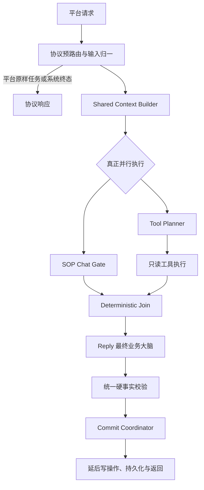

# Reply Chain 并行重构方案

## 1. 背景

当前生产链路仍是串行结构：SOP Chat Gate 先判断，随后旧 Planner 同时处理工具规划、业务策略和回复草稿，最后 Reply 再生成客户可见内容。长期问题包括：

- Gate、Planner、Reply 重复理解同一段对话，职责重叠。
- Planner 既查事实又判断心理和成交节奏，输出容易过度约束 Reply。
- 最新客户原话可能被画像、历史事件或旧策略摘要压过。
- “每轮都回主线”等默认策略被执行成硬命令，导致客户已说明时间不确定、正在忙或质疑门店时仍被机械追问。
- 串行模型调用放大总耗时。

本次重构不是增加更多规则和保护层，而是减少重复决策，让一个模型拥有最终业务判断权。

## 2. 重构目的

1. SOP Chat Gate 与 Tool Planner 基于同一份上下文真正并行运行，降低等待时间。
2. Gate 只匹配可用话术和给出路由建议，不成为新的业务大脑。
3. Tool Planner 只决定需要哪些只读事实，不输出客户话术，不判断客户心理。
4. Reply 统一理解完整聊天、客户当前状态、话术候选和工具事实，负责最终回复与销售节奏。
5. 代码只负责数据清洗、事实、工具、结构、安全、幂等、重试和失败恢复。
6. 完整迁移主分支现有业务事实与能力，不恢复已经废弃的旧规则。

## 3. 非目标

- 不新增 LangGraph 业务节点来分散语义判断。
- 不新增 Python 关键词分支判断普通客户意图、心理、顾虑或是否推进。
- 不把客户画像和旧模型策略作为权威结论。
- 不改变平台、门店、支付、订单和 SOP 外部协议。
- 不在该开发分支部署生产或发送真实客户消息。

## 4. 项目宪法

- 模型负责：业务语义、客户心理、意向变化、销售节奏、主线选择和自然表达。
- 代码负责：事实输入、工具调用、schema、客户可见门店、金额、已付状态、风险硬边界、幂等、重试和非业务兜底。
- Join 只合并证据，不能生成业务话术或决定成交动作。
- 普通策略错误优先修 Prompt、完整聊天、事实输入和模型选择，不能增加 Python 关键词分支。

## 5. 目标架构

这里的“并行”必须是两个独立模型任务同时启动，例如 `asyncio.gather()`；不能在旧 Planner 完成后再把同一结果包装成两个分支。

## 6. 统一上下文

Gate、Tool Planner 和 Reply 使用同一份不可变基础上下文：

- 当前消息原文、消息类型和时间。
- 可获得的完整聊天记录，每条带发送方、消息类型和时间。
- 当前北京时间和时区。
- 权威订单、支付、登记、门店范围、SOP 发送、结构消息和风险事实。
- 当前业务规则版本及按层级渲染的规则。

事实优先级：当前客户消息 > 本轮工具事实 > 近期真实聊天 > 结构发送记录 > 低置信背景信息。

不作为权威输入：旧 `next_sales_strategy`、旧客户类型、旧心理总结、旧意向等级、无原话证据的偏好和下一步建议。

聊天不多时全部输入；超过技术上限时保留最近完整消息和被引用的早期原话，不能用旧画像摘要替代当前对话。

## 7. 节点职责

### 7.1 SOP Chat Gate

负责：

- 匹配 SOP、精准回复和简单静态话术素材。
- 输出内容候选、证据引用和路由建议。
- 判断候选内容是否需要动态事实能力，但不生成工具参数。

不负责：

- 最终客户心理、成交阶段、主线动作和回复语气。
- 门店、支付、订单、案例等工具参数。
- 创建 SOP task、更新 send_once、持久化或发送。

输出路由建议：

- `content_only_reply`：有话术素材，但需要 Reply 理解历史后表达。
- `tools_only`：需要动态事实，没有固定话术素材。
- `content_and_tools`：同时需要话术素材和动态事实。

当前实现不启用 Gate 直回。所有候选都进入 Reply，避免静态文本绕过完整历史、当前事实和最终业务判断。若未来恢复窄直回，必须单独通过行为门禁，不能由 Gate 自行发送。

预约卡点采用固定的“索引识别、Reply 回答”边界：Gate 只接收去重后的 `scene_id/applicable_scene`，命中后输出候选 `selected_scene_id`，不接收完整候选话术，也不能根据场景名自行生成回复。预约卡点本身不属于 Gate 可直回内容；没有独立 SOP 时进入 `content_only_reply`，同时还需要事实时进入 `content_and_tools`。完整候选仅在 Reply 输入中按命中场景加载，由 Reply 结合最新消息和完整聊天决定是否采用、采用哪一个思路以及压单强度。

### 7.2 Tool Planner

负责：

- 判断当前回复缺少哪些动态事实。
- 生成最小只读工具计划、参数、依赖、停止条件和缺失字段。
- 在事实无法补齐时描述 Reply 最小反问所需的信息。

不负责：

- 客户可见话术。
- SOP 或精准话术选择。
- 客户心理、成交理由、是否压单、是否回主线。
- 写操作。

允许的并行只读能力包括门店查询与详情、距离排序、案例查询、订单和支付状态查询。开单、同步手机号、排客和发送必须延后。

### 7.3 Deterministic Join

只做：

- 合并 Gate 候选、Tool Planner 结果、只读工具事实和权威事实。
- 标记事实缺失、来源冲突和路由条件。
- 生成 Reply 的结构化输入。

禁止：生成客户文案、选择心理策略、判断成交动作、修改工具事实。

### 7.4 Reply

Reply 是复杂场景唯一最终业务大脑，负责：

- 优先准确回答客户当前问题。
- 结合完整历史判断客户刚刚的真实意向和是否已经反复表达同一信息。
- 判断默认主线策略本轮是否适用。
- 必要时选择一个自然的下一动作，也可以在上下文不适合时暂停推进。
- 使用 Gate 话术作为素材而非必须原样拼接。
- 复核 Gate 命中的预约卡点是否仍符合最新上下文；预约卡点候选只作表达和销售思路参考，最多采用一个，不替代付款、门店、订单、健康或投诉事实。
- 只使用权威事实生成最终文字和结构消息。

### 7.5 Commit Coordinator

只在最终硬校验通过后执行：

- 客户可见消息持久化。
- SOP/send_once 记录。
- 发送计数和必要记忆记录。
- 已批准的延后写工具。

写失败不能倒推修改模型语义，也不能伪造已完成事实。

## 8. 规则分层

- `hard_law`：绝对边界，可由代码硬校验，例如可见门店、金额、已付禁卡、健康和投诉禁卡、同轮最多一张预约金卡、非空回复。
- `business_fact`：权威业务事实，模型不能说反，但可判断本轮是否需要提及。
- `strong_default`：通常应遵循，例如答疑后自然推进一个动作；客户当前上下文冲突时可以暂停或调整。
- `playbook`：表达参考，不触发硬失败。
- `deprecated`：废弃规则，只保留迁移审计，不进入 Prompt。

“回答后推进主线”“门店后带斑点问题”“精准回答后必须有动作句”属于 `strong_default`，不能升级为代码硬规则。

## 9. 必须保留的业务边界

- 每位 10 元预约金，活动总价和尾款按当前业务配置；活动铺垫完成后可发卡，订单不是前置。
- 已付后收姓名、电话和到店意向，不重复发卡；普通流程保持 `registration_only`。
- 门店卡只能来自当前客户可见范围；候选 1 到 3 家可全部发送，超过 3 家再补区域。
- 无近期真实案例图发送证据时，客户问效果应查询并发送真实案例。
- 当前健康风险、投诉退款、明确强拒付和人数超限遵守硬边界。
- 三个月外历史订单不能永久把客户当成当前已付。
- 不编造门店、距离、案例、订单、支付、档期、接待人或到店指引。

完整清单以 `docs/rule_ownership_matrix.md` 和当前业务配置为准。

## 10. 实施阶段

1. 清理旧伪 Shadow 和重复审计，恢复可理解的基线。
2. 固化规则归属矩阵和主分支功能差异清单。
3. 实现 Shared Context Builder 及上下文合同测试。
4. 实现 Gate 与 Tool Planner 的独立输出 schema 和单节点测试。
5. 在真实 Graph 中并行启动两个节点，并执行只读工具。
6. 实现纯确定性 Join，增加禁止业务语义的静态审查。
7. 调整 Reply 输入，让 Reply 使用完整上下文、内容候选和工具事实。
8. 实现 Commit Coordinator，统一延后写操作和持久化。
9. 运行全量回归、三模型矩阵和离线全链路仿真。
10. 人工审核客户可见回复后，才讨论合并 `main`；本分支不部署。

每个阶段两轮 review：

- 结构 review：职责、依赖、并发、失败路径和写操作边界。
- 业务保护 review：规则矩阵是否遗漏、回复效果是否退化、代码是否越权。

## 11. 测试节点

- T0：规则矩阵、Prompt 合同、UTF-8 和 secret scan。
- T1：Shared Context 完整聊天、时间和权威事实测试。
- T2：Gate 内容选择与窄直回边界测试。
- T3：Tool Planner 工具计划与零客户话术测试。
- T4：Join 确定性和零业务决策测试。
- T5：Reply 当前问题、历史承接、主线节奏和真人感测试。
- T6：真实并行、超时、取消和分支隔离测试。
- T7：离线全链路仿真，禁止生产写入和发送。
- T8：模型效果与速度矩阵，报告硬错误、语义通过率、P50 和 P90。
- T9：与最新 `main` 的功能和业务规则对比。

验收门槛：硬错误为 0；关键场景全部通过；总体语义通过率不低于 90%；不得低于主分支基线；无空回复、不可见门店、金额错误、重复卡和事实编造。

## 12. 当前状态

- 当前分支已同步最新主分支业务改动，并保留规则分层、业务修复、仿真和模型矩阵工具。
- 旧 Shadow 只是在串行 Planner 后包装旧输出，不是真并行，也不能证明新链路效果，已从开发基线移除。
- 目标运行时已经落入真实 Graph：Shared Context 一次构建，Gate 与 Tool Planner 通过 `asyncio.gather()` 同时启动，Tool Planner 只规划只读工具，Join 只合并证据，Reply 生成唯一客户可见回复，Commit 在硬校验通过后执行。
- Shared Context 已包含完整带时间聊天、权威订单与支付、客户可见门店、SOP 进度、发送事实、内容索引和分层规则；旧画像销售建议及代码派生阶段不进入新链路。
- Gate 当前只提供 SOP、精准回复和预约卡点候选，不直回；Tool Planner 不输出客户话术或销售动作；Join 不产生业务决策。
- 全量确定性回归已通过。真实模型全量仿真及人工回复审核仍是当前行为切换门禁，因此本分支仍不能描述为“可上线”，也不合并或部署。
