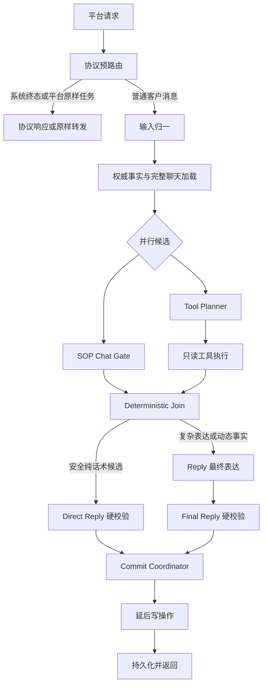
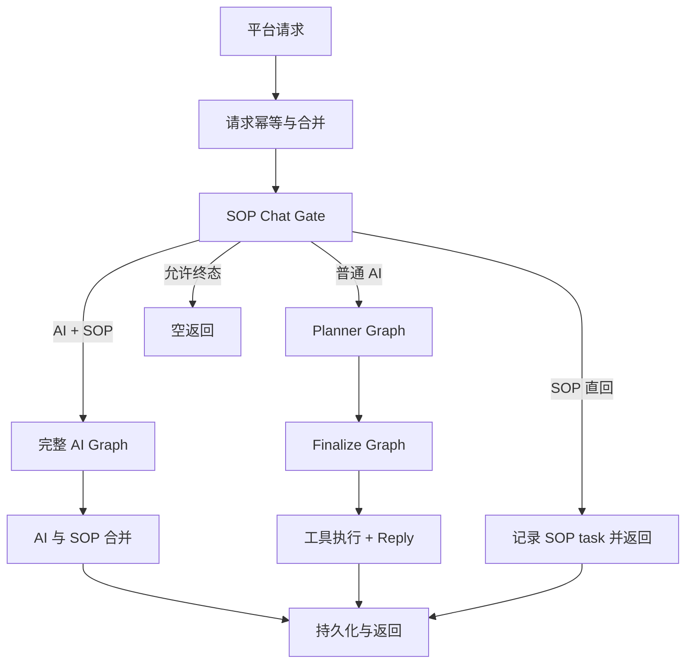

# SOP Chat Gate、Tool Planner、Reply 并行重构方案

## 1. 文档信息

- 基线：`main@625061d28` 之后的 `codex/reply-chain-refactor` 分支。
- 禁止事项：不得提交到 `main`，不得部署，不得主动发送真实客户消息。
- 适用入口：普通 AI 回复链路，包括 `/reply`、`/reply/workflow-compatible` 及兼容入口。
- 不直接改动：`/sop/events` 主动触达框架、平台外部协议、支付/门店/订单接口协议、客户可见消息 schema。
- 当前状态：本文是迁移设计和 review 合同，不代表目标链路已经启用。

## 2. 背景与核心问题

线上问题不是单条业务规则缺失，而是职责边界混杂：

1. Gate、Planner、Reply 都可能重新理解客户当前问题。
2. Planner 同时承载工具规划、成交节奏、客户心理、主线推进和客户可见草稿。
3. Reply 在 Planner 之外又补动作，导致历史承接和当前意图不稳定。
4. 客户画像、历史事件和旧策略摘要有时压过最新聊天原话。
5. “回答当前问题后带一个主线动作”过于粗糙，容易在客户反复表示时间不确定、正在忙、明确拒绝或存在健康风险时机械追问。

重构目标不是让 Gate 变成新的大脑，也不是让 Planner 继续决定客户心理，而是：

- 一次构建完整带时间聊天和权威事实。
- SOP Chat Gate 和 Tool Planner 并行，各自只做边界内判断。
- Reply 作为复杂场景最终业务大脑，基于完整聊天、Gate 候选和工具事实做最终表达。
- 代码只保留事实、工具、schema、幂等、重试、安全边界和非业务兜底。

## 3. 项目宪法

- 模型负责业务语义、客户心理、销售节奏和自然表达。
- 代码负责事实输入、工具调用、schema、幂等、安全边界、重试和非业务兜底。
- 不新增 Python 关键词分支判断普通销售意图、顾虑类型或对话阶段。
- 不因重构删除当前业务规则、活动事实、支付规则、项目范围或门店权限边界。
- 不为了缩短 prompt 用摘要替代最新真实聊天。
- Join 层不能成为新的业务规则引擎。
- 并行阶段不能投机执行写操作。

## 4. 目标架构



关键边界：

- Gate 不是新的 Planner。
- Gate 不是最终表达大脑。
- Tool Planner 不输出客户话术。
- Tool Planner 不判断客户心理、成交节奏或主线动作。
- Reply 是复杂场景最终业务大脑。
- Reply 负责最终客户可见回复、复杂历史理解、客户当前意向、单一主线动作和语气。
- Join 只做确定性汇总与路由，不生成业务话术。

## 5. 当前代码链路

当前 `ChatRuntime` 仍是串行主链：



已存在 shadow/audit 组件：

- `chat_gate_router_shadow`
- `tool_plan_preview`
- `read_only_tool_executor_shadow`
- `reply_chain_join_shadow`
- `reply_final_brain_handoff_shadow`
- `parallel_reply_chain_shadow`
- `parallel_gate_planner_runner_shadow`
- `parallel_reply_chain_comparison`
- `reply_chain_commit_shadow`
- `parallel_reply_chain_diagnostics`
- `reply_chain_shadow_bundle_audit`
- `reply_chain_behavior_switch_guard`

本轮重构必须先通过 shadow 和诊断推进，不直接切换生产行为。

## 6. 统一上下文原则

### 6.1 完整聊天优先

普通客户聊天通常不长。正式决策上下文优先输入完整可获得聊天记录，而不是旧画像生成的客户心理摘要。

每条消息至少保留：

```json
{
  "message_ref": "msg_18",
  "sender": "customer | assistant | staff | system",
  "message_type": "text | image | voice | location | store_address | payment_collection | transfer_event",
  "content": "客户可见正文或结构消息摘要",
  "sent_at": "2026-08-06T14:32:10+08:00"
}
```

同时提供：

```json
{
  "current_time": "2026-08-06T15:10:00+08:00",
  "timezone": "Asia/Shanghai"
}
```

时间必须附着在每条消息上。模型需要判断客户说“在忙”“先不定”“时间不确定”是刚刚发生还是几天前；也要判断门店卡、案例图、预约金卡是否刚发送。

### 6.2 不进入正式决策的软画像

以下内容不作 Gate/Tool Planner/Reply 的权威输入：

- `next_sales_strategy`
- 旧模型推断的客户类型
- 旧心理总结
- 旧意向等级
- 旧 `main_blocker`
- 旧下一步建议
- 没有消息证据的偏好推断

这些内容最多作为后台分析材料，不允许压过最新聊天。

### 6.3 必须保留的权威事实

不能从聊天文字可靠推断的事实，必须使用结构账本：

```json
{
  "authoritative_facts": {
    "payment": {},
    "orders": {},
    "registration": {},
    "visible_store_scope": {},
    "sop_deliveries": {},
    "structured_messages": {},
    "risk_holds": {}
  }
}
```

原因：

- 发过预约金卡不代表已付。
- 文本门店名不能替代真实 `store_id` 和客户可见范围。
- SOP 完成状态、send_once 和发送次数不一定完整出现在聊天里。
- 支付截图理解、平台转账事件和订单支付状态属于结构事实。
- 三个月以前订单需要代码按时间窗口规范化。
- 图片 URL 不能单独证明已经发送有效案例图。

### 6.4 长度保护

- 不超过 100 条：全部输入。
- 超过 100 条：最近 80 条完整输入，早期只保留结构事实和被明确引用的原话。
- 上限是技术保护，不是业务语义截断规则。

## 7. SOP Chat Gate

Gate 是内容匹配和第一层路由节点，不是复杂场景的最终业务大脑。

### 7.1 负责

- 阅读完整带时间聊天，识别客户当前是否命中 SOP、精准话术或无需工具的简单场景。
- 选择本轮可供 Reply 使用的内容素材。
- 给出路由建议：安全直回、复杂纯话术、纯工具、话术加工具。
- 声明可能需要的动态事实能力类别，但不生成工具参数。
- 在安全简单场景生成 `direct_reply_candidate`。
- 对 SOP/精准话术匹配引用必要 `message_ref`。

### 7.2 不负责

- 最终判断客户意向度、心理状态和成交阶段。
- 最终确定 `turn_outcome`、任务状态或 `closing_move`。
- 判断复杂历史中某个槽位是否应该再次追问。
- 生成工具名和工具参数。
- 编造门店、案例、订单、支付、距离或档期事实。
- 执行工具或写数据库。
- 创建 SOP task、更新 send_once 或标记 SOP 已发。

### 7.3 路由类型

| 路由 | 含义 | 后续 |
| --- | --- | --- |
| `direct_text` | 无动态事实、无复杂历史判断的安全纯话术 | 等待 Tool Planner 的 `fact_requirement=none` 后才允许直回 |
| `content_only_reply` | 不需要工具，但需要完整历史、客户态度或任务状态判断 | 内容候选进入 Reply |
| `tools_only` | 没有固定内容，必须依赖工具事实回答 | 工具完成后进入 Reply |
| `content_and_tools` | 命中 SOP/精准话术，但仍需要实时事实 | 内容候选与工具事实一起进入 Reply |

增加 `content_only_reply` 是为了避免 Gate 变成大脑。复杂软拒绝、时间反复不确定、客户信任异议等场景即使不需要工具，也应进入 Reply。

### 7.4 Gate 直回边界

只有同时满足以下条件才允许 Gate 直回：

- 不需要门店、案例、支付、订单、距离、档期等动态事实。
- 不包含动态结构卡片。
- 不涉及已付、退款、投诉、健康风险等状态冲突。
- 不需要从多轮历史判断客户是否延期、拒绝或已经反复回答。
- Gate 候选通过统一硬校验。
- Gate 必须提供非空静态 `direct_reply_candidate`，否则交 Reply 恢复表达。
- Tool Planner 同轮输出 `fact_requirement=none`。

适合直回：固定年龄准入、固定项目范围、简单人数金额说明、终态礼貌回复。

不适合直回：客户三次表示时间不确定、客户态度反复、门店信任异议、付款状态变化、复杂软拒绝。即使不需要工具，也进入 Reply。

### 7.5 输出合同

```json
{
  "current_question": {
    "intent": "visit_time_uncertain",
    "must_answer": true,
    "evidence_refs": ["msg_21"]
  },
  "selected_content": {
    "sop_pack_ids": [],
    "precision_qa_ids": [],
    "simple_scene_id": "visit_time_acknowledgement",
    "usage": "reference"
  },
  "dynamic_fact_expectation": {
    "requirement": "none | optional | required",
    "capability_classes": []
  },
  "route_suggestion": "direct_text | content_only_reply | tools_only | content_and_tools",
  "direct_reply_candidate": [],
  "handoff_notes": ["复杂历史状态由 Reply 最终判断"]
}
```

## 8. Tool Planner

Tool Planner 只规划只读工具事实，不能输出客户话术，不能判断客户心理。

### 8.1 负责

- 根据当前消息、完整聊天和权威事实判断是否缺少动态事实。
- 选择完成本轮回复所需的最小只读工具集合。
- 生成工具参数、依赖关系和停止条件。
- 声明缺失事实字段和工具失败后的最小反问目标。
- 提出延后写动作建议，但不执行。

### 8.2 不负责

- 输出客户可见文本。
- 判断客户心理、意向或成交理由。
- 选择 SOP、精准话术或主线动作。
- 决定是否继续压预约金。
- 因“可能有用”而查询全部工具。

### 8.3 输出合同

```json
{
  "fact_requirement": "none | optional | required",
  "read_tool_calls": [
    {
      "call_id": "store_lookup_1",
      "tool": "customer_store_lookup",
      "arguments": {"query": "洪湖市"},
      "purpose": "获得客户可见范围内真实门店",
      "depends_on": []
    }
  ],
  "required_fact_fields": ["resolved_location", "visible_store_candidates"],
  "stop_conditions": ["获得 1 到 3 家完整可见门店"],
  "customer_question_if_incomplete": {
    "required": false,
    "field": "",
    "goal": ""
  },
  "deferred_write_proposals": []
}
```

## 9. Read-only Tool Executor

并行阶段只允许白名单只读工具。

| 类别 | 并行阶段 |
| --- | --- |
| 门店查询、详情、距离排序 | 允许 |
| 案例查询 | 允许 |
| 订单查询 | 允许 |
| 支付状态查询 | 允许 |
| 语音转写、图片理解 | 允许，作为输入归一或事实加载的一部分 |
| 创建订单、同步手机号、排客、主动发送 | 不允许，必须延后 |

工具失败不能让模型凭空编造事实。Reply 可以基于缺失事实生成最小反问。

## 10. Deterministic Join

Join 是确定性合并层，不是第三个模型大脑。

负责：

- 合并 Gate 候选、Tool Planner 计划、工具事实和权威事实。
- 判断是否具备 Gate 安全直回条件。
- 为 Reply 准备清晰 handoff。
- 输出 `direct_reply_guard_audit`，证明 Gate 直回只在静态候选存在、无动态事实、无只读工具和无未知工具时成立。
- 输出 `model_semantics_ownership`，证明 Gate/Tool Planner/Join 没有接管客户心理、销售节奏或最终话术。

不负责：

- 生成新客户话术。
- 选择成交理由。
- 判断客户是否应该被继续推进。
- 修改 SOP 或精准话术。

## 11. Reply

Reply 是复杂场景最终业务大脑。

输入：

- 完整带时间聊天。
- 当前消息。
- 权威事实。
- Gate 的 SOP/精准话术/简单场景候选。
- Tool Planner 的工具计划和只读工具事实。
- 结构 blocker 和缺失事实说明。

负责：

- 精准回答当前问题。
- 结合完整历史判断客户当前真实状态和意向。
- 只选择一个自然主线动作；可以是继续推进，也可以是停止压单、等待、解释、收信息或安抚。
- 将 SOP/精准话术自然融合，不机械拼接。
- 使用真实门店、案例、订单、支付事实。
- 不输出“继续帮您处理”“安排下一步”等机器人句式。

不负责：

- 绕过硬边界。
- 编造门店、案例、地址、订单、支付、档期、距离或老师事实。
- 直接写数据库或主动发送。

## 12. Commit Coordinator

Commit Coordinator 只在最终回复校验通过后执行持久化和写动作。

允许：

- 写虚拟/真实 outbox。
- 记录 SOP task、send_once、发送计数。
- 在已付且姓名电话齐全后尝试后台订单创建或关联。
- 记录审计 trace。

不允许：

- 在 Reply 前执行真实写操作。
- 因并行分支预测结果提前发消息。
- 使用失败的 shadow 输出影响生产链路。

## 13. 关键业务规则保护

| 规则 | 目标归属 |
| --- | --- |
| 最新完整聊天优先于软画像 | Shared Context + Reply |
| 门店卡只能来自客户可见范围 | Tool + Validation |
| 城市可见候选 1 到 3 家时发送全部门店卡，超过 3 家才问区或定位 | Reply 基于工具事实 |
| 客户问效果且近期没有真实案例图证据时要查并发真实案例图 | Tool Planner + Reply |
| 活动报价完成后可发预约金卡，订单不是前置 | Reply + Validation |
| 同轮最多一个预约金卡 | Validation |
| 已付后收姓名电话和到店意向，不再发卡 | Reply + Validation |
| 三个月外历史订单不能当当前已付 | Fact Normalization |
| 健康风险、投诉退款、明确拒绝优先于营销推进 | Validation + Reply |
| SOP/精准问答需要自然过渡，不机械拼接 | Reply |
| 客户多次表达时间不确定时，不机械追问具体时间 | Reply |

## 14. Review 安排

每个阶段两轮 review：结构 review 和业务规则保护 review。任何阶段缺一轮都不能进入下一阶段，也不能作为行为切换证据。

结构 review：

- 节点职责是否单一：Gate 选候选，Tool Planner 查事实，Join 合并事实，Reply 最终表达。
- 新增字段是否有 schema 版本、来源和用途。
- Shadow 字段是否只进入 trace/report，不进入生产模型 prompt。
- 并行分支是否没有写数据库、没有主动发送、没有创建订单。
- 失败是否可审计：节点名、错误类型、blocker、fallback source。

业务规则保护 review：

- 对照 `docs/rule_ownership_matrix.md` 检查 active/hard_boundary 规则是否仍有 owner。
- 抽查高风险规则：门店可见范围、活动报价后发卡、已付不发卡、健康风险、明确拒绝、同轮最多一张预约金卡、三个月订单保护。
- 检查是否出现“为了提速或缩短 prompt 导致规则消失”的改动。
- 检查新增测试是否覆盖本批次影响面，而不是只测 happy path。
- 如果客户可见样本变化，必须单独列出变化前后样例和原因。

## 15. 测试节点

测试节点分层：

- T0：合同与隔离测试。
- T1：Shared Context 完整时间线测试。
- T2：Gate shadow 路由与直回边界测试。
- T3：Tool Planner 只读工具计划测试。
- T4：Join 确定性测试。
- T5：Reply handoff 与旧 Planner 语义残留测试。
- T6：并行组合测试。
- T7：离线全链路仿真。
- T8：Shadow 对比与行为开关审核。

基础静态测试：

```powershell
git diff --check
$env:PYTHONPATH='.;ai_paths'
python -m py_compile <本批次改动的 Python 文件>
```

核心重构回归：

```powershell
$env:PYTHONPATH='.;ai_paths'
python -m pytest `
  workflow_tests/test_reply_chain_refactor_contract.py `
  workflow_tests/test_reply_chain_refactor_settings.py `
  workflow_tests/test_reply_chain_behavior_switch_guard.py `
  workflow_tests/test_reply_chain_shadow_context.py `
  workflow_tests/test_reply_chain_join_shadow.py `
  workflow_tests/test_reply_final_brain_handoff.py `
  workflow_tests/test_reply_chain_commit_shadow.py `
  workflow_tests/test_reply_chain_shadow_bundle_audit.py `
  workflow_tests/test_parallel_reply_chain_runner.py `
  workflow_tests/test_parallel_reply_chain_shadow.py `
  workflow_tests/test_parallel_reply_chain_comparison.py `
  workflow_tests/test_parallel_reply_chain_diagnostics.py `
  workflow_tests/test_reply_chain_shadow_payload_isolation.py -q
```

业务效果仿真测试在 B7 后成为发布前门槛，至少覆盖：

- 门店：省、市、区县、县级市、乡镇、村、地标、定位卡、多店、不可见门店。
- 效果：问效果、问一次性、问反弹反黑、问案例图。
- 成交：问价格、问怎么预约、问怎么付费、软拒绝、明确拒绝、重复发卡、已付后登记。
- 风险：过敏、破损、投诉、退款。
- SOP：正常主线、精准问答后接 SOP、沉默触达、聊天中不触达、重复包修复。

## 16. 行为切换门禁

行为切换前必须同时满足：

- `reply_chain_release_review_checklist_v1.can_enable_behavior_switch=false` 仍为默认值；不能由测试自动打开。
- `rule_ownership_matrix` 中没有未归属的 active/hard_boundary 规则。
- `reply_final_brain_handoff` 中旧 Planner 客户话术和销售判断残留已经迁移或显式 blocker 阻断。
- 离线仿真硬错误为 0，关键场景全过。
- 三模型矩阵使用 `claude-opus-4-7`、`gemini-3.5-flash`、`gpt-5.4`，均通过 `https://linkai.shop/v1` 中转调用。
- 模型矩阵必须是 full release gate candidate，不能用 targeted smoke 替代。
- 模型矩阵不能跳过语义评审，普通场景 attempts 至少 3，关键场景 attempts 至少 5。
- 报告中列出新旧链路客户可见回复差异，且人工确认没有偏离项目初衷。
- `reply_chain_behavior_switch_guard` 只有在所有外部证据、rollback 计划和人工审核 reviewed evidence 齐全时才允许行为切换。

## 17. 回滚策略

- 每个阶段单独提交。
- 不合并旧分支全量代码。
- 任何行为退化只回滚对应阶段。
- `main` 保持生产唯一来源。
- 本分支提交不得部署。

## 18. 当前状态与下一步

当前 `codex/reply-chain-refactor` 已完成 B0-B8 的主要 shadow 骨架和行为开关审核门禁：

1. 当前生产串行行为保持不变。
2. Shared Context、Gate、Tool Planner、Join、Reply handoff、Commit shadow、Parallel runner、Comparison、Diagnostics、Bundle audit 均有结构审计。
3. Gate/Tool Planner/Join 不成为业务大脑的边界已有自动 blocker。
4. 离线仿真报告、三模型矩阵报告、payload isolation、business wording freeze、rollback evidence、model semantics ownership 都已纳入行为开关证据要求。
5. Human review 不能只写 `approved=true`；必须列出已审核的证据清单和 rollback plan。
6. 当前所有改动只允许提交到 `codex/reply-chain-refactor`，不得部署，不得合入 `main`。

下一阶段不是启用行为切换，而是继续补强效果验证：

- 使用真实模型完成三模型矩阵准确率和速度评估。
- 使用离线仿真反复覆盖门店、支付、已付、健康风险、SOP、精准回复和软拒绝组合场景。
- 对任何效果退化先修 prompt、上下文和事实输入，不新增 Python 关键词业务分支。
- 行为切换仍保持 blocked，直到人工审核基于完整证据明确批准。
