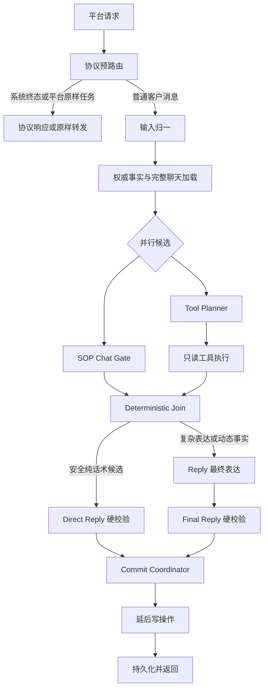
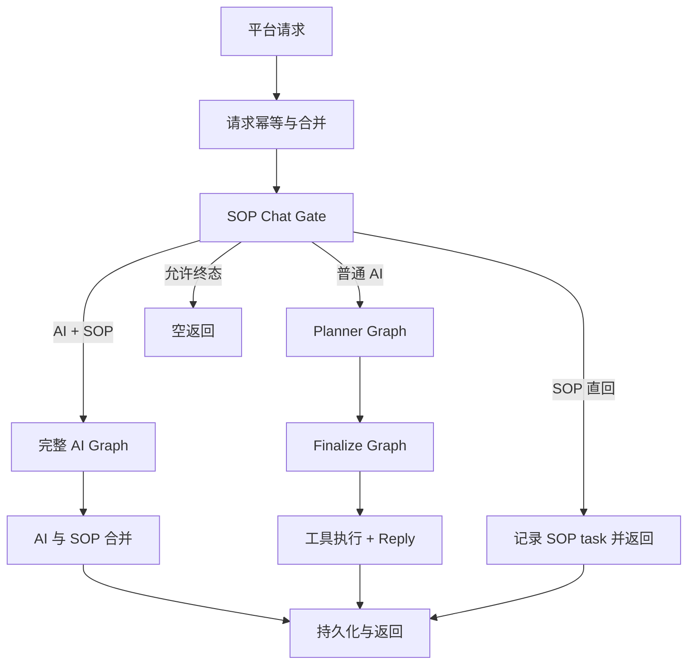

# SOP Chat Gate、Tool Planner、Reply 并行重构方案

## 1. 文档信息

- 当前代码基线：`625061d283a4b18a63c3381e81da918d65da52c2` 之后的 `codex/reply-chain-refactor` 分支。
- 实施分支：`codex/reply-chain-refactor`。
- 禁止事项：不得提交到 `main`，不得部署，不得主动发送真实客户消息。
- 文档目的：定义普通客户回复链路的目标架构、节点职责、输入输出合同、迁移步骤、Review 安排和测试节点。
- 适用入口：`/reply`、`/reply/workflow-compatible` 及兼容入口。
- 不直接改动：`/sop/events` 主动触达框架、平台外部协议、支付/门店/订单接口协议、客户可见消息 schema。
- 当前状态：本文是迁移设计，不代表目标架构已经启用。

## 2. 背景与核心问题

线上反复出现的问题不是单条业务规则缺失，而是职责边界混在一起：

1. Gate、Planner、Reply 都可能重新理解客户当前问题。
2. Planner 同时承载工具规划、成交节奏、客户心理、主线推进和客户可见草稿。
3. Reply 在 Planner 之外又补动作，导致历史理解和当前意图不稳定。
4. 客户画像、历史事件和旧策略摘要有时压过最新聊天原话。
5. “回答当前问题后带一个主线动作”这类规则过于粗糙，缺少对客户真实状态的约束，容易在客户已经多次表示时间不确定、正在忙、拒绝或健康风险时继续机械追问。

重构目标不是让 Gate 变成新大脑，也不是让 Planner 继续决定客户心理，而是：

- 一次构建完整带时间聊天与权威事实。
- Gate 和 Tool Planner 并行，各自只做自己边界内的候选判断。
- Reply 作为复杂场景最终业务大脑，基于完整聊天、Gate 候选和工具事实做最终表达。
- 代码只保留事实、工具、结构、安全、幂等、重试和非业务兜底。

## 3. 项目宪法

- 模型负责业务语义、客户心理、销售节奏和自然表达。
- 代码负责事实输入、工具调用、schema、幂等、安全边界、重试和非业务兜底。
- 不新增 Python 关键词分支判断普通销售意图、顾虑类型或对话阶段。
- 不因为重构删除当前业务规则、活动事实、支付规则、项目范围或门店权限边界。
- 不为了缩短 Prompt 用摘要替代最新真实聊天。
- Join 层不能成为新的业务规则引擎。
- 并行阶段不能投机执行写操作。

## 4. 目标架构



关键结论：

- Gate 不是新的 Planner。
- Gate 不是最终表达大脑。
- Tool Planner 不输出客户话术。
- Tool Planner 不判断客户心理、成交节奏或主线动作。
- Reply 是复杂场景最终业务大脑。
- Reply 负责最终客户可见回复、复杂历史理解、客户当前意向、单一主线动作和语气。
- Join 只做确定性汇总与路由，不能生成业务话术。

## 5. 当前代码链路

当前 `ChatRuntime` 仍是串行主链：



已存在的兼容入口：

- `planner_graph`：输入归一、背景上下文、Planner。
- `finalize_graph`：工具执行、Reply。
- `full_graph`：完整串行图。
- shadow 服务：`chat_gate_router_shadow`、`tool_plan_preview`、`read_only_tool_executor_shadow`、`reply_chain_join_shadow`、`reply_final_brain_handoff_shadow`、`parallel_reply_chain_shadow`、`parallel_gate_planner_runner_shadow`、`parallel_reply_chain_comparison`、`reply_chain_commit_shadow`、`parallel_reply_chain_diagnostics`、`reply_chain_shadow_bundle_audit`。

本轮重构必须先通过 shadow 和诊断推进，不直接切换生产行为。

### 5.1 Shadow Bundle Audit

为避免 Review 时只看见单个诊断字段而漏掉某一环证据，当前分支增加 `reply_chain_shadow_bundle_audit_v1`：

- Planner 末尾生成 `precommit` 版本，检查共享上下文、Gate shadow、Tool Planner preview、只读工具执行预览、Join、Reply handoff、runner、comparison 和 diagnostics 是否齐全。
- Runtime 在 Reply 校验后生成 `reply_chain_commit_shadow`，并刷新 `postcommit` 版本，额外检查写入阶段是否仍由 `runtime_after_reply_validation` 持有。
- 该字段是审计输出，不进入 Planner、Reply、SOP Gate 的模型 payload。
- 该字段不批准行为切换；即使 `ready_for_refactor_review=true`，仍必须完成手工 Review、离线仿真、回归测试和显式启用开关。
- 它的目的只是把“这次重构有没有丢掉业务规则输入、谁拥有最终表达、谁能写状态”这些证据集中到一处，降低人工漏审风险。

## 6. 统一上下文原则

### 6.1 完整聊天优先

普通客户聊天通常不长。正式决策上下文优先输入完整可获得聊天记录，而不是旧画像生成的客户心理摘要。

每条消息至少保留：

```json
{
  "message_ref": "msg_18",
  "sender": "customer | assistant | staff | system",
  "message_type": "text | image | voice | location | store_address | payment_collection | transfer_event",
  "content": "客户可见正文或结构消息摘要",
  "sent_at": "2026-08-06T14:32:10+08:00"
}
```

同时提供：

```json
{
  "current_time": "2026-08-06T15:10:00+08:00",
  "timezone": "Asia/Shanghai"
}
```

时间必须附着在每条消息上。模型需要判断客户说“在忙”“先不定”“时间不确定”是刚刚发生还是几天前；也要判断门店卡、案例图、预约金卡是否刚发送。

### 6.2 不进入正式决策的软画像

以下内容不作为 Gate/Tool Planner/Reply 的权威输入：

- `next_sales_strategy`
- 旧模型推断的客户类型
- 旧心理总结
- 旧意向等级
- 旧 `main_blocker`
- 旧下一步建议
- 没有消息证据的偏好推断

这些内容最多作为后台分析材料，不允许压过最新聊天。

### 6.3 必须保留的权威事实

不能从聊天文字可靠推断的事实，必须使用结构账本：

```json
{
  "authoritative_facts": {
    "payment": {},
    "orders": {},
    "registration": {},
    "visible_store_scope": {},
    "sop_deliveries": {},
    "structured_messages": {},
    "risk_holds": {}
  }
}
```

原因：

- 发过预约金卡不代表已付。
- 文本门店名不能替代真实 `store_id` 和客户可见范围。
- SOP 完成状态、send_once 和发送次数不一定完整出现在平台聊天中。
- 支付截图理解、平台转账事件和订单支付状态属于结构事实。
- 三个月以前订单需要代码按时间窗口规范化。
- 图片 URL 不能单独证明已经发送有效案例图。

### 6.4 长度保护

- 不超过 100 条：全部输入。
- 超过 100 条：最近 80 条完整输入，早期只保留结构事实和被明确引用的原话。
- 上限是技术保护，不是业务语义截断规则。

## 7. SOP Chat Gate

Gate 是内容匹配和第一层路由节点，不是复杂场景的最终业务大脑。

### 7.1 负责

- 阅读完整带时间聊天，识别客户当前是否命中 SOP、精准话术或无需工具的简单场景。
- 选择本轮可供 Reply 使用的内容素材。
- 给出路由建议：安全直回、复杂纯话术、纯工具、话术加工具。
- 声明可能需要的动态事实能力类别，但不生成工具参数。
- 在安全简单场景生成 `direct_reply_candidate`。
- 对 SOP/精准话术匹配引用必要 `message_ref`。

### 7.2 不负责

- 最终判断客户意向度、心理状态和成交阶段。
- 最终确定 `turn_outcome`、任务状态或 `closing_move`。
- 判断复杂历史中某个槽位是否应该再次追问。
- 生成工具名和工具参数。
- 编造门店、案例、订单、支付、距离或档期事实。
- 执行工具或写数据库。
- 创建 SOP task、更新 send_once 或标记 SOP 已发。

### 7.3 路由类型

| 路由 | 含义 | 后续 |
| --- | --- | --- |
| `direct_text` | 无动态事实、无复杂历史判断的安全纯话术 | 等待 Tool Planner 的 `fact_requirement=none` 后才允许直回 |
| `content_only_reply` | 不需要工具，但需要完整历史、客户态度或任务状态判断 | 内容候选进入 Reply |
| `tools_only` | 没有固定内容，必须依赖工具事实回答 | 工具完成后进入 Reply |
| `content_and_tools` | 命中 SOP/精准话术，但仍需要实时事实 | 内容候选与工具事实一起进入 Reply |

增加 `content_only_reply` 是为了避免 Gate 变成大脑。复杂软拒绝、时间反复不确定、客户信任异议等场景即使不需要工具，也应进入 Reply。

### 7.4 Gate 直回边界

只有同时满足以下条件才允许 Gate 直回：

- 不需要门店、案例、支付、订单、距离、档期等动态事实。
- 不包含动态结构卡片。
- 不涉及已付、退款、投诉、健康风险等状态冲突。
- 不需要从多轮历史判断客户是否延期、拒绝或已经反复回答。
- Gate 候选通过统一硬校验。
- Gate 必须提供非空静态 `direct_reply_candidate`，否则交 Reply 恢复表达。
- Tool Planner 同轮输出 `fact_requirement=none`。

适合直回的例子：明确年龄准入、固定项目范围、简单人数金额说明、终态礼貌回复。

不适合直回的例子：客户三次表示时间不确定、客户态度反复、门店信任异议、付款状态变化、复杂软拒绝。即使不需要工具，也进入 Reply。

### 7.5 输出合同

```json
{
  "current_question": {
    "intent": "visit_time_uncertain",
    "must_answer": true,
    "evidence_refs": ["msg_21"]
  },
  "selected_content": {
    "sop_pack_ids": [],
    "precision_qa_ids": [],
    "simple_scene_id": "visit_time_acknowledgement",
    "usage": "reference"
  },
  "dynamic_fact_expectation": {
    "requirement": "none | optional | required",
    "capability_classes": []
  },
  "route_suggestion": "direct_text | content_only_reply | tools_only | content_and_tools",
  "direct_reply_candidate": [],
  "handoff_notes": ["复杂历史状态由 Reply 最终判断"]
}
```

## 8. Tool Planner

Tool Planner 只规划只读工具事实，不能输出客户话术，不能判断客户心理。

### 8.1 负责

- 根据当前消息、完整聊天和权威事实判断是否缺少动态事实。
- 选择完成本轮回答所需的最小只读工具集合。
- 生成工具参数、依赖关系和停止条件。
- 声明缺失事实字段和工具失败后的最小反问目标。
- 提出延后写动作建议，但不执行。

### 8.2 不负责

- 输出客户可见文本。
- 判断客户心理、意向或成交理由。
- 选择 SOP、精准话术或主线动作。
- 决定是否继续压预约金。
- 因“可能有用”而查询全部工具。

### 8.3 输出合同

```json
{
  "fact_requirement": "none | optional | required",
  "read_tool_calls": [
    {
      "call_id": "store_lookup_1",
      "tool": "customer_store_lookup",
      "arguments": {"query": "洪湖市"},
      "purpose": "获得客户可见范围内真实门店",
      "depends_on": []
    }
  ],
  "required_fact_fields": ["resolved_location", "visible_store_candidates"],
  "stop_conditions": ["获得1到3家完整可见门店"],
  "customer_question_if_incomplete": {
    "required": false,
    "field": "",
    "goal": ""
  },
  "deferred_write_proposals": []
}
```

## 9. Read-only Tool Executor

并行阶段只允许白名单只读工具。

| 类别 | 并行阶段 |
| --- | --- |
| 门店查询、详情、距离排序 | 允许 |
| 案例查询 | 允许 |
| 订单查询 | 允许 |
| 支付状态查询 | 允许 |
| 语音转写、图片理解 | 允许，但作为输入归一或事实加载的一部分 |
| 创建订单、同步手机号、排客、主动发送 | 不允许，必须延后 |

工具失败不能让模型凭空编造事实。Reply 可以基于缺失事实生成最小反问。

早执行只读工具前还必须通过依赖审计：

- 每个被 `depends_on` 引用的 `call_id` 必须存在于同一批只读工具计划中。
- `call_id` 不能重复，否则执行顺序不可证明。
- 依赖缺失或重复时只能进入 shadow blocker，不能提前执行。

## 10. Deterministic Join

Join 是确定性合并层，不是第三个模型大脑。

### 10.1 负责

- 合并 Gate 候选、Tool Planner 计划、工具事实和权威事实。
- 判断是否具备 Gate 安全直回条件。
- 为 Reply 准备清晰 handoff。
- 记录冲突和阻断原因。
- 输出 `direct_reply_guard_audit`，显式证明 Gate 直回例外只在静态候选存在、无动态事实、无只读工具和无未知工具时成立。

### 10.2 不负责

- 生成客户可见业务话术。
- 选择销售心理、逼单理由或主线动作。
- 修改 SOP 文案。
- 用代码判断普通客户意图。

### 10.3 Gate 直回 Guard

Gate 直回是极窄例外，不是让 Gate 变成大脑。Join 必须记录 `reply_chain_direct_reply_guard_audit_v1`：

- `direct_reply_requested=true`：Gate 建议 `direct_text`。
- `static_candidate_present=true`：Gate 确实有静态候选消息。
- `tool_fact_requirement_none=true`：Tool Planner 未声明动态事实需求。
- `read_tools_absent=true` 且 `unknown_tools_absent=true`。
- 全部满足后才允许 `final_route=direct_reply`。

即使允许直回，最终仍必须经过统一硬校验和 commit phase；Join 不生成客户可见文本，也不拥有销售心理判断。

## 11. Reply

Reply 是复杂场景最终业务大脑。

### 11.1 输入

- 完整带时间聊天。
- 当前客户消息。
- 权威事实账本。
- Gate 的 SOP/精准话术/简单场景候选。
- Tool Planner 的工具计划和只读工具事实。
- Join 的路由与冲突说明。
- 业务规则包和硬边界。

### 11.2 负责

- 精准回答当前问题。
- 理解完整历史和客户当前态度。
- 判断本轮唯一主线动作。
- 将 SOP 或精准话术自然融入微信对话。
- 根据工具事实生成最终客户可见消息。
- 在客户不适合继续推进时停止压单或改为轻触。

### 11.3 不负责

- 编造门店、案例、订单、支付、距离或档期事实。
- 覆盖代码提供的已付、风险、门店可见范围等硬事实。
- 一轮推进多个无关主线动作。
- 输出内部接口失败、入口未对上、模型错误等系统状态。

## 12. Commit Coordinator 与延后写操作

所有写操作必须在最终回复硬校验后执行：

- SOP task 创建与发送记录。
- send_once 更新。
- 客户画像和状态写入。
- 订单创建或关联。
- 手机号同步。
- 主动发送。

并行阶段不得写库、不得发送、不得改变线上状态。

## 13. 关键业务规则保护

重构不能丢失以下规则：

| 规则 | 目标归属 |
| --- | --- |
| 最新完整聊天优先于软画像 | Shared Context + Reply |
| 门店卡只能来自客户可见范围 | Tool + Validation |
| 城市可见候选 1 到 3 家时发送全部门店卡，超过 3 家才问区或定位 | Reply 基于工具事实 |
| 客户问效果且近期没有真实案例图证据时要查并发真实案例图 | Tool Planner + Reply |
| 活动报价完成后可发预约金卡，订单不是前置 | Reply + Validation |
| 同轮最多一个预约金卡 | Validation |
| 已付后收姓名电话和到店意向，不再发卡 | Reply + Validation |
| 三个月外历史订单不能当当前已付 | Fact Normalization |
| 健康风险优先，不压卡 | Reply + Validation |
| 明确拒绝、投诉、退款不能继续普通营销压单 | Reply + SOP Event |
| `sop_platform_task` 原样透传 | Protocol Pre-router |
| 中性兜底只在模型/repair 失败后出现 | Runtime |

## 14. 迁移阶段

### 14.1 Stage 0：规则与诊断基线

目标：证明当前重构只是在 shadow 中观察，不改变线上行为。

交付：

- 规则归属矩阵。
- Gate router shadow。
- Tool plan preview。
- Join shadow。
- Reply handoff readiness audit。
- Release review checklist。

状态：进行中。

### 14.2 Stage 1：统一 Shared Context

目标：一次构建完整带时间聊天和权威事实，供 Gate、Tool Planner、Reply 共用。

Review 重点：

- 当前消息必须在 timeline 中且为最新客户消息。
- 软画像不能进入权威上下文。
- 权威事实只描述事实、来源、时间和完整度。

测试：

- `workflow_tests/test_reply_chain_shadow_context.py`
- 当前消息缺失、顺序错误、缺时间的阻断测试。
- 历史较长时的截断测试。

### 14.3 Stage 2：Gate Shadow 收口

目标：Gate 输出候选和路由，不提交、不写库、不成为大脑。

Review 重点：

- Gate 不能输出最终复杂成交结论。
- Gate 直回条件必须严格。
- 命中 SOP/精准话术必须引用证据。

测试：

- `workflow_tests/test_chat_gate_router_shadow.py`
- `workflow_tests/test_chat_gate_preview.py`
- Gate 直回边界测试。

### 14.4 Stage 3：Tool Planner Shadow 收口

目标：从当前 Planner 输出中抽离只读工具计划，逐步减少业务语义 residue。

Review 重点：

- Tool Planner 不输出客户话术。
- Tool Planner 不判断客户心理。
- 工具计划最小化，不贪查。
- 工具 `arguments` 只包含真实工具参数，不混入 `tool`、`name`、`call_id`、`depends_on`、`purpose` 等编排元数据。

测试：

- `workflow_tests/test_tool_plan_preview.py`
- `workflow_tests/test_read_only_tool_executor_shadow.py`
- 工具白名单和延后写阻断测试。

### 14.5 Stage 4：Read-only Tool Executor

目标：并行执行只读工具，但所有写操作仍延后。

Review 重点：

- 不创建订单、不同步手机号、不排客、不发送。
- 工具失败给 Reply 明确缺失事实，不让 Reply 编造。

测试：

- 门店、案例、订单、支付只读工具成功/失败/超时场景。
- 写工具进入并行阶段必须失败。

### 14.6 Stage 5：Join Shadow

目标：合并 Gate 和工具事实，决定是否可以直回或必须进入 Reply。

Review 重点：

- Join 不生成客户话术。
- Join 不判断销售心理。
- 复杂场景全部交 Reply。

测试：

- `workflow_tests/test_reply_chain_join_shadow.py`
- `workflow_tests/test_reply_final_brain_handoff.py`

### 14.7 Stage 6：Reply Handoff 切换 Shadow

目标：Reply 使用新 handoff 作为影子输入，与旧链路输出对比。

Review 重点：

- Reply 收到完整聊天、权威事实、Gate 候选、工具事实。
- Reply handoff 必须输出 `reply_final_brain_target_input_schema_v1` 和 `reply_final_brain_target_input_schema_audit_v1`；旧 Planner 话术、阶段、成交和付款决策只能出现在 shadow-only groups，不能成为 active Reply input。
- Tool Planner 如果声明 `fact_requirement=required` 或存在只读工具计划，Reply handoff 必须同时看到 `read_only_tool_executor_shadow_v1` 和 `read_only_tool_dependency_audit_v1`，否则不能切换 Reply 输入。
- “有工具计划”不等于“Reply 有可用事实”；缺 executor、依赖错误、blocked 工具都必须进入 handoff readiness blocker。
- Reply 仍是最终表达和复杂判断 owner。
- 不改变客户可见行为。

测试：

- Reply 单节点对比。
- 复杂软拒绝、时间不确定、门店异议、效果图、支付、已付、风险场景。
- 工具事实 handoff 审计：有 read tool 但无 executor、依赖不通过、required facts 无 read tool 都必须阻断。

### 14.8 Stage 7：并行组合 Shadow

目标：Gate 和 Tool Planner 真正并行运行，但结果只进入 shadow 对比。

Review 重点：

- 并行分支输入隔离。
- 并行分支输出契约必须明确：Gate 分支输出 `gate_router_shadow.schema_version=chat_gate_router_shadow_v1`，Tool Planner 分支输出 `tool_plan_preview.schema_version=tool_plan_preview_v2`。
- runner 不能只因为两个分支 `completed` 就视为可迁移；缺少必需输出、schema 错误或输出位置错误都必须进入 diagnostics blocker。
- shadow 字段不进入生产 Prompt。
- 没有写操作。

测试：

- `workflow_tests/test_parallel_reply_chain_runner.py`
- `workflow_tests/test_parallel_reply_chain_shadow.py`
- `workflow_tests/test_parallel_reply_chain_comparison.py`
- `workflow_tests/test_parallel_reply_chain_diagnostics.py`
- 分支输出契约审计测试：错误 schema、缺失 `gate_router_shadow`、缺失 `tool_plan_preview` 必须阻断后续行为切换。

### 14.9 Stage 8：离线全链路仿真

目标：用脱敏多轮轨迹验证新旧链路差异。

测试覆盖：

- SOP 主线。
- 精准问答接主线。
- 省、市、区县、乡镇、村、地标、定位卡、多店和不可见门店。
- 效果图、一次效果、反黑反弹、隐形消费、项目范围。
- 活动报价、预约金、转账、重复发卡、已付登记。
- 软拒绝、明确拒绝、投诉、退款、健康风险。
- 客户沉默、跨夜触达、重复 SOP、聊天中不触达。
- 模型超时、JSON 协议错误、工具失败和空回复恢复。

验收：

- 硬错误为 0。
- 总体语义通过率不低于 90%。
- 关键场景全部通过。
- 无真实外部写操作。

### 14.10 Stage 9：人工 Review 后才允许讨论行为开关

即使 shadow 全绿，也不能自动启用。必须人工审核：

- 规则归属矩阵变化。
- 离线仿真报告。
- 新旧链路差异。
- 客户可见话术样本。
- `reply_chain_precommit_validation_audit_v1` 证明写入发生在最终回复可提交之后。
- 回滚路径。

## 15. Review 代码安排

### 15.1 每次提交前自查

- 是否只在 `codex/reply-chain-refactor`。
- 是否没有部署命令。
- 是否没有真实客户发送。
- 是否没有修改业务规则或客户可见话术；如有，必须拆成单独业务 review 提交。
- 是否新增了 Python 业务关键词判断。
- 是否把 Gate、Tool Planner 或 Join 变成业务大脑。

### 15.2 每阶段两轮 Review

第一轮：结构 Review。

- 文件边界是否清晰。
- 输入输出 schema 是否稳定。
- 是否符合项目宪法。
- 是否容易回滚。

第二轮：业务规则保护 Review。

- 对照 `docs/rule_ownership_matrix.md`。
- 每条 active 或 hard_boundary 规则是否仍有 owner。
- 是否有测试证明规则未丢失。
- 是否有客户可见效果变化；若有，是否经过单独审核。

### 15.3 必须审查的高风险文件

- `ai_paths/app/graph/nodes/planner_nodes.py`
- `ai_paths/app/graph/nodes/reply_nodes.py`
- `ai_paths/app/graph/nodes/reply_context.py`
- `ai_paths/app/graph/nodes/reply_validation.py`
- `ai_paths/app/services/chat_gate_router_shadow.py`
- `ai_paths/app/services/tool_plan_preview.py`
- `ai_paths/app/services/parallel_reply_chain_shadow.py`
- `ai_paths/app/services/parallel_reply_chain_diagnostics.py`
- `ai_paths/app/services/platform_reply_runtime.py`
- `ai_paths/app/policies/business_rules.json`
- `config/sop_reply_packs.json`

## 16. 测试节点

### 16.1 T0：合同与隔离测试

命令：

```powershell
$env:PYTHONPATH='ai_paths'
python -m pytest workflow_tests/test_reply_chain_refactor_contract.py workflow_tests/test_reply_chain_shadow_payload_isolation.py -q
```

目的：

- 文档和规则矩阵没有漂移。
- shadow 字段不进入生产模型 payload。

### 16.2 T1：Shared Context 测试

命令：

```powershell
$env:PYTHONPATH='ai_paths'
python -m pytest workflow_tests/test_reply_chain_shadow_context.py -q
```

目的：

- 当前消息权威。
- 完整带时间聊天优先。
- 软画像不作为权威。

### 16.3 T2：Gate Router 测试

命令：

```powershell
$env:PYTHONPATH='ai_paths'
python -m pytest workflow_tests/test_chat_gate_preview.py workflow_tests/test_chat_gate_router_shadow.py -q
```

目的：

- Gate 只输出候选和路由。
- Gate 不写库、不发消息。
- 复杂场景不直回。

### 16.4 T3：Tool Planner 测试

命令：

```powershell
$env:PYTHONPATH='ai_paths'
python -m pytest workflow_tests/test_tool_plan_preview.py workflow_tests/test_read_only_tool_executor_shadow.py -q
```

目的：

- Tool Planner 不输出客户话术。
- 只读工具和延后写工具分离。

### 16.5 T4：Join 确定性测试

命令：

```powershell
$env:PYTHONPATH='ai_paths'
python -m pytest workflow_tests/test_reply_chain_join_shadow.py workflow_tests/test_reply_final_brain_handoff.py -q
```

目的：

- Join 不成为第三个大脑。
- Reply handoff 完整。

### 16.6 T5：Commit Phase 测试

命令：

```powershell
$env:PYTHONPATH='ai_paths'
python -m pytest workflow_tests/test_reply_chain_commit_shadow.py workflow_tests/test_platform_reply_runtime.py -q
```

目的：

- 写操作只发生在 Reply 校验后。
- 提交前置审计存在且通过；空回复未被允许时必须阻断行为切换。
- 测试隔离和 memory 不写入只是 side effect 范围收缩，不应被误判为业务失败。
- shadow 阶段不写线上状态。

### 16.7 T6：并行组合测试

命令：

```powershell
$env:PYTHONPATH='ai_paths'
python -m pytest workflow_tests/test_parallel_reply_chain_runner.py workflow_tests/test_parallel_reply_chain_shadow.py workflow_tests/test_parallel_reply_chain_comparison.py workflow_tests/test_parallel_reply_chain_diagnostics.py -q
```

目的：

- 并行分支输入隔离。
- shadow 对比可审计。
- comparison 必须消费 runner 的 `parallel_branch_output_contract_audit_v1`；契约缺失或不通过时只能标记为 `not_comparable`。
- 诊断不能自动批准行为开关。

### 16.8 T7：离线全链路仿真

命令按仿真系统实际入口执行，要求报告包含：

- 业务硬错误。
- 语义评分。
- 新旧链路差异。
- Gate、Tool Planner、Reply 原始输出。
- 工具事实。
- 虚拟 outbox。
- 状态变化。

### 16.9 T8：Shadow 对比

上线前必须提供对比报告，但本分支不部署。

要求：

- `ready_for_human_review` 只表示可以人工审核。
- `reply_chain_release_review_checklist_v1` 必须显示 `can_enable_behavior_switch=false`。
- 行为开关只能在人工审核和离线仿真通过后另行讨论。

## 17. 影响评估

### 17.1 预期收益

- 降低 Gate 与 Planner 串行等待时间。
- 减少客户画像和旧摘要压过当前聊天。
- 降低 Planner 业务语义负担。
- 让 Reply 更稳定地理解完整历史和当前意向。
- 工具事实更早准备，门店、案例、订单、支付类回复更稳。

### 17.2 风险

- Prompt 输入变长，模型成本和延迟可能上升。
- Gate 直回边界过宽会让 Gate 变成大脑。
- Tool Planner 如果贪查工具，会增加延迟和不稳定。
- Join 如果做业务判断，会违反项目宪法。
- 如果 shadow 字段进入生产 Prompt，可能改变线上效果。

### 17.3 风险控制

- 阶段化提交。
- 每阶段独立测试。
- 规则归属矩阵审查。
- shadow 只读、无写操作。
- 发布审查清单永远不能自动通过行为切换。
- 行为切换前必须离线仿真和人工审核。

## 18. 回滚策略

- 每个阶段单独提交。
- 不合并旧分支全量代码。
- 任何行为退化只回滚对应阶段。
- `main` 保持生产唯一来源。
- 本分支提交不得部署。

## 19. 当前下一步

当前 `codex/reply-chain-refactor` 已经完成 B0-B6 的主要 shadow 骨架：

1. 保持当前生产串行行为不变。
2. Shared Context、Gate、Tool Planner、Join、Reply handoff、Commit shadow、Parallel runner、Comparison、Diagnostics、Bundle audit 均已有结构审计。
3. Gate/Tool Planner/Join 不成为业务大脑的边界已有自动 blocker。
4. Reply handoff 里旧 Planner 客户话术和销售语义残留已有 blocker；旧 Planner group/source 不能进入未来 Reply active input。
5. Release review checklist 仍是诊断证据，不能自称批准行为切换。
6. 当前所有改动仍只允许提交到 `codex/reply-chain-refactor`，不得部署，不得合入 `main`。

下一阶段不应直接切生产行为，也不应先改客户话术。优先进入 B7：建立离线全链路仿真门禁，把真实脱敏历史和模拟多轮场景跑在 shadow/隔离环境里，证明新链路不会丢业务规则、不会让 Gate/Planner 重新接管客户心理和销售节奏。

## 20. 开发执行方案

本重构必须按“小批次、shadow 优先、测试先行、人工 review 后再进入下一阶段”的方式推进。任何阶段都不能直接改变生产客户可见回复，除非后续另开行为切换任务并经过离线仿真、人工审核和回滚方案确认。

### 20.1 执行原则

- 每次只解决一个结构问题，例如“上下文缺少时间线审计”或“Reply handoff 没有工具事实 blocker”，不能顺手修改业务话术。
- 每次提交必须留在 `codex/reply-chain-refactor`，不得提交到 `main`。
- 每次提交都必须说明是否改变客户可见行为。当前阶段默认答案应为“不改变，只增加 shadow 审计或测试”。
- 业务规则只允许迁移归属，不允许静默删除。删除旧规则前必须在 `docs/rule_ownership_matrix.md` 标记 `merged`、`superseded` 或 `node_specific`。
- 不能通过 Python 关键词新增普通销售语义判断；如果需要区分客户心理、顾虑或成交节奏，应调整模型输入、prompt 或 Reply handoff。
- 所有写操作仍在最终回复校验后执行；并行阶段只允许只读工具和 shadow 输出。

### 20.2 开发批次

| 批次 | 目标 | 主要代码范围 | 客户可见行为 | Review 重点 | 退出条件 |
| --- | --- | --- | --- | --- | --- |
| B0 基线保护 | 固定当前串行链路和规则归属 | `docs/rule_ownership_matrix.md`、现有 shadow tests | 不变 | 规则是否有 owner；是否禁止部署 | 合同测试通过，分支干净 |
| B1 Shared Context | 构建完整带时间聊天和权威事实账本 | `reply_context`、shadow context 服务 | 不变 | 当前消息、时间、结构事实是否完整；画像是否不再压过聊天 | 上下文契约测试通过 |
| B2 Gate Shadow | Gate 只输出内容候选和路由建议 | `chat_gate_router_shadow`、Gate preview tests | 不变 | Gate 是否变成大脑；直回边界是否过宽 | Gate 直回 guard 全绿 |
| B3 Tool Planner Shadow | Planner 收口为只读工具计划 | `tool_plan_preview`、只读工具 executor | 不变 | 是否输出客户话术；是否贪查；是否混入销售判断 | 工具白名单和依赖测试通过 |
| B4 Join Shadow | 合并 Gate 候选和工具事实，但不做业务判断 | `reply_chain_join_shadow` | 不变 | Join 是否生成话术；是否用代码选择成交动作 | Join 合同测试通过 |
| B5 Reply Handoff | Reply 获得完整聊天、候选内容、工具事实和 blocker | `reply_final_brain_handoff` | 不变 | Reply 是否重新成为最终业务大脑；旧 Planner 语义是否仍残留 | handoff readiness 全绿 |
| B6 Parallel Runner | Gate 与 Tool Planner 并行 shadow 执行 | `parallel_reply_chain_runner`、comparison、diagnostics | 不变 | 分支输出契约、隔离、失败分类 | diagnostics 不批准自动切换 |
| B7 离线仿真 | 用多轮虚拟客户验证效果 | simulation CLI 与 fixtures | 不变 | 是否贴近真实问题；是否隔离生产 | 硬错误 0，关键场景全过 |
| B8 行为切换评审 | 讨论是否启用新链路 | 配置开关，另开任务 | 待审核 | 回滚、灰度、指标、人工样本 | 用户明确批准后才做 |

### 20.3 代码 Review 安排

每个批次完成后必须做两轮 review。

第一轮是结构 review：

- 节点职责是否单一：Gate 选候选，Tool Planner 查事实，Join 合并事实，Reply 最终表达。
- 新增字段是否有 schema 版本、来源和用途。
- Shadow 字段是否只进入 trace/report，不进入生产模型 prompt。
- 并行分支是否没有写数据库、没有主动发送、没有创建订单。
- 失败时是否可审计：节点名、错误类型、blocker、fallback source。

第二轮是业务规则保护 review：

- 对照 `docs/rule_ownership_matrix.md` 检查 active/hard_boundary 规则是否仍有 owner。
- 抽查高风险规则：门店可见范围、活动报价后发卡、已付不发卡、健康风险、明确拒绝、同轮最多一张预约金卡、三个月订单保护。
- 检查是否出现“为了提速缩短 prompt 导致规则消失”的改动。
- 检查新增测试是否覆盖本批次影响面，而不是只测 happy path。
- 如果客户可见样本变化，必须单独列出变化前后样例和原因。

### 20.4 测试节点

每个批次至少运行对应节点测试和基础静态测试。

基础静态测试：

```powershell
git diff --check
$env:PYTHONPATH='ai_paths'
python -m py_compile <本批次改动的 Python 文件>
```

核心重构回归：

```powershell
$env:PYTHONPATH='ai_paths'
python -m pytest `
  workflow_tests/test_reply_chain_refactor_contract.py `
  workflow_tests/test_reply_chain_refactor_settings.py `
  workflow_tests/test_reply_chain_behavior_switch_guard.py `
  workflow_tests/test_reply_chain_shadow_context.py `
  workflow_tests/test_chat_gate_preview.py `
  workflow_tests/test_chat_gate_router_shadow.py `
  workflow_tests/test_tool_plan_preview.py `
  workflow_tests/test_read_only_tool_executor_shadow.py `
  workflow_tests/test_reply_chain_join_shadow.py `
  workflow_tests/test_reply_final_brain_handoff.py `
  workflow_tests/test_reply_chain_commit_shadow.py `
  workflow_tests/test_reply_chain_shadow_bundle_audit.py `
  workflow_tests/test_parallel_reply_chain_runner.py `
  workflow_tests/test_parallel_reply_chain_shadow.py `
  workflow_tests/test_parallel_reply_chain_comparison.py `
  workflow_tests/test_parallel_reply_chain_diagnostics.py `
  workflow_tests/test_reply_chain_shadow_payload_isolation.py `
  workflow_tests/test_platform_reply_runtime.py `
  workflow_tests/test_model_timeout_and_planner_payload.py -q
```

业务效果仿真测试在 B7 之后成为发布前门槛，至少覆盖：

- 门店：省、市、区县、县级市、乡镇、村、地标、定位卡、多店、不可见门店。
- 效果：问效果、问一次性、问反弹反黑、问案例图。
- 成交：问价格、问怎么预约、问怎么付费、软拒绝、明确拒绝、重复发卡、已付后登记。
- 风险：过敏、破损、投诉、退款。
- SOP：正常主线、精准问答后接 SOP、沉默触达、聊天中不触达、重复包修复。

### 20.5 不丢业务规则的门禁

行为切换前必须同时满足：

- `reply_chain_release_review_checklist_v1.can_enable_behavior_switch=false` 仍为默认值；不能由测试自动打开。
- `rule_ownership_matrix` 中没有未归属的 active/hard_boundary 规则。
- `reply_final_brain_handoff` 中旧 Planner 客户话术和销售判断残留已经被迁移或显式 blocker 阻断。
- 离线仿真硬错误为 0，关键场景全过。
- 报告中列出新旧链路客户可见回复差异，且人工确认没有偏离项目初衷。

### 20.6 当前建议的下一处开发点

下一步不应直接改 Reply 行为，而应补 B7 离线仿真门禁：

1. 建立或完善完全隔离的仿真入口，只允许真实模型调用，平台客户、门店、订单、支付、消息发送和状态更新全部使用本地适配器。
2. 固化一批脱敏历史轨迹和裂变场景，覆盖 SOP、精准问答、门店、效果图、价格、预约金、已付登记、健康风险、投诉退款、软拒绝、模型失败和工具失败。
3. 每轮把虚拟发送写入本地 outbox，再作为下一轮历史输入，检验多轮主线承接，而不是只测单轮 JSON 合法。
4. 报告必须区分结构硬错误、业务语义失败、模型供应商失败和工具夹具失败。
5. 行为切换前必须有 B7 报告路径和人工 review 结论；否则 `simulation_regression_review` 继续保持未通过。

原因：

- B0-B6 证明的是“结构上可迁移”，还不能证明“回复效果不退化”。
- 过去线上问题往往来自多轮历史、SOP 进度、门店事实、支付状态和客户软拒绝组合，单节点测试无法充分覆盖。
- 离线仿真能在不碰生产客户、不部署、不写线上状态的前提下提前发现回复效果问题。
- 这直接服务于项目宪法：让模型在完整上下文中判断业务语义，同时用代码和仿真门禁证明事实、工具、schema、幂等和安全边界没有被破坏。
