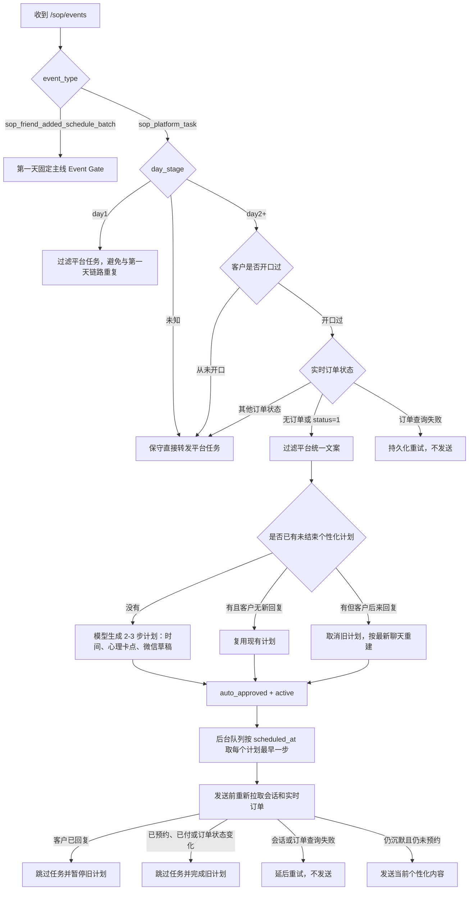

# 第二天起个性化主动唤醒

## 目标

第一天继续由普通 AI 回复和 `sop_friend_added_schedule_batch` 推进固定销售主线。

第二天起，平台继续负责提供触发时钟。系统按客户是否开口、实时订单状态和当前客服账号下的历史，决定：

- 从未开口或已经预约的客户：直接转发平台 `sop_platform_task`。
- 开口过、无订单或订单状态为 `1`（待定中）的客户：过滤平台统一文案，由模型生成 2-3 步个性化唤醒计划。

个性化计划默认审核通过并立即进入定时队列，不需要人工激活。模型负责客户心理、未成交卡点、触达时间和客户可见文案；代码只负责事实、路由、幂等、队列、发送前复核和安全边界。

## 流程

## 路由场景

| 场景 | 应有结果 |
| --- | --- |
| 第一天收到 `sop_platform_task` | 过滤，不与第一天 AI/SOP 链路重复 |
| 第二天起、客户从未开口 | 直接转发平台 SOP |
| 第二天起、客户开口过、无订单 | 过滤平台文案，生成并自动排队个性化计划 |
| 第二天起、客户开口过、订单状态 `1` | 过滤平台文案，生成并自动排队个性化计划 |
| 第二天起、客户已有其他订单状态 | 直接转发平台 SOP，个性化链路不接管 |
| 无法确认第几天 | 保守直接转发，避免误过滤 |
| 实时订单查询失败 | 不猜状态、不发送，进入持久化重试 |
| 模型超时或结构失败 | 不回退为平台群发文案，进入持久化重试 |

## 个性化场景与预期效果

| 客户卡点 | 第一步应解决 | 后续仍未回复时 | 禁止行为 |
| --- | --- | --- | --- |
| 效果担忧 | 给信心，说明到店检测、同类案例或真实效果依据 | 再自然衔接活动价值或低门槛决策 | 第一条就催付款；编案例；只说因人而异 |
| 反弹、反黑担忧 | 用非绝对口径解释，多数反馈正常并强调检测操作 | 推进活动资格或到店了解 | 绝对保证；堆免责话术 |
| 价格或隐形消费 | 讲清 268、每位 10 元、到店抵扣和未做或不满意可退 | 用一个真实理由推进预约金 | 重复整套规则；虚构额外优惠 |
| 距离远 | 理解距离顾虑，塑造值得到店的检测、活动或真实服务价值 | 到店时间可后定，继续推进活动资格 | 主动送客；编公里、分钟、路线 |
| 没时间、最近忙 | 不要求立即确定到店时间，降低当前决策成本 | 推进先锁活动，时间后定 | 反复追问哪天到店 |
| 家人反对或需要商量 | 理解决策压力，给可验证、低风险的下一步 | 邀请同行了解或保留资格 | 贬低家人；虚构承诺 |
| “再考虑、改天、算了” | 识别为软拒绝，化解主要阻力并给一个价值理由 | 仍不回复时换角度轻触一次 | “不勉强、先不打扰、那就算了” |
| 门店顾虑 | 只使用真实门店事实；已知门店不重复问 | 回到效果、活动或预约金主线 | 编门店、路线、停车和通勤 |
| 已明确要入口或交预约金 | 直接承接付款动作 | 无回复时围绕完成登记提醒 | 让客户翻旧卡；凭空判断支付失败 |
| 单纯沉默、卡点不明 | 短句唤醒，围绕最近未完成主线让客户开口 | 下一步换一个最相关的主线价值点 | 连续群发完整 SOP |
| 明确拒绝联系 | 不创建普通营销计划 | 无 | 继续营销 |
| 投诉、退款、付款异常 | 不创建普通营销计划，交对应风险链路 | 无 | 催预约金 |
| 健康高风险 | 不创建普通成交计划 | 无 | 发预约金卡或做效果保证 |

## 计划规则

- 默认生成 2-3 步，最长不超过 72 小时。
- 每一步时间由模型结合最近回复时间、沉默时长和客户卡点决定，不使用所有客户相同的固定间隔。
- 第 2、3 步必须假设客户在前一步之后仍未回复，不能假设客户已同意、已选门店或已确定时间。
- 每条只解决一个主要卡点并给一个动作，通常 30-100 个汉字，最多 140 个汉字。
- 输入中已经明确的城市、区域、门店、时间、价格和顾虑不重复询问。
- 平台原始任务只是弱参考，不能覆盖最近聊天和实时订单事实，也不能直接复制成群发话术。
- 客户出现新回复后，旧计划停止；下次触发时按最新聊天重新制定。

## 自动发送边界

- 只有 `trigger_context.activation_policy=auto_approved` 的第二天个性化计划由后台自动消费者执行。
- 手工创建、历史 `review_required` 或其他来源计划不会被自动消费者误发。
- 每个计划一次只执行最早未完成步骤；即使服务停机后多步都已过期，也不会同一轮连续发送。
- 任务发送前必须重新拉取最新会话和实时订单。
- 客户已回复时跳过任务并暂停计划。
- 客户已预约、已付或订单状态不再是“无订单/待定中”时跳过任务并结束计划。
- 会话或订单复核失败时延后重试，不使用旧数据冒险发送。
- 进程重启后，执行中的任务恢复为待执行；平台发送使用固定 `plan_id + task_id` 作为幂等身份。

## 验收指标

| 指标 | 目标 |
| --- | --- |
| 确定性路由准确率 | 100% |
| 模型场景语义通过率 | 不低于 90% |
| 客户回复后旧任务继续发送 | 0 |
| 已预约/已付后个性化未成交唤醒 | 0 |
| 同一计划多步同时发送 | 0 |
| 虚构门店、案例、赠品、总监事实 | 0 |
| 客户可见内部字段或编号 | 0 |

上线后另行观察重新开口率、预约金转化率和退订/投诉率。这些是业务结果指标，不能由离线模型测试伪造结论。
