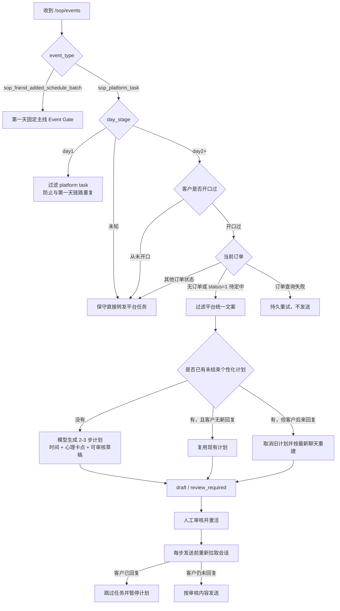

# 第二天起个性化主动唤醒

## 目标

第一天继续使用普通 AI 回复和 `sop_friend_added_schedule_batch` 推进固定销售主线。第二天起，平台仍负责触发时钟，系统根据客户是否开口和当前订单状态决定直接转发平台 SOP，或过滤平台文案并生成个性化唤醒计划。

模型负责判断客户心理、未成交卡点、触达时间和客户可见草稿。代码只负责客户范围、天数、开口事实、订单事实、路由、幂等、计划状态和发送前复查。

## 路由

## 客户分类

| 场景 | 处理 |
| --- | --- |
| 第一天 `sop_platform_task` | 过滤，不发送；第一天只由普通 AI 和首次加微事件链路处理 |
| 第二天起，从未开口 | 直接转发平台 `sop_platform_task` |
| 第二天起，开口过，无订单 | 过滤平台任务，生成个性化计划 |
| 第二天起，开口过，订单状态 `1` | 过滤平台任务，生成个性化计划 |
| 第二天起，已有其他订单状态 | 直接转发平台任务 |
| 无法确认 `day_stage` | 保守直接转发，避免误过滤 |
| 订单查询失败 | 不猜订单状态，不发送，进入持久重试 |
| 个性化模型失败 | 不回退成平台群发文案，进入持久重试 |

“开口过”同时参考最近会话和当前 `corp_id + wechat + external_userid/customer_id` 销售接触档案中的客户消息时间。只要观察到真实客户消息，就持久化该事实，避免早期消息超出最近会话窗口后被误判为从未开口。

## 个性化计划

模型输入包括：

- 最近最多 30 条聊天；
- 最新客户和客服消息时间、当前沉默状态；
- 当前客服号下的客户画像和历史事实；
- 实时订单、支付及客户状态；
- 被过滤的平台任务，且只作为弱参考；
- 当前活动事实。

模型输出包括：

- 是否适合创建计划；
- 客户类型、心理和最近卡点；
- 当前成交阶段和下一最佳动作；
- 2-3 个触达步骤；
- 每步相对触发时间；
- 每步目标和客户可见草稿；
- 是否允许携带预约金卡。

第 2、3 步必须假设客户在前一步之后仍未回复，不能凭空假设客户已经接受、选店、确定时间或推进付款。客户一旦产生新回复，旧计划不得继续复用。

## 发送边界

- 当前版本新计划状态为 `draft`，激活策略为 `review_required`，不会自动给客户发送。
- 人工审核并激活后，每一步仍需在发送前重新拉取最新会话。
- 客户已经回复时跳过当前任务并暂停计划。
- 会话复查失败时阻断发送，不使用旧聊天冒险发送。
- 不生成虚假评价、虚假案例、虚构门店、总监到店或赠品事实。
- 客户可见文案不得暴露 `S10`、阶段编号、`platform_task` 等内部字段。

## 失败恢复

以下失败进入事件级持久重试：

- 模型超时或结构失败；
- 实时订单查询失败；
- 个性化服务未配置；
- 个性化计划生成失败。

重试复用原事件和原任务幂等键。已经成功直接转发的同批客户不会重复发送；失败客户的原任务会更新为恢复后的状态。

