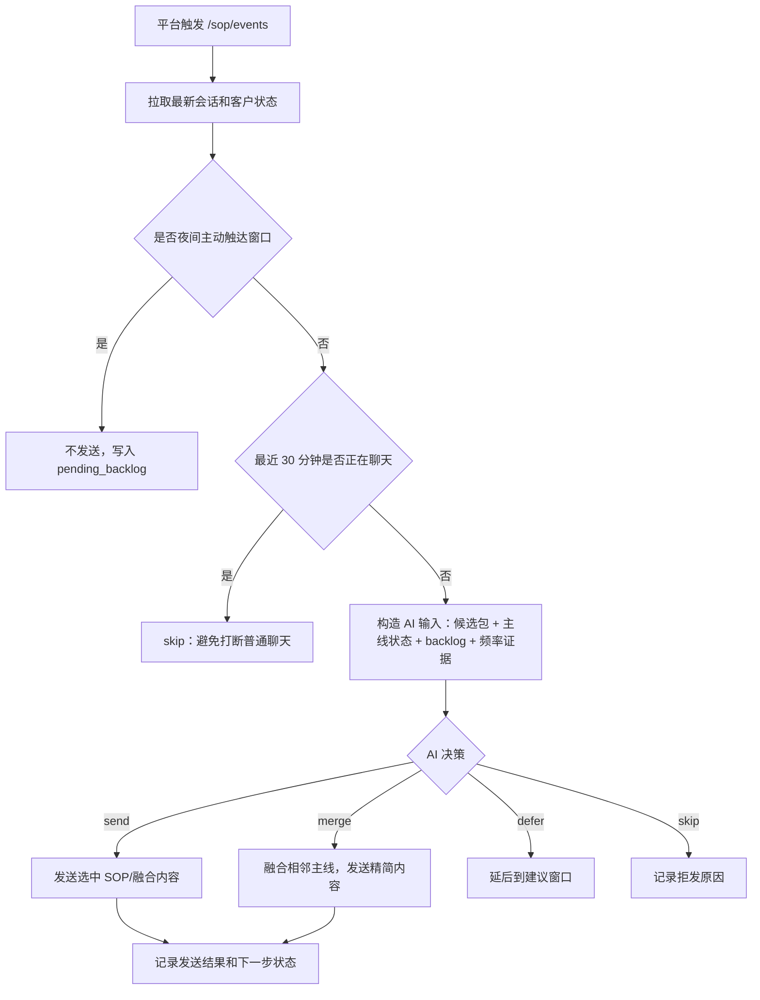

# SOP 主动唤醒 A/B 方案设计

来源：`20260720ai客服主动唤醒sop设计会议.txt`
整理时间：2026-07-20
适用范围：`/sop/events` 主动触达链路，不改变普通客户消息必须回复的规则。

## 1. 会议结论摘要

会议核心不是“到点发固定话术”，而是把 SOP 主动触达拆成两套可验证方案：

- **A 方案：市场节奏版**
  平台按市场配置的时间点触发，AI 负责判断“发不发、发什么、是否跳过、是否融合、是否控制频率”。这是基础版，先满足业务现有流程。

- **B 方案：AI 生命周期运营版**
  由 AI 基于客户生命周期、行为状态、沉默时长、意向强弱和删除风险决定触达时机、频率和内容。这是进阶版，用于与 A 方案做数据对照。

两套方案都必须保留项目宪法：

- AI 负责客户心理、销售节奏、语义判断和话术融合。
- 代码负责触发事件、事实整理、频率证据、夜间规则、状态记录、结构安全和发送幂等。
- 不用 Python 关键词分支决定普通业务意图和销售阶段。

## 2. 共同规则

### 2.1 主动触达和普通回复分离

普通客户主动消息：

- 必须进入普通 AI 回复链路。
- 不受夜间主动触达限制。
- 不能因为 SOP 触发规则返回空。

SOP 主动触达：

- 由 `/sop/events` 触发。
- 平台触发只代表“现在可以评估是否触达”，不是“必须发送候选话术包”。
- AI 必须结合最新聊天记录和客户状态判断。

### 2.2 夜间规则

会议里主要讨论的是凌晨不发，示例为 `00:00-08:00`。

建议设计成配置：

```json
{
  "quiet_hours": {
    "enabled": true,
    "start": "23:00",
    "end": "08:00",
    "timezone": "Asia/Shanghai"
  }
}
```

夜间普通客户正在聊天时，客户消息仍要回复；夜间只限制系统主动唤醒。

### 2.3 正在聊天不打断

默认规则：

- 最近客户消息或小贝/销售消息在 `30 分钟内`，不主动触发 SOP。
- 如果当前客户问题尚未回答，应交普通 AI 回复，不发主动包。
- 如果最近刚发过 AI/SOP 消息，且客户未回，不应短时间连续轰炸。

### 2.4 主线顺序

主动触达必须围绕销售主线推进：

1. 新客破冰和项目认知。
2. 城市/区域/定位，匹配门店。
3. 需求、效果、案例。
4. 活动和价格。
5. 预约金价值和付款决策。
6. 已付后登记姓名、电话、门店、到店日期/时间意向。

可以跳过已经被聊天解决的节点，但不能跳过必要前置。例如：活动价格没铺垫时，不应直接发预约金收款包。

## 3. A 方案：市场节奏版

### 3.1 方案定位

A 方案是基础版，核心是：

> 市场/平台负责“什么时候触发”，AI 负责“这次触发到底发不发、发哪一步、是否融合、是否控制频率”。

它不是机械执行市场配置。它仍然要由 AI 判断上下文和主线状态。

### 3.2 职责边界

平台负责：

- 产生 SOP Event。
- 配置触发频率和时间点。
- 提供客户、账号、事件、候选 policy 信息。

AI 负责：

- 判断当前是否正在聊天。
- 判断候选包是否适合当前上下文。
- 判断主线停在哪一步。
- 判断夜间漏发内容是否需要补。
- 判断是否融合相邻节点。
- 判断今天是否已经触达够了。
- 生成自然过渡话术，并调整文本。

代码负责：

- 夜间禁发硬拦截。
- 记录被夜间压住的 `pending_backlog`。
- 记录发送次数、最近触达时间、连续沉默次数。
- 防止重复发送同一 `send_once_key`。
- 保存 AI 决策 trace。
- 最终发送幂等和失败记录。

### 3.3 A 方案核心流程



### 3.4 夜间漏发处理

会议明确提到：凌晨触发但不能发的消息，不应直接丢掉，也不应第二天一次全部发。

正确机制：

1. 夜间触发时不发送。
2. 记录为 `suppressed_due_to_quiet_hours`。
3. 写入 `pending_backlog`。
4. 第二天第一个可触达窗口，由 AI 判断是否补发。
5. 最多融合 `1-2 个相邻主线节点`。

适合融合：

- 效果铺垫 + 活动介绍。
- 活动介绍 + 预约金价值解释。
- 门店已确认 + 需求效果承接。

不适合融合：

- 新客破冰 + 直接收款。
- 未报价 + 直接催预约金。
- 客户有未回答异议 + 直接发收款包。
- 一次补 3 个以上主线节点。

### 3.5 频率控制

AI 可以拦截平台过密触发。

建议输入字段：

```json
{
  "today_touch_count": 2,
  "total_touch_count": 5,
  "last_sop_sent_at": "2026-07-20T10:30:00+08:00",
  "last_customer_message_at": "2026-07-19T22:10:00+08:00",
  "consecutive_silent_touch_count": 3,
  "pending_backlog_count": 2
}
```

建议判断：

- 第一日可以相对密集，但要看客户是否开口。
- 第二日如果第一天已有效聊天，通常只触达 1-2 次。
- 今天已触达 2 次且客户无新回复，第三次可以 skip。
- 如果夜间漏发导致主线明显慢，可以融合相邻两步，但不能一次发太多。
- 如果平台早上触发的是本该晚上发的内容，可以 `defer`。

### 3.6 A 方案场景矩阵

| 场景 | 输入状态 | AI 应做 | 禁止 |
| --- | --- | --- | --- |
| 夜间 2 点触发活动包 | 夜间禁发 | 不发，写 backlog | 凌晨照发、直接丢弃 |
| 第二天早上有夜间 backlog | 昨晚漏效果/活动 | 补最早未完成主线，可融合 1-2 步 | 一次补 5-8 条 |
| 平台第二天第 3 次触发 | 今天已发 2 次，客户未回 | skip 或 defer | 机械继续发 |
| 客户刚问门店 | 首次加微事件发现客户有待回复消息 | 本次主动事件跳过；实时聊天接口负责精准回答/查门店 | SOP 打断客户问题、Event 假装已交接但无人回复 |
| 客户已提供城市 | 候选仍是问地址 | 跳过问地址，进入门店/效果 | 重复问城市 |
| 活动没讲过 | 候选是预约金收款 | 先活动价格铺垫 | 直接发收款包 |
| 客户沉默且上次只问城市 | 已轻触过一次 | 可推进效果/活动唤醒 | 一直追问城市 |
| 客户明确高意向 | 问怎么预约/付款 | 实时聊天链路可在匹配订单成立后直接发预约金卡 | 让客户翻旧卡、无订单发卡 |

### 3.7 A 方案 AI 输出

建议 `/sop/events` 的模型输出：

```json
{
  "decision": "send",
  "strategy": "continue_mainline",
  "selected_pack_ids": ["s10_activity_intro"],
  "merge_pack_ids": [],
  "skip_reason": "",
  "frequency_reason": "today_touch_count_ok",
  "backlog_handling": "none",
  "messages": [
    {
      "type": "text",
      "content": "亲，昨天晚点怕打扰您就没继续发啦，我先把活动这块给您说清楚。"
    }
  ],
  "next_expected_customer_action": "understand_activity_or_pay_deposit",
  "suggested_next_window": "evening"
}
```

`decision` 枚举：

- `send`：发送一个主线包。
- `merge`：融合相邻主线包。
- `skip`：本次不触达。
- `defer`：延后到更合适时间。
- `handoff_to_ai_reply`：客户当前有实时问题，交普通 AI。

决策优先级固定为：

1. 硬事实禁止发送：夜间主动触达、会话拉取失败、身份不完整、已付后候选仍含收款卡等。
2. 未处理的实时客户问题：仅在满足下述严格条件时交普通 AI。
3. 正常主线推进：默认选择一个未完成 SOP 包发送。
4. 夜间积压补发：只允许融合两个相邻主线包。
5. 频率、重复或时机不合适：选择 `skip` 或 `defer`。

#### `handoff_to_ai_reply` 严格边界

这是异常分支，不是主动触达的常规选择。模型只有在输入明确给出 `ai_reply_policy.allowed=true` 时才允许选择；否则输出该决策必须由结构归一层拒绝并记录 `handoff_to_ai_reply_not_allowed_for_proactive_event`。

`ai_reply_policy.allowed=true` 必须同时满足：

- 最新真实客户消息晚于最近一条小贝、销售或 SOP 消息，客户问题仍未被处理。
- 这条消息确实需要实时事实、工具或风险处理，候选 SOP 无法自然覆盖。
- 平台或当前执行链明确具备普通 AI 回复接管能力，不能只记录“交 AI”却没人回复。

典型允许场景：

- 客户发城市、区、地标或定位卡，需要查询真实门店。
- 客户反馈付款失败、多收钱、退款、投诉、严重不适等，需要实时事实或安全处理。
- 客户发语音、图片或位置消息，需要先转写、识图或调用工具才能回答。

禁止交普通 AI 的场景：

- 客户沉默，当前只是平台定时提醒主动触达。
- 最近没有新的客户消息，最后一条是小贝、销售或 SOP。
- 客户只回复“嗯、好、可以、发吧”等短确认，当前主线包可以直接承接。
- 客户未付但没有提出新问题；应按主线继续效果、活动或预约金价值触达。
- 候选 SOP 已能覆盖当前阶段，只是模型认为普通 AI 表达可能更自然。
- 当前运行链没有普通 AI 接管执行器。此时只能 `send/merge/skip/defer`，不能伪交接后留下空回复。

代码只负责计算并提供 `ai_reply_policy` 的事实资格，不通过业务关键词判断客户心理。是否属于门店事实、支付异常、风险或媒体理解问题，优先使用平台消息类型、结构化事件、已有风险事实和模型语义判断；但没有“未处理的新客户消息”这一事实时，模型无权交接。

### 3.8 A 方案示例

夜间漏发后第二天补效果和活动：

> 亲，昨晚晚点怕打扰您就没继续发啦。您这个斑点问题到店会先检测，适合再操作，做前做后也会留原相机对比。
> 现在新客活动是 268，线上先用 10 元留活动名额，到店抵扣，时间后面按您方便安排。

平台触发过早，今天已发过两次：

```json
{
  "decision": "skip",
  "skip_reason": "today_touch_count_enough_no_new_customer_progress"
}
```

客户已经问过地址但没回：

> 亲，门店位置我刚刚发您了，您先看下哪个顺路。到店会先做检测，适合再操作，不满意也不会强制做，活动名额这边我也可以先帮您留着。

## 4. B 方案：AI 生命周期运营版

### 4.1 方案定位

B 方案是进阶版，核心是：

> 不再以固定 SOP 时间点为中心，而是以客户生命周期为中心，由 AI 决定触达时机、触达频率和触达内容。

B 方案用于验证：AI 运营节奏是否比市场固定 SOP 更高开口率、更低删除率、更高预约金转化率。

### 4.2 B 方案客户生命周期

| 状态 | 含义 | 目标 |
| --- | --- | --- |
| `new_added_no_reply` | 加微后未开口 | 破冰、让客户开口 |
| `opened_no_location` | 已开口但没城市/区域 | 获取门店落点 |
| `location_matched` | 已匹配门店 | 引导斑点情况/效果案例 |
| `need_case_done` | 需求效果已铺垫 | 活动价格 |
| `activity_quoted` | 已报价 | 预约金决策 |
| `deposit_sent_unpaid` | 已发卡未付 | 消除顾虑、轻压单 |
| `paid_pending_info` | 已付缺姓名电话 | 登记信息 |
| `stalled_objection` | 有顾虑未解决 | 精准答疑后回主线 |
| `silent_low_intent` | 多次沉默低意向 | 降频，发价值内容 |
| `high_intent_multi_contact` | 多次加微/多账号/多次问门店价格付款 | 加快节奏重点跟进 |

### 4.3 B 方案触达窗口

B 方案建议由 AI 调度器或周期任务扫描客户，而不是只等平台 SOP 时间点。

建议窗口：

- 早上：`08:00` 左右。
- 午间：`11:30-13:30`。
- 晚间：`19:30-21:30`。
- 夜间不主动触达。

频率建议：

| 客户状态 | 建议频率 |
| --- | --- |
| 高意向 | 每天 3-4 次 |
| 普通意向 | 每天 2-3 次 |
| 连续沉默 | 每天 1-2 次 |
| 删除风险高 | 降频或暂停强推 |
| 已付缺信息 | 可更明确提醒补姓名电话 |

### 4.4 B 方案内容策略

B 方案不只发案例、活动、预约金。它应根据客户状态动态组合内容：

- 专业斑点知识。
- 做前做后案例。
- 客户常见顾虑解答。
- 门店服务价值。
- 活动名额和优惠。
- 预约金价值。
- 低压唤醒。
- 已付后登记提醒。

推荐结构：

> 一句承接/共情 -> 一个有价值信息 -> 一个轻动作

示例：

> 亲，您这种斑点问题很多客户一开始都会先观望，主要是担心效果和费用。我们到店会先做检测，适合再操作，做前做后也会留原相机对比。
> 您如果这两天方便，可以先把活动名额留住，到店时间后面按您方便安排。

### 4.5 B 方案场景矩阵

| 场景 | 生命周期状态 | 触达内容 |
| --- | --- | --- |
| 新客未开口 | `new_added_no_reply` | 轻破冰 + 问城市/区域 |
| 已说城市但未回 | `opened_no_location` | 发真实门店/问区，轻带效果 |
| 已发门店客户沉默 | `location_matched` | 效果案例或活动价值 |
| 问过效果但没付款 | `need_case_done` | 案例 + 活动名额 |
| 已报价但没付 | `activity_quoted` | 预约金价值 + 可退/抵扣 |
| 已发卡未付 | `deposit_sent_unpaid` | 消除顾虑，不机械重复卡；有新进展可重发 |
| 已付缺姓名电话 | `paid_pending_info` | 明确请补姓名电话 |
| 客户多次加微 | `high_intent_multi_contact` | 加快节奏，直接推进门店/活动/预约金 |
| 连续沉默 2 天 | `silent_low_intent` | 降低催付，多发价值知识 |

### 4.6 B 方案 AI 输出

```json
{
  "should_touch": true,
  "lifecycle_state": "activity_quoted",
  "touch_intensity": "medium",
  "content_strategy": "deposit_value_with_objection_relief",
  "reason": "已完成门店和活动铺垫，客户未支付但未明确拒绝",
  "messages": [
    {
      "type": "text",
      "content": "亲，您可以先用10元把活动名额留住，到店时间后面按您方便安排。"
    }
  ],
  "next_touch_after_minutes": 180,
  "risk_flags": []
}
```

## 5. A/B 实验设计

### 5.1 分组方式

会议建议使用两个号做对照：

- A 组账号：市场节奏版。
- B 组账号：AI 生命周期运营版。

原因：

- 一个账号内混合策略容易污染数据。
- 两个号可以独立统计开口率、删除率、转化率。
- 业务侧也更容易接受“一个基础版，一个进阶版”的验证方式。

### 5.2 核心指标

| 指标 | 定义 |
| --- | --- |
| 开口率 | 主动触达后客户是否回复 |
| 唤醒率 | 沉默客户被触达后是否重新开口 |
| 删除率 | 客户删除/拉黑比例 |
| 预约金转化率 | 支付预约金客户占比 |
| 付款前触达次数 | 成交前平均主动触达次数 |
| 删除前最后触达包 | 判断哪类触达导致反感 |
| 首次回复耗时 | 加微到第一次有效回复时间 |
| 主线推进率 | 是否推进到活动/预约金阶段 |
| 客户疲劳度 | 连续触达未回复次数、当天触达次数 |

会议特别强调的核心指标：

- 开口率。
- 删除率。
- 转化率。

### 5.3 数据记录

每次触达都要记录：

```json
{
  "customer_key": "...",
  "experiment_variant": "A",
  "event_id": "...",
  "trigger_source": "platform_schedule",
  "candidate_pack_ids": ["event_s10_price_quote_60min"],
  "decision": "send",
  "selected_pack_ids": ["s10_activity_intro"],
  "lifecycle_state": "activity_quoted",
  "mainline_stage": "activity_and_price",
  "today_touch_count": 2,
  "consecutive_silent_touch_count": 1,
  "quiet_hour_suppressed": false,
  "backlog_count": 0,
  "sent_status": "success",
  "customer_replied_after_touch": null,
  "deleted_after_touch": null,
  "paid_after_touch": null
}
```

### 5.4 看板要求

看板至少要支持：

- 按 A/B 分组看开口率、删除率、转化率。
- 按触达阶段看效果。
- 按触达时间段看效果。
- 按触达次数看删除风险。
- 查看删除前最后一条触达内容。
- 查看付款前触达路径。
- 查看夜间压制和第二天补发情况。

## 6. 实现建议

### 6.1 A 方案短期实现

先在现有 `/sop/events` 上实现：

1. 增加 `pending_backlog` 记录。
2. 增加夜间压制后第二天补发判断。
3. 增加 `today_touch_count` 和 `consecutive_silent_touch_count`。
4. SOP Event 模型输入加入主线状态、候选包、backlog、频率证据。
5. 模型输出支持 `send/merge/skip/defer/handoff_to_ai_reply`。
6. 支持最多融合两个相邻主线包。
7. 所有触达写入实验日志。

当前实现状态（2026-07-20）：

- 已在 `/sop/events` 输入中加入当天/历史触达次数、连续沉默次数、最近触达时间、夜间 backlog 和可配置软上限。
- 默认 `SOP_EVENT_DAILY_TOUCH_SOFT_LIMIT=2`；它作为模型频率证据，不由代码直接决定发送。
- 已支持最多两个候选包融合，并把两个包分别记录为已发送，避免后续重复。
- 当前 `/sop/events` 没有挂载普通 AI 回复执行器，因此 `ai_reply_policy.allowed=false`；不允许模型输出无法执行的假交接。实时客户问题仍由正常 `/reply` 请求处理。
- 如后续要让 `/sop/events` 自己执行普通 AI，必须先补齐跨接口幂等和重复回复保护，再把运行资格打开。

### 6.2 B 方案影子运行

B 方案不要直接上线发送，先做 shadow：

1. 用同一批客户数据跑 B 模型决策。
2. 不发送，只记录“如果按 B 会发什么”。
3. 与 A 的真实结果对比。
4. 观察 B 是否更少触达、更像运营、更低删除风险。
5. 通过后再用独立账号真实发送。

### 6.3 配置建议

```json
{
  "sop_experiment": {
    "enabled": true,
    "variant": "A",
    "quiet_hours": {
      "start": "23:00",
      "end": "08:00"
    },
    "active_chat_suppress_minutes": 30,
    "max_merge_pack_count": 2,
    "max_daily_touch_soft_limit": 2,
    "shadow_variant_b_enabled": true
  }
}
```

## 7. 风险和边界

### 7.1 A 方案风险

- 平台触发太频繁，AI 虽能拦截，但业务可能误以为“没按规则发”。
- 夜间 backlog 如果设计不好，会第二天堆消息。
- 只按市场主线，可能仍然偏机械。
- 如果 SOP 包内容本身不适合，需要模型润色，否则客户感觉生硬。

### 7.2 B 方案风险

- 业务可能认为偏离原 SOP。
- 初期需要足够数据，不适合直接替代 A。
- AI 自主判断必须有频率和安全边界。
- 如果没有删除/支付/回复回流，B 方案无法验证优劣。

### 7.3 共同硬边界

- 夜间主动触达不发。
- 正在聊天不插入 SOP。
- 没有活动价格铺垫，不直接强推预约金。
- 客户明确健康风险、投诉、退款、付款异常，不压预约金。
- 已付后不再发预约金卡。
- 文本润色不能改价格、退款、门店、图片、卡片、金额事实。

## 8. 测试计划

### 8.1 A 方案测试场景

1. 晚上 21 点加微，凌晨 1 点候选包触发，必须压制并进 backlog。
2. 第二天早上触发，补夜间漏发效果包。
3. 夜间漏发两个相邻包，第二天融合为一次自然触达。
4. 夜间漏发三个包，第二天最多补两个，不能堆叠。
5. 客户 30 分钟内刚聊天，SOP Event 必须 skip。
6. 今天已触达 2 次且客户未回，第三次 skip。
7. 客户已提供城市，候选问地址包应跳过。
8. 活动没铺垫，候选预约金包应改为活动价格。
9. 客户高意向问付款，允许直接发卡。
10. 平台触发时间不合适，AI 输出 defer。

### 8.2 B 方案测试场景

1. 新客未开口，AI 选择轻破冰。
2. 已开口没地址，AI 选择问城市/区域。
3. 已发门店沉默，AI 选择效果案例或活动价值。
4. 已报价未付，AI 选择预约金价值解释。
5. 已发卡未付但连续沉默，AI 降频。
6. 多次加微或多次问门店价格，AI 提高意向等级。
7. 连续沉默 3 天，AI 减少催付，多发价值内容。
8. 已付缺姓名电话，AI 明确登记。

### 8.3 验收标准

A 方案：

- 主线顺序不乱。
- 夜间不发。
- 第二天能补漏但不堆叠。
- 平台过密触发能被 AI 拦截。
- 触达内容能融入上下文。

B 方案：

- 生命周期判断稳定。
- 频率低于或等于 A，但开口率不低于 A。
- 删除率低于 A。
- 预约金转化率不低于 A。
- 内容比 A 更个性化、更像私域运营。

## 9. 推荐落地顺序

1. 先完成 A 方案：平台触发 + AI 发不发/发什么/频率控制。
2. 同时补齐数据埋点和看板字段。
3. B 方案先 shadow，不真实发送。
4. shadow 运行 2-3 天后评估 B 决策质量。
5. 两个账号正式跑 A/B。
6. 每天看开口率、删除率、转化率。
7. 用数据决定是否逐步把 B 方案扩大。

## 10. 需要业务确认的问题

1. A 方案第二天补夜间 backlog，最多融合几个节点，建议最多 2 个。
2. A 方案第二天最大触达次数，建议普通客户 1-2 次，高意向可 3 次。
3. B 方案是否允许少于市场配置触达次数。
4. B 方案是否允许加入专业知识内容，而不是只发活动和收款。

## 11. 方案 A 当前验证结果

2026-07-21 提交前本地验证：

- 确定性 SOP Event 测试：`77 passed`。
- 全量 `workflow_tests`：`543 passed`，仅保留第三方 Authlib 弃用警告。
- 单节点模型矩阵扩展为 `29` 类，明确模拟北京时间、客户阶段、近期聊天、已完成包、候选未完成包、当天/历史触达次数、连续沉默、夜间 backlog、平台 actions 和支付卡资格。
- 完整两轮稳定性测试曾达到 `58/58`；最终规则与测试口径收口后，最终矩阵为 `29/29`，通过率 `100%`，P50 `5.21s`、P90 `6.98s`。
- Claude 独立语义评审先发现 3 类问题：越过最早未完成包、无依据虚构“前面/刚才”、重复插入同义铺垫。修复后三类专项分别通过 `5/5` 和 `10/10`，累计覆盖全部场景类型。
- 最终整批 Claude 复评因模型服务连续超时未完成；同模型评审又错误把受信 SOP 短报价事实判成编造，因此不把该评审器结果作为验收数字。最终验收以结构/业务矩阵 `29/29`、Claude 已完成的逐类评审和全仓回归共同判定。

当前结构保护只校验可计算事实：候选包必须从最早未完成包开始、最多合并两个相邻包、已完成包不得重复、频率保护必须有计数证据、语义冲突必须存在近期客户消息或结构化冲突来源。违反时进入同模型 repair，代码不代替模型生成业务决策或客户话术。

本轮单节点测试全程未调用主动发送接口、未写线上客户状态。部署后只做不发送的线上配置/模型 smoke；真实主动发送仍应使用专用测试客户并单独审核。
