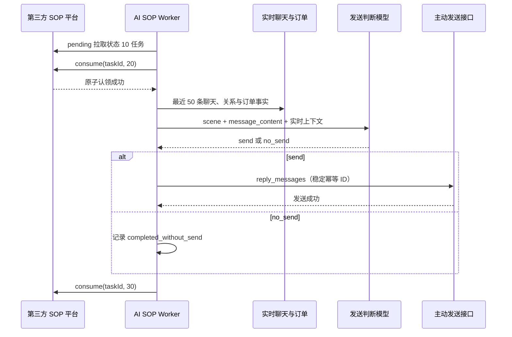

# 第三方 SOP 消费链路

## 职责边界

- 第三方 SOP 平台负责策略、触发时间、频率、任务内容和后续任务。
- AI 系统只负责拉取状态 `10` 的待发送任务、认领为 `20`、读取实时上下文、判断 `send/no_send`、必要时改写文字、发送并回写 `30`。
- `no_send` 是已完成的业务结果，平台状态同样回写 `30`；详细原因只保存在 AI 系统审计日志。
- 模型不得延期、重新排期或创建任务。
- `/sop` 是“AI回复主线话术”，只服务客户主动消息进入普通 AI 回复链路时的 SOP Gate 和精准回复。

## 运行流程



平台只返回已经到期的任务，AI 系统看不到 `dispatch_wait`。Worker 默认每 10 秒拉取一次，把任务放入容量 24 的本地队列，默认由 6 个执行槽并发处理。任务进入执行槽后才调用 `consume(20)`，未开始执行的任务仍由平台保持状态 10。10 秒轮询在接口调用量和到期延迟之间更平衡；10 分钟轮询会产生平均约 5 分钟、最坏接近 10 分钟的额外延迟，不适合作为生产默认值。

模型判断使用 `gpt-5.4-mini`，明确失败后顺序回退 `gpt-5.4`。SOP 调用关闭并行 hedge，避免与普通客户回复争抢供应商总并发。

## 文案处理

- `useAiCopy=false`：通过基础执行校验和夜间保护后直接原样发送，不读取业务上下文、不调用模型。
- `useAiCopy=true`：模型可改写文字以承接最新聊天；图片、视频、链接不得修改或新增。
- AI 文案任务的 `message_content` 为空时，只能根据 `scene.sceneDesc`、`scene.knowledgeText` 或 `scene.engine.generateNote` 生成 1–2 条文字。
- 平台没有提供可信内容时直接 `no_send`，不得编造活动、素材或业务事实。
- Worker 不生成预约金卡。

## 夜间保护

- 使用北京时间 `Asia/Shanghai`，默认窗口为 `00:00-08:00`。
- 普通客户主动消息仍由普通 AI 回复链路及时处理；这里只拦截第三方主动 SOP。
- 夜间保护优先于 `useAiCopy`，固定文案任务也不能绕过。
- 第二天及以后的营销任务在夜间直接 `completed_without_send`，平台仍按 `20→30` 完成。
- `add_wecom` 首次加微任务仅在最近客户活动或平台自动开场不足 30 分钟、客户没有待回复消息时允许继续。
- 活跃时间未知、沉默达到 30 分钟、客户问题待回复或关系已删除时不发送。
- 夜间任务不由 AI 延期、不创建早间补发任务；是否再次触达由第三方平台生成新任务。
- 判断以任务 `scheduledAt` 为准，因此夜间任务即使延迟到白天才被拉取，也不会绕过保护。

## 失败恢复

- `20` 认领响应未确认时，不读取上下文、不调用模型、不发送。
- 模型或上下文失败后，本地保留 `platform_processing_retry`，使用同一平台任务恢复。
- 主动发送使用 `platform-sop-<task_id>` 和 `platform-sop-send-<task_id>` 作为稳定幂等标识。
- 客户消息已经发送而平台 `30` 回写失败时，本地保留 `platform_complete_pending`；恢复只重试回写 `30`，不得再次发送。
- 发送超时且结果不确定时保留 `platform_send_uncertain`，不得伪造平台成功。
- `platform_send_uncertain` 恢复时复用原始 `plan_id/task_id/reply_messages`，不重新运行模型。
- 缺少完整客户身份、消息结构非法、缺少可信文案来源、任务超过 6 小时或早于 Live 切换时间时，安全地按 `completed_without_send` 完成并写明原因。

## 观测指标

`/health` 和 Outreach 管理统计返回队列深度、执行中数量、平台待发送总数、最老任务延迟、各阶段 P50/P90/最大耗时，以及发送、不发送、恢复、身份缺失、过期和不确定发送计数。任务延迟超过 120 秒会记录 warning，发送结果不确定会记录 error。

管理页面 `/logs/sop-platform` 展示任务从平台到客户发送的完整状态：

| 页面阶段 | 含义 | 是否已有本地审计 |
| --- | --- | --- |
| 平台待拉取 | 平台仍返回状态 10，AI 本地尚未见到该任务 | 否 |
| 已拉取待判断 | 已进入本地有界队列，尚未开始读取上下文和模型判断 | 是 |
| 判断中 | Worker 已开始处理，正在读取最新上下文或调用模型 | 是 |
| 已判断发送 | 模型判断应发送，但 Shadow 模式下尚未实际发送 | 是 |
| 已判断不发 | 模型或结构保护判断不发送 | 是 |
| 发送中 | 已调用主动发送链路，尚未确认最终结果 | 是 |
| 已发送 | 客户消息发送成功，平台状态已完成或等待完成回写 | 是 |
| 恢复中 | 模型、发送或平台回写失败，等待使用同一任务 ID 恢复 | 是 |

任务在放入内存队列前必须先写入本地审计，因此服务重启后“已拉取待判断”和“判断中”任务都能进入恢复链路。页面支持按任务 ID、客户 ID、阶段和模型结论筛选，并同时展示平台原始内容、模型最终内容、判断原因和处理时间线。平台实时队列读取失败时，页面保留本地审计结果并明确显示上游错误。

## 当前可实现范围与限制

可以实现：到期后近实时拉取、发送前读取最近 50 条聊天和实时业务事实、`send/no_send`、受控文字改写、有界并发、幂等发送和服务重启恢复。

当前限制：

- 无法提前读取尚未到期的 `dispatch_wait`，不能预计算。
- 同一时刻大量到期时只能排队，不能保证精确到秒。
- `pending` 单次最多 500 且无游标，只能通过认领后重复拉取排空。
- 平台只有 10/20/30，基础设施失败必须保留 20 并在 AI 系统本地恢复。
- 暂不处理读取上下文后、真正发送前出现新客户消息的最后一秒竞态。
- 缺少企业、客服或客户身份时不能跨租户猜测补齐，只能不发送。
- SQLite 单进程适合当前规模，不支持多实例并行消费。

## 旧链路状态

- `/sop/events` 仅记录 `retired_legacy_route` 审计，不调用模型、不创建任务、不发送。
- 旧 SOP Event 重试 Worker 不再启动。
- Outreach 自动计划、沉默监控和自动发送 Worker 不再启动；页面仅保留历史只读能力。
- 异议素材库目前只是空结构预留，不进入模型运行时。

## 上线开关

默认配置：

```env
SOP_PLATFORM_PULL_ENABLED=false
SOP_PLATFORM_SHADOW_MODE=true
SOP_PLATFORM_POLL_SECONDS=10
SOP_PLATFORM_BATCH_SIZE=50
SOP_PLATFORM_TASK_CONCURRENCY=6
SOP_PLATFORM_QUEUE_SIZE=24
SOP_PLATFORM_RECOVERY_CONCURRENCY=2
SOP_PLATFORM_MODEL_TIMEOUT_SECONDS=20
SOP_PLATFORM_MAX_TASK_AGE_SECONDS=21600
SOP_PLATFORM_LIVE_NOT_BEFORE=
SOP_PLATFORM_QUIET_HOURS_ENABLED=true
SOP_PLATFORM_QUIET_START_HOUR=0
SOP_PLATFORM_QUIET_END_HOUR=8
SOP_PLATFORM_QUIET_FIRST_ADD_GRACE_MINUTES=30
```

部署后先配置平台地址和 token，再开启拉取并保持影子模式。影子模式只拉取和判断，不认领、不发送、不回写。完成影子数据审核和隔离账号发送测试后，才能单独关闭影子模式。

测试环境文档中的 HTTP 地址会重定向到 HTTPS。默认配置直接使用 HTTPS，客户端也允许跟随重定向，避免把 301 HTML 响应误判成空任务列表。
