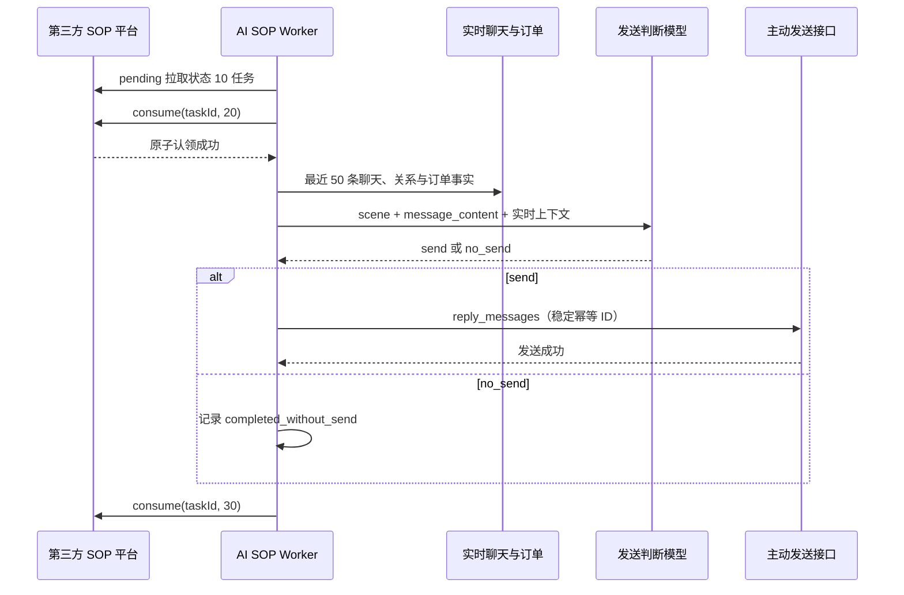

# 第三方 SOP 消费链路

## 职责边界

- 第三方 SOP 平台负责策略、触发时间、频率、任务内容和后续任务。
- AI 系统只负责拉取状态 `10` 的待发送任务、认领为 `20`、读取实时上下文、判断 `send/no_send`、必要时改写文字、发送并回写 `30`。
- `no_send` 是已完成的业务结果，平台状态同样回写 `30`；详细原因只保存在 AI 系统审计日志。
- 模型不得延期、重新排期或创建任务。
- `/sop` 是“AI回复主线话术”，只服务客户主动消息进入普通 AI 回复链路时的 SOP Gate 和精准回复。

## 运行流程



## 文案处理

- `useAiCopy=false`：模型只判断发不发，平台文字、图片、视频、链接及顺序原样发送。
- `useAiCopy=true`：模型可改写文字以承接最新聊天；图片、视频、链接不得修改或新增。
- AI 文案任务的 `message_content` 为空时，只能根据 `scene.sceneDesc`、`scene.knowledgeText` 或 `scene.engine.generateNote` 生成 1–2 条文字。
- 平台没有提供可信内容时直接 `no_send`，不得编造活动、素材或业务事实。
- Worker 不生成预约金卡。

## 失败恢复

- `20` 认领响应未确认时，不读取上下文、不调用模型、不发送。
- 模型或上下文失败后，本地保留 `platform_processing_retry`，使用同一平台任务恢复。
- 主动发送使用 `platform-sop-<task_id>` 和 `platform-sop-send-<task_id>` 作为稳定幂等标识。
- 客户消息已经发送而平台 `30` 回写失败时，本地保留 `platform_complete_pending`；恢复只重试回写 `30`，不得再次发送。
- 发送超时且结果不确定时保留 `platform_send_uncertain`，不得伪造平台成功。

## 旧链路状态

- `/sop/events` 仅记录 `retired_legacy_route` 审计，不调用模型、不创建任务、不发送。
- 旧 SOP Event 重试 Worker 不再启动。
- Outreach 自动计划、沉默监控和自动发送 Worker 不再启动；页面仅保留历史只读能力。
- 异议素材库目前只是空结构预留，不进入模型运行时。

## 上线开关

默认配置：

```env
SOP_PLATFORM_PULL_ENABLED=false
SOP_PLATFORM_SHADOW_MODE=true
```

部署后先配置平台地址和 token，再开启拉取并保持影子模式。影子模式只拉取和判断，不认领、不发送、不回写。完成影子数据审核和隔离账号发送测试后，才能单独关闭影子模式。

测试环境文档中的 HTTP 地址会重定向到 HTTPS。默认配置直接使用 HTTPS，客户端也允许跟随重定向，避免把 301 HTML 响应误判成空任务列表。
